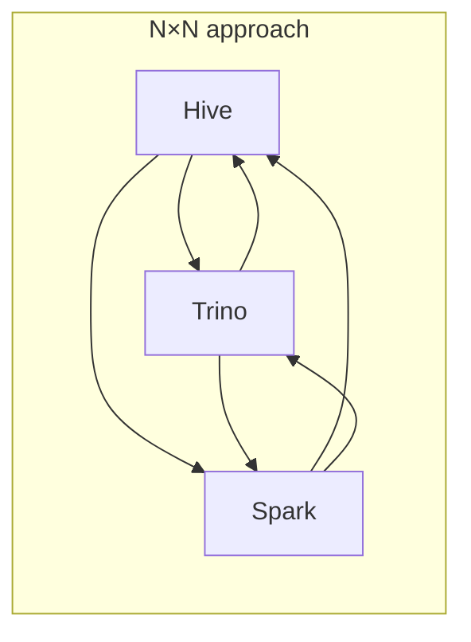
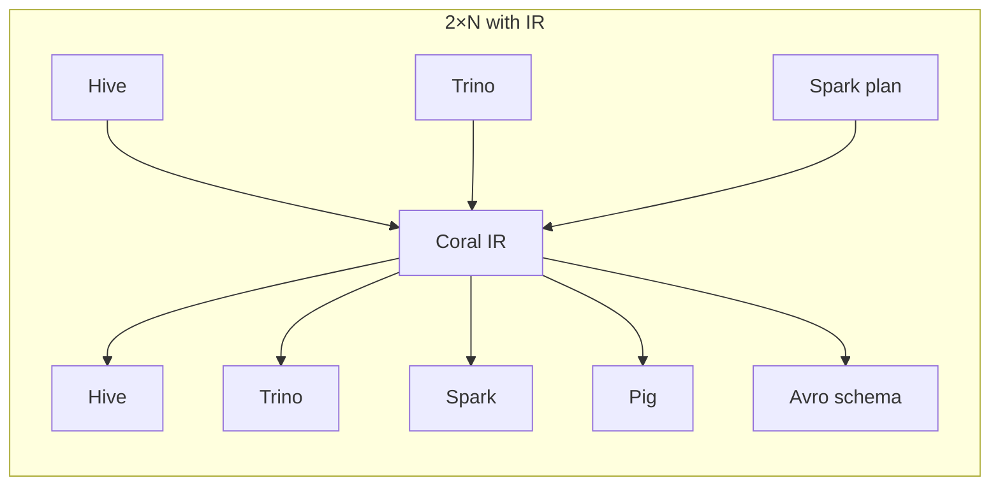
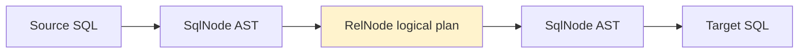
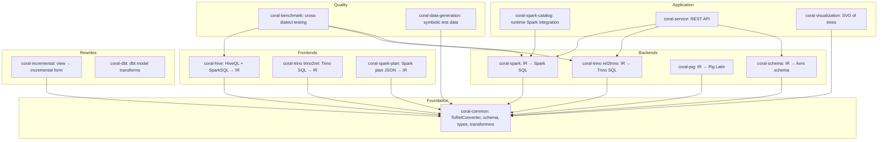

# 01 — The big picture

Coral is a SQL translation, analysis, and rewrite engine built on top of Apache Calcite. It defines an intermediate representation — Coral IR — that captures the semantics of a query independent of any specific SQL dialect, then provides a library of frontends that parse dialects into IR and backends that emit dialects from IR. Read this chapter to understand why Coral exists, what shape the IR takes, and where every module lives on the map.

## The problem Coral solves

LinkedIn (and any large data platform) deals with many SQL dialects: HiveQL, Spark SQL, Trino, Pig Latin, sometimes Presto. A single logical view may need to run on three or four of these engines. The naive approach is to write N × N translators — one for each pair of dialects. Coral collapses this to 2 × N: write one frontend per dialect to parse into IR, write one backend per dialect to emit from IR.

The IR layer pays for itself once you have more than two dialects.

## What Coral IR actually is

Coral IR is not a custom data structure — it is Apache Calcite's existing two-layer representation, tightened with Hive-specific semantics. The two layers:

- **`SqlNode` tree** — abstract syntax tree. Close to the surface SQL. Subclasses are `SqlCall`, `SqlIdentifier`, `SqlLiteral`, `SqlSelect`, `SqlJoin`, ...
- **`RelNode` tree** — logical relational algebra plan. Operators are `LogicalProject`, `LogicalFilter`, `LogicalJoin`, `LogicalAggregate`, `TableScan`, plus a few Coral additions like `HiveUncollect`.

The two layers are **isomorphic** — convertible to each other. Coral converts SQL → SqlNode (the frontend's job), then SqlNode → RelNode for analysis and rewriting, then RelNode → SqlNode → SQL (the backend's job).

Why two layers and not one?

- SqlNode preserves surface SQL structure — order of columns, aliases, hints. Good for dialect emission.
- RelNode is the canonical semantic form — equivalent queries normalize to the same tree. Good for optimization, rewriting, and schema derivation.

A backend that emits in a dialect needs the surface-level information SqlNode carries; an analyzer that infers an Avro schema or rewrites for incremental view maintenance wants the semantic form RelNode provides. So the IR is two-layered on purpose, and [chapter 03](03-pipeline-deep-dive.md) walks the transitions.

## The Coral codebase, in one screen

One sentence each:

| Module | What it does |
|---|---|
| `coral-common` | Abstract converter base (`ToRelConverter`), Calcite extensions (`HiveRelBuilder`, `HiveTypeSystem`), schema layer, `CoralCatalog`, `SqlCallTransformer` framework. Every other module depends on it. |
| `coral-hive` | ANTLR-based Hive (and Spark) SQL parser. Produces `SqlNode`, then `RelNode`. The reference frontend. |
| `coral-trino` | Both directions: `rel2trino` emits Trino SQL; `trino2rel` parses Trino SQL (POC quality for views). |
| `coral-spark` | Emits Spark SQL from IR. Returns extra metadata (`SparkUDFInfo`) describing UDFs Spark needs to register. |
| `coral-spark-plan` | Takes Spark's physical plan JSON and reconstructs a `RelNode`. Useful for analyzing Spark's optimizations. |
| `coral-spark-catalog` | Spark 3.5 `CatalogExtension`. Translates Hive views to Spark SQL on the fly during query execution. |
| `coral-pig` | Emits Pig Latin from IR. Mostly legacy. |
| `coral-schema` | Derives Avro schema from a view's logical plan. Crucial for LinkedIn's Avro-centric pipeline. |
| `coral-dbt` | Applies Coral transformations to dbt models. |
| `coral-incremental` | Rewrites a view into an incremental form (compute deltas instead of full recompute). |
| `coral-visualization` | Renders SqlNode and RelNode trees as graphviz/SVG. |
| `coral-service` | Spring Boot REST service exposing translation, visualization, and incremental rewrite APIs. |
| `coral-benchmark` | Cross-dialect correctness testing framework with three verification levels (TRANSLATION, EXPLAIN, RESULT_SET). |
| `coral-data-generation` | Symbolic constraint solver that generates test data for SQL predicates by inverting expressions. |
| `shading/coral-trino-parser` | Repackages Trino's parser + ANTLR v4 + Airlift into `coral.shading.*` to avoid classpath collisions with Calcite's ANTLR v3. |

## Where LinkedIn fits in

Coral is open source but designed around LinkedIn's data platform:

- **Dali** (LinkedIn's logical dataset platform) — provides versioned views and a unified namespace; Coral translates these views into target-dialect SQL at query time.
- **Transport UDFs** — LinkedIn's framework for portable UDFs across engines. Coral detects them and emits the engine-specific JAR/registration info.
- **Avro everywhere** — Kafka, Espresso, event pipelines all consume Avro schemas. `coral-schema` produces them from view definitions.
- **ViewShift** — dynamic policy enforcement layer that uses Coral IR rewriting to inject access control into views at translation time.

You can use Coral without any of these; if you read code that mentions `DaliOperatorTable`, `TransportUDFTransformer`, or `FuzzyUnionSqlRewriter`, that's LinkedIn-specific context ([chapter 15](15-linkedin-specifics.md) covers the terms).

## Why the IR is faithful to Hive

Coral's type system, validator, and converter implementations all skew Hive-flavored. `HiveTypeSystem` defines precision rules. `HiveSqlValidator` is the validator. `HiveRelBuilder` overrides UNNEST quirks. This is a historical artifact: Coral started as a Hive-centric tool inside LinkedIn before generalizing. The legacy shows up in places — most visibly in `ToRelConverter.processViewWithCoralCatalog`, which still converts Iceberg tables to a "minimal Hive Table" for backward compatibility (tracked in issue #575). When reviewing PRs in `coral-common` or `coral-hive`, watch for whether the change is paving over this legacy or entrenching it.

## What to read next

- If Calcite's `SqlNode` / `RelNode` / convertlet vocabulary is rusty: **[chapter 02](02-calcite-primer.md)** — the primer.
- If Calcite is fresh in your head: **[chapter 03](03-pipeline-deep-dive.md)** — walks a real query end-to-end.
- If you're about to review a PR right now: **[chapter 16](16-pr-review-companion.md)** — the reviewer's checklist.
