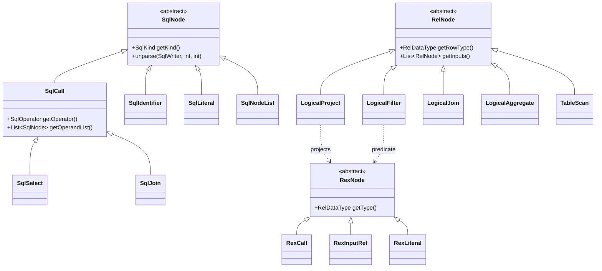

# 02 — A Calcite primer for Coral readers

This chapter teaches just enough Apache Calcite vocabulary to read Coral source without tab-switching to Calcite's javadoc. After this, you can open `HiveToRelConverter` and recognize every Calcite type and every Coral subclass at a glance. The strategy is: name the Calcite concept, show the shape it takes, then point at the Coral class that extends it. The next chapter (03) ties them together by walking a query through the pipeline.

> **Reading time** ~14 min  ·  **Prerequisites** [chapter 01](01-the-big-picture.md)
>
> **Key takeaways**
> - Calcite represents a query in three types — `SqlNode` (AST), `RelNode` (relational plan), and `RexNode` (row expression living inside a `RelNode`) — and knowing which layer you are at tells you which expression type to expect.
> - Coral plugs into Calcite by subclassing extension points — `HiveSqlValidator`, `HiveSqlToRelConverter`, `CoralConvertletTable`, `DaliOperatorTable`, `HiveRelBuilder`, `HiveTypeSystem` — overriding a small surface and threading the override through `FrameworkConfig`.
> - `CoralConvertletTable` defines only two custom convertlets — preserving casts as abstract casts and handling `FunctionFieldReferenceOperator` — and falls through to `StandardConvertletTable` for everything else.

## The two-layer IR

Calcite represents a query in two trees, sequentially produced:

- **`SqlNode`** — the parsed and validated AST. Close to surface SQL. Every parser, every dialect emitter, every unparser deals in `SqlNode`.
- **`RelNode`** — a logical relational-algebra plan. The semantic form. Optimizers, schema derivers, and rewriters work here.
- **`RexNode`** — a row expression. Lives *inside* a `RelNode` (the projection list of a `LogicalProject`, the predicate of a `LogicalFilter`). `RexNode` is to `RelNode` what columns and expressions are to relational operators.

You will never see a `RexNode` outside the body of a `RelNode`. Conversely, `SqlNode` carries its own expression representation — there is no `RexNode` at the SqlNode layer. The boundary matters: when reading Coral, the question "am I at the SqlNode layer or the RelNode layer?" tells you which expression type to expect.



### SqlNode subclasses worth recognizing

- **`SqlCall`** — every function call, operator application, or compound construct. `lower(b)` is a `SqlCall` whose operator is the `LOWER` `SqlOperator` and whose operand is one `SqlIdentifier`. `SqlSelect` itself extends `SqlCall` (a `SELECT` *is* a call to the `SELECT` operator). `SqlBasicCall` is the concrete subclass used when there is no specialized class.
- **`SqlIdentifier`** — names: column refs, table refs, function names. Has a `names` list because `db.tbl.col` is one identifier with three components.
- **`SqlLiteral`** — typed constants. Subclasses include `SqlNumericLiteral`, `SqlCharStringLiteral`, `SqlIntervalLiteral`.
- **`SqlNodeList`** — a wrapped `List<SqlNode>`. Used for the select clause, the group-by list, the order-by list. You cannot pass a bare `List` where Calcite expects a `SqlNodeList`; that distinction trips people up.
- **`SqlSelect`** — the body of a single `SELECT`. Holds keyword list, select list, from clause, where clause, group/having/window, order/offset/fetch.
- **`SqlJoin`** — a join expression in the `FROM` clause. Carries left, right, join type (`SqlJoinType`), condition type (ON, USING, NONE), condition.

The standard interaction pattern: cast to `SqlCall`, walk `getOperandList()`, recurse. The polymorphic dispatch lives on `SqlVisitor` and on `SqlShuttle` (a visitor that rewrites in place). Coral uses `SqlShuttle` constantly — see [chapter 07](07-transformers-pattern.md).

### RelNode operators worth recognizing

Same shape on the relational side. The operators you will read in 90% of Coral code:

- **`TableScan`** — leaf. Reads a base table. Carries the `RelOptTable` and from there the row type.
- **`LogicalProject`** — applies a list of `RexNode` expressions, one per output column. Has exactly one input.
- **`LogicalFilter`** — applies one `RexNode` predicate. One input.
- **`LogicalJoin`** — two inputs, one `RexNode` join condition, a `JoinRelType` (INNER, LEFT, RIGHT, FULL, SEMI, ANTI).
- **`LogicalAggregate`** — group-by + aggregate calls. Carries a `groupSet` (BitSet of input columns) and a list of `AggregateCall`s.

`LogicalXxx` are the Calcite-canonical implementations; the parent abstractions are `Project`, `Filter`, `Join`, `Aggregate`, `TableScan`. Always match by the parent class in `instanceof` checks unless you know you only handle the logical variant.

Coral adds a few of its own — `HiveUncollect` (in `coral-common`) overrides Calcite's `Uncollect` to handle Hive's `LATERAL VIEW EXPLODE` shape. The default `RelBuilder` does not know about it, which is why `HiveRelBuilder` exists.

## How Calcite resolves functions

A `SqlCall` carries a `SqlOperator`. `SqlOperator` is the symbolic descriptor of a function or operator: name, syntax (prefix, infix, function, special), operand type checker, return type inferrer, operand count rules. Concrete subclasses include `SqlFunction`, `SqlBinaryOperator`, `SqlPrefixOperator`, `SqlAggFunction`.

`SqlOperatorTable` is the lookup interface. It exposes `lookupOperatorOverloads(SqlIdentifier name, SqlFunctionCategory, SqlSyntax, List<SqlOperator> result, SqlNameMatcher)` — given a name and a syntax hint, populate `result` with candidates. The validator then chooses among them by operand type.

Calcite ships `SqlStdOperatorTable.instance()` — the standard SQL operators (`+`, `LOWER`, `CASE`, the standard aggregates). Coral wires its dialect operators via `ChainedSqlOperatorTable`:

```java
// HiveToRelConverter.getOperatorTable()
return ChainedSqlOperatorTable.of(
    SqlStdOperatorTable.instance(),
    new DaliOperatorTable(functionResolver));
```

`DaliOperatorTable` (in `coral-hive`) delegates to `HiveFunctionResolver`, which in turn consults `StaticHiveFunctionRegistry` (Hive's built-in catalog) and the Dali function metadata that lives in Hive table parameters. The Calcite contract — `SqlOperatorTable` — does not change; Coral plugs in its own implementation. [Chapter 06](06-coral-hive.md) dissects the function resolver in detail.

## SqlValidator — what validation does

`SqlValidator` is the largest single interface in Calcite. Its job: turn an unannotated `SqlNode` tree into an annotated one. Two responsibilities dominate:

1. **Identifier resolution.** Bind every `SqlIdentifier` to a real schema object (column of a real table, named subquery output, aliased expression). Resolution walks scopes — `SqlValidatorScope` and its subclasses (`SelectScope`, `JoinScope`, `OrderByScope`). When validation completes, every column reference knows what it points to.
2. **Type derivation.** Compute a `RelDataType` for every expression bottom-up. Literals get their declared type. Identifiers get the type of the column they resolve to. Calls get the type produced by their `SqlOperator.inferReturnType(...)`. Type coercion happens here when an operand needs to be widened (INT → BIGINT for SUM, etc.).

After validation, you can call `validator.getValidatedNodeType(sqlNode)` to retrieve the derived type of any node. The tree shape is unchanged; the type annotations are stored in the validator, not on the nodes themselves.

Coral's extension is `HiveSqlValidator` (subclasses Calcite's `SqlValidatorImpl`). It tweaks three things:
- Sets `NullCollation.LOW` to match Hive's null-ordering.
- Overrides `inferUnknownTypes` so that a bare `NULL` literal gets the explicit NULL type rather than inheriting context.
- Overrides `expand` to keep `FunctionFieldReferenceOperator.DOT` calls intact (Coral's struct-field-access operator must not be rewritten by Calcite's standard expansion).

Constructor signature is `HiveSqlValidator(SqlOperatorTable, CalciteCatalogReader, JavaTypeFactory, SqlConformance)` — note that the validator owns the operator table reference. That is the wiring point.

## SqlToRelConverter — moving between layers

Once validated, the `SqlNode` tree is ready for conversion. `SqlToRelConverter.convertQuery(SqlNode, boolean needsValidation, boolean top)` returns a `RelRoot`, from which you take `.rel` to get the actual `RelNode`. Internally the converter:

- Builds `RelNode`s for the FROM clause (a `TableScan` for each table, `LogicalJoin` for joins).
- Walks the SELECT list, builds `RexNode`s for each expression, wraps them in a `LogicalProject`.
- Walks the WHERE clause, builds a `RexNode`, wraps in `LogicalFilter`.
- Repeats for GROUP BY (`LogicalAggregate`), HAVING (`LogicalFilter`), ORDER BY (`LogicalSort`), windowing, etc.

Coral's `HiveSqlToRelConverter` overrides `convertFrom` to handle Hive's UNNEST semantics — Hive's `LATERAL VIEW EXPLODE` becomes a `HiveUncollect` rather than the Calcite-stock `Uncollect`. The overridden `convertQuery` also skips the base class's row-type assertion, because Hive is lax about view schemas (the view's declared row type can disagree with the converted plan's row type).

The converter does not handle expression conversion itself; it delegates that to a convertlet table.

## SqlRexConvertletTable and convertlets

A **convertlet** is a function that converts one `SqlCall` (a SqlNode-layer expression) into one `RexNode` (a RelNode-layer expression). `SqlRexConvertletTable` maps each `SqlOperator` to a `SqlRexConvertlet`. When `SqlToRelConverter` walks expressions, it asks the convertlet table for a rule per operator.

Calcite ships `StandardConvertletTable.INSTANCE` — covers all `SqlStdOperatorTable` operators. Most operators get the trivial convertlet: recurse into operands, build a `RexCall` with the same operator. The interesting convertlets handle rewrites — `EXTRACT(YEAR FROM x)` may be lowered to a different `RexCall` shape, casts may be folded, etc.

Coral's `CoralConvertletTable` (in `coral-hive`) extends `ReflectiveConvertletTable`. Methods on `ReflectiveConvertletTable` named `convertXxx(SqlRexContext, SqlOperator, SqlCall)` are auto-registered for the operator type of the second argument. Coral defines exactly two:

```java
public class CoralConvertletTable extends ReflectiveConvertletTable {
  public RexNode convertFunctionFieldReferenceOperator(SqlRexContext cx,
      FunctionFieldReferenceOperator op, SqlCall call) { ... }

  public RexNode convertCast(SqlRexContext cx, SqlCastFunction cast, SqlCall call) {
    // Use makeAbstractCast instead of letting StandardConvertletTable fold
    return cx.getRexBuilder().makeAbstractCast(castType, leftRex);
  }

  @Override
  public SqlRexConvertlet get(SqlCall call) {
    SqlRexConvertlet convertlet = super.get(call);
    return convertlet != null ? convertlet : StandardConvertletTable.INSTANCE.get(call);
  }
}
```

The `get` override is the fall-through pattern: if Coral has a custom rule, use it; otherwise defer to the standard table. The cast override exists because `StandardConvertletTable.convertCast` aggressively eliminates casts that Calcite considers redundant — and Hive's type rules disagree, so Coral preserves every cast as an abstract cast.

## RelBuilder — building plans by hand

`RelBuilder` is a fluent builder that constructs `RelNode` trees imperatively:

```java
builder.scan("db", "tbl")
       .filter(builder.call(SqlStdOperatorTable.GREATER_THAN,
                            builder.field("c"),
                            builder.literal(1)))
       .project(builder.field("a"),
                builder.alias(builder.call(LOWER, builder.field("b")), "lower_b"))
       .build();
```

The builder maintains a stack of `RelNode`s. Each method consumes inputs from the stack and pushes the result. `build()` pops the top. It is the same pattern as Calcite's `SqlBuilder` and produces equivalent output to `SqlToRelConverter` for the queries it can express. Many of Coral's hand-built rewrites use `RelBuilder` rather than constructing `LogicalProject`/`LogicalFilter` directly.

Coral's `HiveRelBuilder` (in `coral-common`) overrides `rename(List<String> fieldNames)`. The stock `RelBuilder` wraps every rename in a fresh `LogicalProject`; `HiveRelBuilder` recognizes when the top of stack is a `HiveUncollect` or `Values` and rebuilds it in place. The effect is that unparsed SQL emits `CROSS JOIN UNNEST(arr) AS t(x)` rather than `CROSS JOIN (SELECT arr AS x FROM UNNEST(arr)) AS t`. The factory `HiveRelBuilder.LOGICAL_BUILDER` is the `RelBuilderFactory` passed into `SqlToRelConverter.Config`.

## The type system

`RelDataType` is the type of any expression or row. Scalar types (`INTEGER`, `VARCHAR(n)`, `DECIMAL(p,s)`) and structured types (`RecordType` for rows and structs, `ArrayType`, `MapType`) all implement it. The interesting methods are `getSqlTypeName()`, `getPrecision()`, `getScale()`, `getFieldList()`, `isNullable()`.

`RelDataTypeFactory` constructs `RelDataType`s. `JavaTypeFactoryImpl` is the standard implementation. `RelDataTypeSystem` parameterizes the factory with rules — max precisions, default precisions, how SUM/MULTIPLY/DIVIDE derive their result types.

Coral plugs in `HiveTypeSystem` (extends `RelDataTypeSystemImpl`), which encodes Hive's numeric rules:
- `MAX_DECIMAL_PRECISION = 38`, `MAX_DECIMAL_SCALE = 38`.
- `DEFAULT_VARCHAR_PRECISION = 65535`.
- `deriveSumType` widens TINYINT/SMALLINT to INTEGER, INTEGER/BIGINT to BIGINT, FLOAT/DOUBLE to DOUBLE — Hive's actual behavior.
- `deriveDecimalDivideType` returns DOUBLE when neither operand is decimal, matching Hive.
- `isSchemaCaseSensitive()` returns false.

`HiveRexBuilder` (in `coral-hive`) is the parallel `RexBuilder` override; it forces `makeFieldAccess` to be case-insensitive so views with mixed-case struct field names from Hive 1.1 resolve.

## FrameworkConfig — wiring it all together

Calcite's `FrameworkConfig` is the holder for the choices above: which convertlet table, which schema, which type system, which operator table, which optimizer rules. Coral's `ToRelConverter` constructor builds it in one call:

```java
config = Frameworks.newConfigBuilder()
    .convertletTable(convertletTable)        // CoralConvertletTable
    .defaultSchema(schemaPlus)               // CoralRootSchema or HiveSchema
    .typeSystem(new HiveTypeSystem())
    .traitDefs((List<RelTraitDef>) null)
    .operatorTable(getOperatorTable())       // SqlStdOperatorTable + DaliOperatorTable
    .programs(Programs.ofRules(Programs.RULE_SET))
    .build();
```

Every Coral converter assembles its `FrameworkConfig` once at construction. `HiveRelBuilder.create(config)` then materializes a builder bound to that config, and `SqlToRelConverter` consumes the same config indirectly via the catalog reader, validator, and cluster.

## Where each Calcite concept lives in Coral

| Calcite concept | Coral extension | File |
|---|---|---|
| `SqlValidator` | `HiveSqlValidator` | [`coral-hive/src/main/java/com/linkedin/coral/hive/hive2rel/HiveSqlValidator.java`](../coral-hive/src/main/java/com/linkedin/coral/hive/hive2rel/HiveSqlValidator.java) |
| `SqlToRelConverter` | `HiveSqlToRelConverter` | [`coral-hive/src/main/java/com/linkedin/coral/hive/hive2rel/HiveSqlToRelConverter.java`](../coral-hive/src/main/java/com/linkedin/coral/hive/hive2rel/HiveSqlToRelConverter.java) |
| `SqlRexConvertletTable` | `CoralConvertletTable` | [`coral-hive/src/main/java/com/linkedin/coral/hive/hive2rel/CoralConvertletTable.java`](../coral-hive/src/main/java/com/linkedin/coral/hive/hive2rel/CoralConvertletTable.java) |
| `SqlOperatorTable` | `DaliOperatorTable` (chained with `SqlStdOperatorTable`) | [`coral-hive/src/main/java/com/linkedin/coral/hive/hive2rel/DaliOperatorTable.java`](../coral-hive/src/main/java/com/linkedin/coral/hive/hive2rel/DaliOperatorTable.java) |
| `RelBuilder` | `HiveRelBuilder` | [`coral-common/src/main/java/com/linkedin/coral/common/HiveRelBuilder.java`](../coral-common/src/main/java/com/linkedin/coral/common/HiveRelBuilder.java) |
| `RexBuilder` | `HiveRexBuilder` | [`coral-hive/src/main/java/com/linkedin/coral/hive/hive2rel/HiveRexBuilder.java`](../coral-hive/src/main/java/com/linkedin/coral/hive/hive2rel/HiveRexBuilder.java) |
| `RelDataTypeSystem` | `HiveTypeSystem` | [`coral-common/src/main/java/com/linkedin/coral/common/HiveTypeSystem.java`](../coral-common/src/main/java/com/linkedin/coral/common/HiveTypeSystem.java) |
| `Uncollect` `RelNode` | `HiveUncollect` | [`coral-common/src/main/java/com/linkedin/coral/common/HiveUncollect.java`](../coral-common/src/main/java/com/linkedin/coral/common/HiveUncollect.java) |
| `FrameworkConfig` assembly | `ToRelConverter` constructors | [`coral-common/src/main/java/com/linkedin/coral/common/ToRelConverter.java`](../coral-common/src/main/java/com/linkedin/coral/common/ToRelConverter.java) |

The pattern is uniform: Coral subclasses a Calcite extension point, overrides a small surface, and threads the override through `FrameworkConfig` and the `ToRelConverter` constructor. If you remember the Calcite interface, you can predict where Coral plugs in.

## Self-check

1. What is a convertlet, and why does `CoralConvertletTable` override `convertCast` to emit an abstract cast instead of letting `StandardConvertletTable` fold it?
2. What are the two dominant responsibilities of `SqlValidator`, and where are the derived type annotations stored after validation completes?
3. How does Coral wire its dialect functions into Calcite's function resolution without modifying the `SqlOperatorTable` contract?
4. Which Coral classes does `FrameworkConfig` hold together, and how does the next chapter's pipeline exercise each of them on a real query?

## Files this chapter discusses

- [`coral-common/src/main/java/com/linkedin/coral/common/ToRelConverter.java`](../coral-common/src/main/java/com/linkedin/coral/common/ToRelConverter.java)
- [`coral-common/src/main/java/com/linkedin/coral/common/HiveTypeSystem.java`](../coral-common/src/main/java/com/linkedin/coral/common/HiveTypeSystem.java)
- [`coral-common/src/main/java/com/linkedin/coral/common/HiveRelBuilder.java`](../coral-common/src/main/java/com/linkedin/coral/common/HiveRelBuilder.java)
- [`coral-common/src/main/java/com/linkedin/coral/common/HiveUncollect.java`](../coral-common/src/main/java/com/linkedin/coral/common/HiveUncollect.java)
- [`coral-hive/src/main/java/com/linkedin/coral/hive/hive2rel/HiveToRelConverter.java`](../coral-hive/src/main/java/com/linkedin/coral/hive/hive2rel/HiveToRelConverter.java)
- [`coral-hive/src/main/java/com/linkedin/coral/hive/hive2rel/HiveSqlValidator.java`](../coral-hive/src/main/java/com/linkedin/coral/hive/hive2rel/HiveSqlValidator.java)
- [`coral-hive/src/main/java/com/linkedin/coral/hive/hive2rel/HiveSqlToRelConverter.java`](../coral-hive/src/main/java/com/linkedin/coral/hive/hive2rel/HiveSqlToRelConverter.java)
- [`coral-hive/src/main/java/com/linkedin/coral/hive/hive2rel/CoralConvertletTable.java`](../coral-hive/src/main/java/com/linkedin/coral/hive/hive2rel/CoralConvertletTable.java)
- [`coral-hive/src/main/java/com/linkedin/coral/hive/hive2rel/DaliOperatorTable.java`](../coral-hive/src/main/java/com/linkedin/coral/hive/hive2rel/DaliOperatorTable.java)
- [`coral-hive/src/main/java/com/linkedin/coral/hive/hive2rel/HiveRexBuilder.java`](../coral-hive/src/main/java/com/linkedin/coral/hive/hive2rel/HiveRexBuilder.java)

## Read next

- **[Chapter 03](03-pipeline-deep-dive.md)** — pipeline deep dive. Watches one query traverse every class above.
- **[Chapter 04](04-coral-common.md)** — coral-common, where `ToRelConverter` and the shared Calcite overrides live.
- **[Chapter 05](05-type-system-and-catalog.md)** — type system and CoralCatalog. Goes deeper on `HiveTypeSystem`, `CoralDataType`, and the schema layer that feeds the validator.
