# 03 — Pipeline deep dive

This chapter walks one Hive query from a SQL string into a Spark SQL string, stage by stage. Every stage names the class that runs it, the data structure it produces, and a debugger breakpoint you can set. After this, you should be able to predict where a PR's change will land in the pipeline just by reading the diff.

The example query, used throughout:

```sql
SELECT a, lower(b) AS lower_b
FROM   db.tbl
WHERE  c > 1
```

## The pipeline at a glance

```mermaid
graph LR
    SQL[Hive SQL string] -->|ANTLR| AST[ASTNode tree]
    AST -->|ParseTreeBuilder| SN1[SqlNode tree]
    SN1 -->|HiveSqlNodeToCoralSqlNodeConverter| SN2[Normalized SqlNode]
    SN2 -->|HiveSqlValidator| SN3[Typed SqlNode]
    SN3 -->|HiveSqlToRelConverter + CoralConvertletTable| REL[RelNode]
    REL -->|IRRelToSparkRelTransformer| REL2[Spark RelNode]
    REL2 -->|CoralRelToSqlNodeConverter| SN4[Spark SqlNode]
    SN4 -->|CoralToSparkSqlCallConverter chain| SN5[Rewritten SqlNode]
    SN5 -->|SparkSqlRewriter + SparkSqlDialect| OUT[Spark SQL string]
```



Seven transitions, six classes worth knowing in detail. The rest of this chapter expands each.

## Stage 1 — Lex and parse

**Class:** ANTLR-generated parser, wrapped by `CoralParseDriver`.

**Where:** `coral-hive/src/main/antlr/roots/` (root grammar) and `coral-hive/src/main/antlr/imports/` (`FromClauseParser.g`, `SelectClauseParser.g`, `IdentifiersParser.g`).

**Input:** the SQL string `"SELECT a, lower(b) AS lower_b FROM db.tbl WHERE c > 1"`.

**Output:** an `ASTNode` tree — Hive's own untyped AST. Each node carries a type tag (`TOK_SELECT`, `TOK_FUNCTION`, `TOK_TABLE_OR_COL`) and a text label.

**Why ASTNode and not SqlNode directly?** ANTLR generates a Hive-style AST because the grammar is Hive's; converting to `SqlNode` is a separate, structured step. The double representation is the price of using Hive's grammar verbatim.

**Breakpoint:** `CoralParseDriver.parse(String)`.

## Stage 2 — ASTNode → SqlNode

**Class:** `ParseTreeBuilder extends AbstractASTVisitor<SqlNode, ParseContext>`.

**File:** `coral-hive/src/main/java/com/linkedin/coral/hive/hive2rel/parsetree/ParseTreeBuilder.java`.

**Method to set a breakpoint on:** `ParseTreeBuilder.process(String sql, Table hiveView)` (line 107) — this is the public entry. Inside, `processAST(root, hiveView)` does the recursion.

**What it does:** walks the `ASTNode` tree depth-first, builds a Calcite `SqlNode` tree. Hive's `TOK_SELECT` becomes `SqlSelect`, `TOK_FUNCTION` becomes `SqlCall`, identifiers become `SqlIdentifier`, literals become `SqlLiteral`.

**Function resolution happens here.** When `ParseTreeBuilder` sees `lower(b)`, it asks `HiveFunctionResolver.resolve("lower", ...)` — backed by `StaticHiveFunctionRegistry` — to find a `SqlOperator`. The returned operator becomes the head of the `SqlCall`. UDF resolution that fails here produces "function not found" errors users see.

**Why this stage exists:** `ASTNode` is untyped and inconvenient for further analysis. `SqlNode` is structured (polymorphic visitor pattern) and is what Calcite's validator and converter expect. The translation is mechanical but not trivial — Hive has constructs (LATERAL VIEW, NAMED_STRUCT) that need careful mapping.

**Output:** a `SqlNode` tree. For our example, the root is a `SqlSelect` with select list `[SqlIdentifier(a), SqlCall(LOWER, [SqlIdentifier(b)]) AS lower_b]`, from list `[SqlIdentifier(db.tbl)]`, where `SqlCall(>, [SqlIdentifier(c), SqlLiteral(1)])`.

## Stage 3 — Normalization

**Class:** `HiveSqlNodeToCoralSqlNodeConverter extends SqlShuttle`.

**File:** `coral-hive/src/main/java/com/linkedin/coral/hive/hive2rel/HiveSqlNodeToCoralSqlNodeConverter.java`.

**Invoked from:** `HiveToRelConverter.toSqlNode(String, Table)`, after `ParseTreeBuilder` and (for views) `FuzzyUnionSqlRewriter`.

**What it does:** applies normalization passes that move from Hive's surface conventions toward Coral's canonical IR. The clearest example is the shift from 1-based to 0-based array indexing. The shuttle visits every `SqlCall` and rewrites the ones that match.

**This is where the `SqlCallTransformer` pattern shows up first.** Chapter 07 covers the pattern in detail; for now, note that the shuttle is a small chain.

**Output:** a normalized `SqlNode` tree. For our example, no transformation fires — the query has no Hive-isms that need normalization.

## Stage 4 — Validation and type derivation

**Class:** `HiveSqlValidator extends AbstractSqlValidator`.

**File:** `coral-hive/src/main/java/com/linkedin/coral/hive/hive2rel/HiveSqlValidator.java`.

**Operator table feeding it:** `ChainedSqlOperatorTable.of(SqlStdOperatorTable.instance(), DaliOperatorTable)` — Calcite's standard operators plus LinkedIn's Dali functions. See `HiveToRelConverter.getOperatorTable()`.

**What it does:**
- Resolves identifiers against the schema (`HiveSchema` or `CoralRootSchema`).
- Derives types for every expression bottom-up using `HiveTypeSystem`'s precision rules.
- Annotates the tree with resolved column refs and types.

**Type system note:** `HiveTypeSystem` defines precision/scale rules that match Hive's (DECIMAL max precision = 38, VARCHAR(n) bounds, etc.). The validator uses these for type inference; backends downstream rely on the annotations being Hive-consistent.

**Output:** the same `SqlNode` tree, now fully typed. `a` resolves to a column of `tbl`; `lower(b)` infers `VARCHAR`; `c > 1` derives `BOOLEAN`.

## Stage 5 — SqlNode → RelNode

**Class:** `HiveSqlToRelConverter extends SqlToRelConverter`.

**File:** `coral-hive/src/main/java/com/linkedin/coral/hive/hive2rel/HiveSqlToRelConverter.java`.

**Convertlet table:** `CoralConvertletTable` (file `coral-hive/.../CoralConvertletTable.java`).

**RelBuilder feeding it:** `HiveRelBuilder` (in coral-common) — handles UNNEST/struct-array quirks.

**Method:** `HiveToRelConverter.toRel(SqlNode)` calls `getSqlToRelConverter().convertQuery(sqlNode, true, true)` and returns `root.rel`. See `ToRelConverter.java:258`.

**What it does:** recursively converts SqlNode → RelNode. `SqlSelect` becomes a chain of `LogicalProject` over `LogicalFilter` over `TableScan`. `SqlCall(LOWER, ...)` becomes a `RexCall(LOWER, RexInputRef(b))` inside the project's expression list. `CoralConvertletTable` is consulted for each expression — it has only two custom rules (`convertCast` to preserve abstract casts and `convertFunctionFieldReferenceOperator` for struct field access), and falls through to `StandardConvertletTable` for everything else.

**Why override `convertCast`?** Calcite's standard convertlet aggressively folds away casts (e.g., `CAST(1 AS INT)` → `1`). Coral wants to preserve casts because Hive's type rules disagree with Calcite's; folding could lose information.

**Output:** a `RelNode` tree:

```
LogicalProject(a, LOWER(b) AS lower_b)
  LogicalFilter(c > 1)
    TableScan(db.tbl)
```

This is Coral IR's lower layer. From here you can analyze, rewrite (for incremental view maintenance), derive Avro schema, or feed a backend.

## Stage 6 — Backend transforms (Hive → Spark example)

**Entry class:** `CoralSpark` (in `coral-spark`).

**File:** `coral-spark/src/main/java/com/linkedin/coral/spark/CoralSpark.java`.

**Public API:** `CoralSpark.create(RelNode irRelNode, HiveMetastoreClient hmsClient)` (line 76).

**Stages inside:**

1. `IRRelToSparkRelTransformer.transform(irRelNode)` returns a `SparkRelInfo` containing a Spark-specific `RelNode` and a set of `SparkUDFInfo` (UDFs Spark needs to register).
2. `CoralRelToSqlNodeConverter` (from coral-common) converts the Spark `RelNode` back into a `SqlNode` tree, this time targeting Spark.
3. `CoralSqlNodeToSparkSqlNodeConverter` applies Spark-specific SqlNode rewrites (e.g., UNNEST → LATERAL VIEW).
4. `CoralToSparkSqlCallConverter` runs a chain of `SqlCallTransformer`s (chapter 07).
5. `DataTypeDerivedSqlCallConverter` applies type-aware adjustments — knows runtime types via Calcite's `TypeDerivationUtil` and inserts CASTs where Spark and Hive disagree.

**Spark-side transformers (file: `coral-spark/.../transformers/`):**

- `HiveUDFTransformer` — `com.example.MyUDF` → registered Spark function name.
- `TransportUDFTransformer` — detects LinkedIn Transport UDFs, extracts Artifactory URLs, emits `SparkUDFInfo`.
- `ExtractUnionFunctionTransformer`, `FuzzyUnionGenericProjectTransformer` — union/schema-evolution helpers.

**Output:** a Spark-flavored `SqlNode` tree.

## Stage 7 — SqlNode → final SQL string

**Class:** `SparkSqlRewriter` + `SparkSqlDialect`.

**File:** `coral-spark/src/main/java/com/linkedin/coral/spark/SparkSqlRewriter.java`.

**What it does:** unparses the `SqlNode` tree using Calcite's `SqlPrettyWriter` with the Spark dialect. The dialect overrides identifier quoting (backticks vs. double quotes), function name casing, and similar surface conventions.

**Output:** the final string:

```sql
SELECT `a`, LOWER(`b`) AS `lower_b`
FROM `db`.`tbl`
WHERE `c` > 1
```

The exact quoting depends on the dialect config. For Trino the equivalent stage produces double-quoted identifiers; for Hive, backticks.

## A note on view inputs

The walk above used a free SQL string (`convertSql`). For views, the entry is `convertView(db, viewName)`:

1. `ToRelConverter.processView(db, viewName)` — branches on whether you constructed with `CoralCatalog` or `HiveMetastoreClient`.
2. With `CoralCatalog`, `processViewWithCoralCatalog` resolves the table, detects `HiveTable` vs. `IcebergTable`, and extracts the view-expanded text (or synthesizes `SELECT * FROM db.t` for non-view tables).
3. Iceberg tables are currently converted via `IcebergHiveTableConverter.toHiveTable(icebergTable)` to a minimal HMS `Table` for backward compatibility — issue #575 is tracking removal of this conversion.
4. `toSqlNode(text, hiveTable)` then runs stages 2-3 with the view's HMS table available for Dali function resolution.

The view path also runs `FuzzyUnionSqlRewriter` after `ParseTreeBuilder` to reconcile heterogeneous UNION branches (chapter 15).

## Hands-on: trace the example yourself

1. Open `HiveToRelConverterTest` in IntelliJ.
2. Pick or write a test that runs `SELECT a, lower(b) FROM db.tbl WHERE c > 1` against the test catalog.
3. Set breakpoints at:
   - `ParseTreeBuilder.process` (entry to stage 2)
   - `HiveSqlNodeToCoralSqlNodeConverter` constructor (stage 3)
   - `HiveSqlValidator.validate` (stage 4)
   - `HiveSqlToRelConverter.convertQuery` (stage 5)
4. At each breakpoint, dump the current tree:
   - For `SqlNode`: `sqlNode.toString()` or `sqlNode.unparse(...)`.
   - For `RelNode`: `RelOptUtil.toString(rel)`.
5. Pipe the final `RelNode` into `CoralSpark.create(...)` (from a Spark-side test) and watch stages 6-7.

Exercise 01 in this guide is the longer-form version of this walk; do it once.

## What to read next

- **Chapter 04** — coral-common, where most of the classes in this chapter live.
- **Chapter 06** — coral-hive, deeper on stages 1-5.
- **Chapter 07** — the `SqlCallTransformer` pattern, central to stage 6.
- **Chapter 08** — coral-spark, deeper on stages 6-7.
