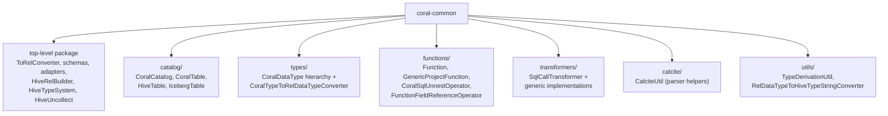
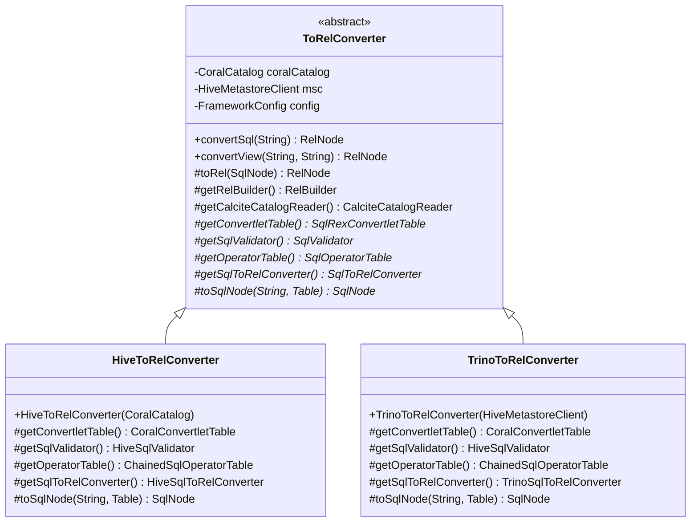

# 04 — coral-common: the foundation

`coral-common` is the module every other Coral module depends on. It holds the abstract `ToRelConverter` that wires Calcite's `FrameworkConfig` together, the Calcite `Schema` adapters that bridge LinkedIn's table metadata into Calcite, a small number of Calcite extension classes that fix Hive-specific semantics, and a few cross-cutting helpers (the `CoralCatalog` interface, the `CoralDataType` hierarchy, the `SqlCallTransformer` framework, and `FuzzyUnionSqlRewriter`). After this chapter you should know which subpackage owns what, and how a concrete dialect (Hive, Trino) plugs five abstract hooks into the template to become a working converter.

## Package map



The top-level package holds the Calcite-facing classes. `catalog/` and `types/` are the modern abstractions over LinkedIn's table metadata and dialect-neutral types (chapter 05 is their chapter). `functions/` collects Calcite `SqlOperator` subclasses Coral defines for its own intermediate-representation needs. `transformers/` is the `SqlCallTransformer` framework that backends compose into chains (chapter 07 is its chapter). `calcite/` and `utils/` are thin helpers.

## The abstract converter template

`com.linkedin.coral.common.ToRelConverter` is the central abstraction. It is `abstract` because it knows the *shape* of a SQL-to-RelNode pipeline but not the parser, validator, or operator table a specific dialect needs. Subclasses fill those slots in.



The five starred methods are the contract every subclass implements:

- `getConvertletTable()` — the `SqlRexConvertletTable` controlling how each `SqlCall` becomes a `RexCall` during the SqlNode → RelNode step. Both shipped subclasses return `CoralConvertletTable` (it lives in `coral-hive`); `CoralConvertletTable` keeps `CAST` calls intact and routes `FunctionFieldReferenceOperator` through a custom convertlet.
- `getSqlValidator()` — the `SqlValidator` that resolves identifiers against the schema and derives types. `HiveToRelConverter` returns `HiveSqlValidator` configured with `HIVE_SQL` conformance; `TrinoToRelConverter` returns `HiveSqlValidator` configured with `TRINO_SQL` conformance.
- `getOperatorTable()` — `SqlOperatorTable` the validator consults to resolve function names. Both subclasses chain `SqlStdOperatorTable.instance()` with `DaliOperatorTable`, the latter holding LinkedIn's Dali (LinkedIn's logical dataset platform) UDF registrations.
- `getSqlToRelConverter()` — the `SqlToRelConverter` instance that turns SqlNode into RelNode. Each dialect subclasses Calcite's `SqlToRelConverter` to override view expansion and inject the dialect's `RelBuilderFactory`.
- `toSqlNode(String, Table)` — the dialect frontend. Hive parses ANTLR-style with `ParseTreeBuilder` then runs `FuzzyUnionSqlRewriter` and `HiveSqlNodeToCoralSqlNodeConverter`. Trino uses `TrinoParserDriver` then `Trino2CoralOperatorConverter`.

### The three constructors

`ToRelConverter` exposes three constructors, each wiring a different schema implementation into the same `FrameworkConfig`:

```java
@Deprecated
protected ToRelConverter(@Nonnull HiveMetastoreClient hiveMetastoreClient) {
  ...
  schemaPlus.add(HiveSchema.ROOT_SCHEMA, new HiveSchema(hiveMetastoreClient));
  ...
}

protected ToRelConverter(@Nonnull CoralCatalog coralCatalog) {
  ...
  schemaPlus.add(CoralRootSchema.ROOT_SCHEMA, new CoralRootSchema(coralCatalog));
  ...
}

protected ToRelConverter(Map<String, Map<String, List<String>>> localMetaStore) {
  ...
  schemaPlus.add(HiveSchema.ROOT_SCHEMA, new LocalMetastoreHiveSchema(localMetaStore));
  ...
}
```

The deprecated `HiveMetastoreClient` constructor is the legacy path: Hive-only metadata, marked `@Deprecated` on the interface itself. The `CoralCatalog` constructor is the modern path and is what new client code should use — it routes through `CoralRootSchema` which dispatches to `HiveTable` or `IcebergTable` per row. The `localMetaStore` constructor is for tests and `coral-spark-plan`, where the in-memory `Map<db, Map<table, columns>>` stands in for a real metastore. Every constructor finishes the same way: instantiate `new Driver()` to register Calcite's JDBC driver, then build a `FrameworkConfig` with `HiveTypeSystem` as the `RelDataTypeSystem`, the dialect's operator table, the dialect's convertlet table, and `Programs.ofRules(Programs.RULE_SET)`.

The migration is in progress: `HiveMetastoreClient` and `HiveMscAdapter` are both `@Deprecated`, with javadocs pointing at issue #575 for the cleanup. PRs that touch catalog plumbing should land on the `CoralCatalog` path.

### convertSql and convertView

Once construction settles, the two public entry points are tiny:

```java
public RelNode convertSql(String sql) {
  return toRel(toSqlNode(sql));
}

public RelNode convertView(String hiveDbName, String hiveViewName) {
  SqlNode sqlNode = processView(hiveDbName, hiveViewName);
  return toRel(sqlNode);
}
```

`convertSql` runs the abstract `toSqlNode(String, Table)` with a null table (no view-creator's metadata to consult), then runs `toRel` which delegates to `getSqlToRelConverter().convertQuery(sqlNode, true, true).rel`.

`convertView` is more interesting because it has to fetch a view definition from the catalog before parsing. `processView` branches:

- If the converter was constructed with a `CoralCatalog`, `processViewWithCoralCatalog` calls `coralCatalog.getTable(dbName, tableName)` and inspects the returned `CoralTable`. A `HiveTable` of type `VIRTUAL_VIEW` yields the view's expanded text; any other `HiveTable` yields a synthesized `SELECT * FROM db.t`. An `IcebergTable` is run through `IcebergHiveTableConverter.toHiveTable(icebergTable)` to produce a minimal HMS `Table` for downstream code that still expects one — this conversion is tracked for removal in issue #575.
- If the converter was constructed with a `HiveMetastoreClient`, `processViewWithMsc` does the equivalent against `msc.getTable(...)`.

Either branch ends by calling `toSqlNode(viewText, hiveTable)`. The HMS `Table` parameter is what `ParseTreeBuilder` and `HiveFunctionResolver` need to read `TBLPROPERTIES('functions' = '...')` for Dali UDF resolution.

The protected `toRel(SqlNode)` also runs `convertQuery(sqlNode, true, true)` — the flags ask Calcite for the rel root and to flatten nested rows. `getRelBuilder()` lazily creates the `HiveRelBuilder` and installs `Hook.REL_BUILDER_SIMPLIFY.add(Hook.propertyJ(false))` to disable Calcite's boolean simplification (Calcite's truth tables don't match Hive's, and simplification would mutate the tree before the rewriter sees it).

`getCalciteCatalogReader()` returns a `MultiSchemaPathCalciteCatalogReader` — an inner subclass that lets the catalog reader resolve unqualified names against multiple schema paths (`["hive", "default"]`, `["hive"]`, and `[]`), so an unqualified `tbl` works as well as a fully-qualified `hive.default.tbl`.

## The schema layer

The schema layer is the bridge between LinkedIn's catalog metadata and Calcite's `org.apache.calcite.schema.Schema` interface. It exists in two parallel two-level hierarchies — a legacy one keyed by `HiveMetastoreClient`, and a modern one keyed by `CoralCatalog`:

- **Legacy:** `HiveSchema` (root) → `HiveDbSchema` (database) → `HiveCalciteTableAdapter` / `HiveCalciteViewAdapter`.
- **Modern:** `CoralRootSchema` (root) → `CoralDatabaseSchema` (database) → `HiveCalciteTableAdapter` / `HiveCalciteViewAdapter` / `IcebergCalciteTableAdapter`.
- **Test:** `LocalMetastoreHiveSchema` (root) → `LocalMetastoreHiveDbSchema` (database) → `LocalMetastoreHiveTable`. Used when the converter is constructed with a `Map`.

Both root schemas advertise themselves as `"hive"` — that's the literal value of `HiveSchema.ROOT_SCHEMA` and `CoralRootSchema.ROOT_SCHEMA`. The name stays `"hive"` for backward compatibility with existing SQL that qualifies tables as `hive.db.tbl`, even though `CoralRootSchema` is format-agnostic and routes Hive and Iceberg through the same interface. Root schemas hold no tables; they only enumerate sub-schemas. Database schemas hold no sub-schemas; they only enumerate tables and dispatch each lookup to the right adapter.

The dispatch in `CoralDatabaseSchema.getTable()` is the interesting part:

```java
if (coralTable instanceof IcebergTable) {
  return new IcebergCalciteTableAdapter((IcebergTable) coralTable);
} else if (coralTable instanceof HiveTable) {
  HiveTable hiveTable = (HiveTable) coralTable;
  if (hiveTable.tableType() == VIEW) {
    return new HiveCalciteViewAdapter(hiveTable, ImmutableList.of(CoralRootSchema.ROOT_SCHEMA, dbName));
  } else {
    return new HiveCalciteTableAdapter(hiveTable);
  }
}
```

A `HiveTable` of type `VIEW` is wrapped in `HiveCalciteViewAdapter` (which implements `TranslatableTable`, so Calcite recursively expands the view's body via `relContext.expandView(...)`); other `HiveTable` instances go to the plain `HiveCalciteTableAdapter`; Iceberg tables go to `IcebergCalciteTableAdapter`. The legacy `HiveDbSchema` does the same dispatch minus the Iceberg branch.

## Calcite adapters

The three `*CalciteTableAdapter` classes implement Calcite's `ScannableTable` so that a Hive or Iceberg table looks like something Calcite knows how to plan against. They are read-only — `scan(DataContext)` throws "Calcite runtime is not supported" — because Coral never executes a query, it only manipulates the plan.

- **`HiveCalciteTableAdapter`** wraps an HMS `org.apache.hadoop.hive.metastore.api.Table`. Beyond `getRowType(...)` it owns two methods that exist specifically for Dali integration: `getDaliFunctionParams()` reads the `'functions'` TBLPROPERTY (`func_name:com.linkedin.ClassName` pairs), and `getDaliUdfDependencies()` reads the `'dependencies'` TBLPROPERTY (Ivy coordinates). `HiveFunctionResolver` and `ParseTreeBuilder` in coral-hive read these to resolve Dali UDF calls when expanding a view.

  `getRowType(...)` in this adapter is currently in shadow-validation mode: it always returns the legacy `TypeConverter`-based path (`Hive TypeInfo` → Calcite directly), but it also runs the two-stage path (`Hive` → `CoralDataType` → Calcite via `CoralTypeToRelDataTypeConverter`) and logs a warning if the two disagree. The two-stage path will eventually become primary; see chapter 05 for the type system that path exercises.

- **`HiveCalciteViewAdapter`** extends `HiveCalciteTableAdapter` and adds `TranslatableTable.toRel(...)`, which calls `relContext.expandView(rowType, hiveTable.getViewExpandedText(), schemaPath, [tableName])`. That is what makes a `SELECT * FROM dali_view` get inlined into the caller's plan tree.

- **`IcebergCalciteTableAdapter`** wraps an `IcebergTable` from the `catalog/` package. It implements only the two-stage type conversion (`IcebergTable.getSchema()` already returns a `CoralDataType` `StructType`). It has no Dali UDF methods because Iceberg has no equivalent of HMS table properties for view-creator metadata; the workaround is `IcebergHiveTableConverter` upstream, which materializes a stand-in HMS `Table` for resolver consumption.

## Calcite extensions

Coral overrides three Calcite classes inside coral-common to align Calcite's defaults with Hive semantics.

**`HiveRelBuilder` extends `RelBuilder`.** Two real changes from the parent. First, `create(FrameworkConfig)` swaps the cluster's `RexBuilder` for one whose type factory is `CoralJavaTypeFactoryImpl` — that factory exists only to force `StructKind.PEEK_FIELDS_NO_EXPAND` on every struct type, so SQL like `SELECT structCol.field FROM tbl` validates without requiring a fully-qualified `tbl.structCol.field`. Second, `rename(List<String>)` is overridden to detect `HiveUncollect` and `Values` underneath. For those two cases it rebuilds the node with the new field names in place of stacking a `LogicalProject` on top. The payoff is in unparsed output: `FROM ... CROSS JOIN UNNEST(...)` instead of `FROM ... CROSS JOIN (SELECT ... FROM UNNEST(...))`.

**`HiveUncollect` extends Calcite's `Uncollect`.** Calcite's default `Uncollect` flattens `array<struct<a, b>>` into two separate output columns; Hive returns a single column of `struct<a, b>` per row. `HiveUncollect.deriveRowType()` keeps the struct intact for array-of-struct, defers to the parent for map operands (still emitting `KEY`/`VALUE` columns), and adds an `ORDINALITY` column when `withOrdinality` is set. The class exposes a `copy(RelDataType)` overload that `HiveRelBuilder.rename(...)` calls during the rename special-case.

**`HiveTypeSystem` extends `RelDataTypeSystemImpl`.** It defines Hive-faithful precision/scale rules — `DECIMAL` maxes at precision 38, scale 38; `VARCHAR` default precision is 65535; `TIMESTAMP` precision tops at 9. The validator uses these for type inference. Chapter 05 walks the type system in depth and connects it to `CoralDataType` and the conversion utilities; this chapter only flags that `ToRelConverter` installs `new HiveTypeSystem()` into every `FrameworkConfig`.

Note that `HiveRexBuilder` is not in coral-common — it lives in `coral-hive` at `coral-hive/src/main/java/com/linkedin/coral/hive/hive2rel/HiveRexBuilder.java` and is wired in only by `HiveToRelConverter.getSqlToRelConverter()`. `TrinoToRelConverter` uses the default `RexBuilder` from the rel builder.

## Cross-cutting machinery

A few classes don't slot into the converter/schema/extension story but are still in coral-common because every other module needs them.

**`FuzzyUnionSqlRewriter`** is a `SqlShuttle` that walks a `SqlNode` AST and, for every `SqlKind.UNION` node, computes the intersection of branch schemas (the "common subset" of columns) and wraps each branch in a generated `SELECT ... generic_project(col, 'col', hiveTypeString) AS col ... FROM (branch) AS table_name`. The motivation is LinkedIn-specific: a Dali view defined as `SELECT * FROM a UNION ALL SELECT * FROM b` deploys when `a` and `b` have identical struct schemas, but Avro evolution can add fields to `b` later and break the view at query time. The rewriter restores the deployed common schema using `GenericProjectFunction` as a placeholder UDF that backends downstream (`coral-spark`, `coral-trino`) resolve into engine-specific SQL. Chapter 15 covers the full fuzzy-union story including how engines materialize `generic_project`.

**The `functions/` package** holds the `SqlOperator` subclasses Coral defines for its own IR. `Function` is the plain wrapper carrying a function name plus its `SqlOperator` (built by `ParseTreeBuilder` when it resolves a Hive function call). `CoralSqlUnnestOperator` overrides Calcite's `SqlUnnestOperator` so that unnesting an `array<struct>` returns one struct-typed column instead of fanning out struct fields — the unparse-time companion of `HiveUncollect`. `FunctionFieldReferenceOperator` is the `.` operator used to write `f(x).field` for struct-returning functions, in the form `SqlBinaryOperator` with `SqlKind.DOT`. `GenericProjectFunction` is the placeholder UDF `FuzzyUnionSqlRewriter` emits. Other entries (`FunctionRegistry`, `FunctionReturnTypes`, `OperandTypeInference`, `SameOperandTypeExceptFirstOperandChecker`) are small utilities supporting the four main types.

**The `transformers/` package** holds the `SqlCallTransformer` framework. `SqlCallTransformer` is the abstract base (`boolean condition(SqlCall)` + `SqlCall transform(SqlCall)`); `SqlCallTransformers` is the ordered container that applies them in sequence. Three generic implementations sit alongside the base: `OperatorRenameSqlCallTransformer` (rename one operator to another), `SourceOperatorMatchSqlCallTransformer` (match by source-side operator name), and `JsonTransformSqlCallTransformer` (data-driven from a JSON spec). Every backend assembles its own chain of these plus dialect-specific subclasses. Chapter 07 walks the framework end-to-end.

**The `catalog/` package** holds the `CoralCatalog` interface and the `CoralTable` hierarchy (`HiveTable`, `IcebergTable`, plus `IcebergHiveTableConverter` and the `TableType` enum). This is the modern abstraction over LinkedIn's table metadata. New code uses `CoralCatalog`; deprecated code still uses `HiveMetastoreClient`. Chapter 05 covers the catalog and types in detail.

**The `types/` package** holds the `CoralDataType` hierarchy — a dialect-neutral type representation independent of both Calcite's `RelDataType` (which carries framework state) and Hive's `TypeInfo` (which carries Hadoop dependencies). Chapter 05 covers the types and their conversion utilities.

**`utils/` and `calcite/`** are small helper packages. `TypeDerivationUtil` lets a transformer ask "what would Calcite infer as the type of this `SqlCall`?" without re-running the whole validator. `RelDataTypeToHiveTypeStringConverter` produces the Hive type string that `GenericProjectFunction` embeds in its third operand. `CalciteUtil` wraps `SqlParser` with Coral's preferred parser config (Oracle 10 conformance, case-insensitive, unchanged casing).

## Files this chapter discusses

- `coral-common/src/main/java/com/linkedin/coral/common/ToRelConverter.java`
- `coral-common/src/main/java/com/linkedin/coral/common/HiveSchema.java`
- `coral-common/src/main/java/com/linkedin/coral/common/HiveDbSchema.java`
- `coral-common/src/main/java/com/linkedin/coral/common/CoralRootSchema.java`
- `coral-common/src/main/java/com/linkedin/coral/common/CoralDatabaseSchema.java`
- `coral-common/src/main/java/com/linkedin/coral/common/LocalMetastoreHiveSchema.java`
- `coral-common/src/main/java/com/linkedin/coral/common/HiveCalciteTableAdapter.java`
- `coral-common/src/main/java/com/linkedin/coral/common/HiveCalciteViewAdapter.java`
- `coral-common/src/main/java/com/linkedin/coral/common/IcebergCalciteTableAdapter.java`
- `coral-common/src/main/java/com/linkedin/coral/common/HiveRelBuilder.java`
- `coral-common/src/main/java/com/linkedin/coral/common/HiveUncollect.java`
- `coral-common/src/main/java/com/linkedin/coral/common/HiveTypeSystem.java`
- `coral-common/src/main/java/com/linkedin/coral/common/CoralJavaTypeFactoryImpl.java`
- `coral-common/src/main/java/com/linkedin/coral/common/HiveMetastoreClient.java`
- `coral-common/src/main/java/com/linkedin/coral/common/HiveMscAdapter.java`
- `coral-common/src/main/java/com/linkedin/coral/common/FuzzyUnionSqlRewriter.java`
- `coral-common/src/main/java/com/linkedin/coral/common/TypeConverter.java`
- `coral-common/src/main/java/com/linkedin/coral/common/functions/Function.java`
- `coral-common/src/main/java/com/linkedin/coral/common/functions/CoralSqlUnnestOperator.java`
- `coral-common/src/main/java/com/linkedin/coral/common/functions/FunctionFieldReferenceOperator.java`
- `coral-common/src/main/java/com/linkedin/coral/common/functions/GenericProjectFunction.java`
- `coral-common/src/main/java/com/linkedin/coral/common/transformers/SqlCallTransformer.java`
- `coral-common/src/main/java/com/linkedin/coral/common/transformers/SqlCallTransformers.java`
- `coral-common/src/main/java/com/linkedin/coral/common/calcite/CalciteUtil.java`
- `coral-common/src/main/java/com/linkedin/coral/common/utils/TypeDerivationUtil.java`
- `coral-common/src/main/java/com/linkedin/coral/common/utils/RelDataTypeToHiveTypeStringConverter.java`
- `coral-hive/src/main/java/com/linkedin/coral/hive/hive2rel/HiveToRelConverter.java`
- `coral-trino/src/main/java/com/linkedin/coral/trino/trino2rel/TrinoToRelConverter.java`

## Read next

- Chapter 05 — the `CoralCatalog` and `CoralDataType` hierarchies you saw referenced throughout this chapter.
- Chapter 07 — the `SqlCallTransformer` framework that lives in `transformers/`.
- Chapter 15 — `FuzzyUnionSqlRewriter` and the rest of the LinkedIn-specific machinery.
