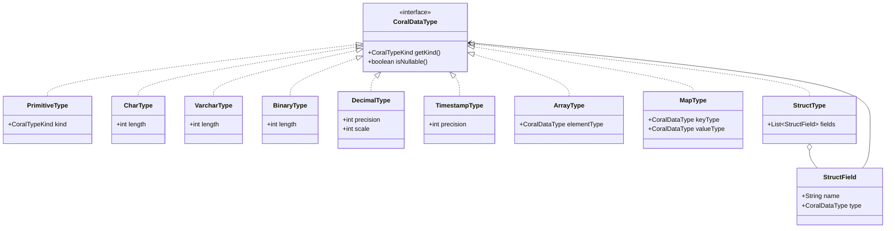
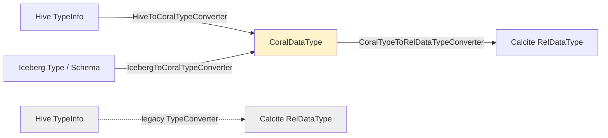

# 05 — Type system and CoralCatalog

Two intertwined abstractions sit in `coral-common` and surface in every other module: `CoralDataType`, a dialect-neutral description of types, and `CoralCatalog`, a unified table-lookup interface that hides whether a table comes from the Hive Metastore (HMS) or an Iceberg catalog. After this chapter you can read the `types/` and `catalog/` packages without bouncing back to Calcite or HMS docs, and you can spot the `HiveMetastoreClient` → `CoralCatalog` migration in a PR diff.

## Why a separate type system exists

Coral has long had a type plumbing problem. Calcite's `RelDataType` is the type that ends up inside `RelNode` trees, but constructing one requires a `RelDataTypeFactory` and a configured type system — it is loaded with framework state. Hive's `TypeInfo` is the type that arrives from HMS, but it drags in the entire `org.apache.hadoop.hive.serde2` jar and is meaningless to Iceberg code. Neither is a good lingua franca for a catalog that needs to describe an Iceberg table without booting Calcite, or for a frontend that wants to talk about a table's schema before validation.

`CoralDataType` is that lingua franca. It is a plain Java interface in `coral-common/src/main/java/com/linkedin/coral/common/types/CoralDataType.java` with two methods — `getKind()` and `isNullable()` — and a small closed hierarchy of immutable implementations. No factory, no Hadoop dependency, no Calcite dependency. Anything that holds a schema in a Coral abstraction holds a `CoralDataType`, and conversions to and from concrete planner types happen at well-defined boundaries.

## The CoralDataType hierarchy



Every implementation in the `types/` package is `final`, immutable, constructed through a static `of(...)` factory, and overrides `equals`/`hashCode`/`toString`. The split between `PrimitiveType` and the per-type classes is deliberate:

- `PrimitiveType` is the catch-all for kinds that need no parameters beyond nullability: `BOOLEAN`, `TINYINT`, `SMALLINT`, `INT`, `BIGINT`, `FLOAT`, `DOUBLE`, `STRING`, `DATE`, `TIME`, `NULL`. It carries the `CoralTypeKind` enum value and a `nullable` flag, nothing more.
- `CharType` and `VarcharType` carry a `length` (`length > 0`).
- `BinaryType` carries a `length` that can be `LENGTH_UNBOUNDED = -1` to distinguish variable-length binary (Hive `BINARY`, Iceberg `BINARY`) from fixed-length binary (Iceberg `FIXED(n)`).
- `DecimalType` carries `precision` and `scale`, with the invariant `0 <= scale <= precision`.
- `TimestampType` carries a fractional-second `precision` in `[0, 9]`, plus a `PRECISION_NOT_SPECIFIED = -1` sentinel for Hive's "no explicit precision" case.
- `ArrayType` and `MapType` recurse: an `ArrayType` wraps an element `CoralDataType`; a `MapType` wraps key and value `CoralDataType`s.
- `StructType` wraps a `List<StructField>`; `StructField` is a `(name, CoralDataType)` pair. `StructType` is also the type used for a whole-table schema — `CoralTable.getSchema()` returns one.

### Enum dispatch via CoralTypeKind

The `getKind()` method returns a `CoralTypeKind` value from a flat enum in `coral-common/src/main/java/com/linkedin/coral/common/types/CoralTypeKind.java`:

```
BOOLEAN, TINYINT, SMALLINT, INT, BIGINT, FLOAT, DOUBLE, DECIMAL,
CHAR, VARCHAR, STRING,
DATE, TIME, TIMESTAMP,
BINARY,
NULL,
ARRAY, MAP, STRUCT
```

Note that `STRING` and `VARCHAR` are distinct kinds even though they collapse to the same Calcite type — this lets the converter chain remember that the source said `STRING` and preserve that intent through downstream stages.

A converter that needs to walk a `CoralDataType` can either dispatch on `getKind()` (cheap, switch on an enum) or on `instanceof` (gives you access to the per-class parameters without a cast). `CoralTypeToRelDataTypeConverter` uses `instanceof` because it needs `getLength()`, `getPrecision()`, `getScale()`, etc.; converters that only need to ask "is this a primitive or a composite?" use the enum.

## Three converters, three directions

There are three live converters that operate on `CoralDataType`, plus a fourth legacy converter that pre-dates the type system.



### HiveToCoralTypeConverter

File: `coral-common/src/main/java/com/linkedin/coral/common/HiveToCoralTypeConverter.java`. A utility class with one public method, `convert(TypeInfo)`, that dispatches on `TypeInfo.getCategory()`:

- `PRIMITIVE` → maps each Hive primitive category to the matching Coral kind. `STRING` becomes `PrimitiveType.of(STRING, true)` rather than a `VarcharType`, preserving the source intent. `TIMESTAMP` becomes `TimestampType.of(PRECISION_NOT_SPECIFIED, true)` to match Hive's "no explicit precision" semantics. `BINARY` becomes an unbounded `BinaryType`.
- `LIST` → `ArrayType`; `MAP` → `MapType`; `STRUCT` → `StructType` with recursive conversion.
- `UNION` → flattened to a struct whose fields are `(tag: INT, field0, field1, ...)`. This Trino-compatible flattening matches `TypeConverter`'s output (see linked trinodb PR in `IcebergToCoralTypeConverter`).

Every produced type is nullable, matching Hive's "data is external, so everything is nullable" convention.

### IcebergToCoralTypeConverter

File: `coral-common/src/main/java/com/linkedin/coral/common/IcebergToCoralTypeConverter.java`. Same shape — `convert(Schema)` for a whole schema, `convert(Type, boolean)` for a single field — but with two differences from the Hive path:

- Nullability is **carried through** from Iceberg's `isOptional()` / `isElementOptional()` / `isValueOptional()` flags, not blanket-true. Iceberg map keys are forced to `nullable=false` because Iceberg requires it.
- Type mappings differ: Iceberg `STRING` maps to `VarcharType.of(Integer.MAX_VALUE, ...)` rather than `PrimitiveType.of(STRING, ...)`; Iceberg `UUID` maps to `CharType.of(36, ...)`; Iceberg `FIXED(n)` maps to a fixed-length `BinaryType`; Iceberg `TIMESTAMP` maps to `TimestampType.of(6, ...)` (microsecond precision). The class flags as a known limitation that Iceberg's `withZone()` / `withoutZone()` distinction is currently collapsed — both reach the same `TIMESTAMP` case.

### CoralTypeToRelDataTypeConverter

File: `coral-common/src/main/java/com/linkedin/coral/common/types/CoralTypeToRelDataTypeConverter.java`. Takes a `CoralDataType` plus a Calcite `RelDataTypeFactory` and produces a `RelDataType`. The factory is the caller's — typically the one wired up with `HiveTypeSystem`, which controls precision and scale rules during construction.

The conversion is mechanical: `instanceof` on the Coral type, build the matching `SqlTypeName` via the factory, recurse for `ArrayType` / `MapType` / `StructType`, then apply nullability with `factory.createTypeWithNullability(...)`. Two cases worth noting:

- `TimestampType` checks `hasPrecision()` and only passes a precision argument when one was specified — otherwise it calls `factory.createSqlType(SqlTypeName.TIMESTAMP)` without precision, matching Calcite's "PRECISION_NOT_SPECIFIED" handling.
- `BinaryType` similarly branches on `isFixedLength()` to decide whether to pass a length.

A `PrimitiveType` of kind `STRING` lands here as `VARCHAR(Integer.MAX_VALUE)`, the same encoding Hive's `STRING` uses in Calcite.

### The legacy TypeConverter

`coral-common/src/main/java/com/linkedin/coral/common/TypeConverter.java` is the older path. It takes a Hive `TypeInfo` directly to a Calcite `RelDataType`, skipping `CoralDataType` entirely, and it also provides the reverse direction (`RelDataType` → `TypeInfo`). The file header notes it was copied from `org.apache.hadoop.hive.ql.optimizer.calcite.translator.TypeConverter`. It is still on call sites that pre-date the `CoralDataType` work — `HiveSchema`, parts of `coral-schema`, the older `HiveCalciteTableAdapter` — and the practical migration is to route new code through `HiveToCoralTypeConverter` then `CoralTypeToRelDataTypeConverter` instead. When you see `TypeConverter.convert(...)` in a diff, treat it as a code smell unless the surrounding context cannot yet hold a `CoralDataType`.

## HiveTypeSystem: where the precision rules live

`coral-common/src/main/java/com/linkedin/coral/common/HiveTypeSystem.java` extends Calcite's `RelDataTypeSystemImpl` and overrides the methods that govern numeric precision/scale, default lengths, and a few arithmetic-result rules. The values are copied verbatim from Hive source:

- `MAX_DECIMAL_PRECISION = 38`, `MAX_DECIMAL_SCALE = 38`, `DEFAULT_DECIMAL_PRECISION = 10`.
- `DEFAULT_VARCHAR_PRECISION = 65535`, `DEFAULT_CHAR_PRECISION = 255`. `MAX_CHAR_PRECISION = Integer.MAX_VALUE` because Hive's `STRING` is encoded as `VARCHAR(Integer.MAX_VALUE)`.
- `MAX_BINARY_PRECISION = Integer.MAX_VALUE`, `MAX_TIMESTAMP_PRECISION = 9`.
- Default integer precisions: `TINYINT=3`, `SMALLINT=5`, `INTEGER=10`, `BIGINT=19`.
- `isSchemaCaseSensitive() = false` and `shouldConvertRaggedUnionTypesToVarying() = true` match Hive's case-insensitivity and Hive's union-promotion rules.
- `deriveSumType` widens integers (TINYINT/SMALLINT → INTEGER, INTEGER/BIGINT → BIGINT) and reals (FLOAT/REAL → DOUBLE), matching Hive's `SUM` return types.
- `deriveDecimalDivideType` returns a nullable `DOUBLE` when neither operand is decimal — that is the Hive/Spark `/` rule for non-decimal operands, and without this override Calcite would return a decimal.
- `deriveDecimalMultiplyType` returns a nullable `BIGINT` when both operands are exact-numeric non-decimal and at least one is `BIGINT`.

Every backend feeds its `RelDataTypeFactory` with a `HiveTypeSystem`, so the type behavior that downstream code observes — what `DECIMAL(38,10) + DECIMAL(20,5)` widens to, what `SUM(int_col)` infers — is consistent across Hive, Spark, and Trino emission paths. If you change a precision rule here, you change every backend's output for that case.

## CoralCatalog and CoralTable

The `catalog/` package mirrors the layering of the type system: an interface, two implementations, plus a temporary bridge.

`CoralCatalog` (`coral-common/src/main/java/com/linkedin/coral/common/catalog/CoralCatalog.java`) has four methods:

```java
CoralTable getTable(String namespace, String tableName);
boolean    namespaceExists(String namespace);
List<String> getAllTables(String namespace);
List<String> getAllNamespaces();
```

That is the entire contract. Implementations decide how to talk to a metastore, how to authenticate, how to cache; the upper layers do not know. Callers receive a `CoralTable` and call `getSchema()` to get a `CoralDataType` (always a `StructType` at the top level), `name()` for the qualified `"db.table"` string, `tableType()` for `TABLE` vs. `VIEW`, and `properties()` for the property map.

`TableType` is a two-value enum in `coral-common/src/main/java/com/linkedin/coral/common/catalog/TableType.java`: `TABLE` and `VIEW`. Hive's `MANAGED_TABLE`, `EXTERNAL_TABLE`, and Iceberg's physical tables collapse to `TABLE`; Hive's `VIRTUAL_VIEW` and `MATERIALIZED_VIEW` collapse to `VIEW`.

### HiveTable

`coral-common/src/main/java/com/linkedin/coral/common/catalog/HiveTable.java` wraps an HMS `org.apache.hadoop.hive.metastore.api.Table`. `name()` concatenates `getDbName()` and `getTableName()`; `properties()` returns `getParameters()`; `tableType()` returns `VIEW` if the Hive table-type string contains `"VIEW"` (case-insensitive), else `TABLE`. `getSchema()` does the real work: it iterates the storage descriptor's columns plus the partition keys, deduplicates by name, parses each Hive type string into a `TypeInfo` via `TypeInfoUtils.getTypeInfoFromTypeString(...)`, then runs it through `HiveToCoralTypeConverter.convert(...)`. The resulting fields become a top-level `StructType`.

There is an internal escape hatch: `getHiveTable()` returns the wrapped HMS table. It is marked `@deprecated` and "INTERNAL API". `IcebergHiveTableConverter` is the only legitimate caller; new code should not reach for it.

### IcebergTable

`coral-common/src/main/java/com/linkedin/coral/common/catalog/IcebergTable.java` wraps an `org.apache.iceberg.Table`. `name()` calls `table.name()`; `tableType()` is always `TABLE`; `properties()` defensively copies `table.properties()`. `getSchema()` calls `IcebergToCoralTypeConverter.convert(table.schema())` and returns the resulting `StructType`. As with `HiveTable`, `getIcebergTable()` is an internal escape hatch.

### IcebergHiveTableConverter and issue #575

`coral-common/src/main/java/com/linkedin/coral/common/catalog/IcebergHiveTableConverter.java` is the bridge that exists for one reason: `ParseTreeBuilder` and `HiveFunctionResolver` in `coral-hive` are currently typed against HMS `Table`, not `CoralTable`. When the pipeline encounters an Iceberg table, `ToRelConverter.processViewWithCoralCatalog` calls `IcebergHiveTableConverter.toHiveTable(icebergTable)` to synthesize a minimal HMS `Table`: it parses `db.table` out of `icebergTable.name()`, copies the property map (including Dali UDF metadata keys `"functions"` and `"dependencies"`), runs Iceberg's schema through Iceberg's own `HiveSchemaUtil.convert(...)` to populate the storage descriptor's columns, and stamps the table type as `MANAGED_TABLE`.

The class header says outright that this is **temporary bridge code** tracked by [issue #575](https://github.com/linkedin/coral/issues/575). The endgame is to refactor `ParseTreeBuilder` and `HiveFunctionResolver` to accept `CoralTable` directly, at which point `IcebergTable` flows through without conversion. Until then, every Iceberg view path runs through this synthesis step. Chapter 03 walks the specific call site.

## The migration off HiveMetastoreClient

`coral-common/src/main/java/com/linkedin/coral/common/HiveMetastoreClient.java` is annotated `@Deprecated` with javadoc pointing at `CoralCatalog`:

```java
/**
 * @deprecated Use {@link com.linkedin.coral.common.catalog.CoralCatalog} instead.
 *             CoralCatalog provides a unified interface supporting multiple table formats
 *             (Hive, Iceberg, etc.) while this interface is Hive-specific.
 *             Existing code using HiveMetastoreClient continues to work.
 */
@Deprecated
public interface HiveMetastoreClient { ... }
```

`ToRelConverter` carries both constructors side by side:

```java
@Deprecated
protected ToRelConverter(@Nonnull HiveMetastoreClient hiveMetastoreClient) { ... }

protected ToRelConverter(@Nonnull CoralCatalog coralCatalog) { ... }
```

Internally, `ToRelConverter` holds both fields (`private final CoralCatalog coralCatalog; private final HiveMetastoreClient msc;`) and switches on which one is non-null. `processView(db, name)` branches to either `processViewWithCoralCatalog` or the legacy path; the legacy path stays Hive-only, while the catalog path detects `HiveTable` vs. `IcebergTable` and chooses the right extraction logic. See `processViewWithCoralCatalog` in `ToRelConverter` for the live branching, and chapter 03 for the full pipeline walk.

For a PR reviewer, the implication is simple:

- **Prefer the `CoralCatalog` path.** New constructors, new test fixtures, new schema adapters should all be parameterized on `CoralCatalog`, not `HiveMetastoreClient`. New `coral-spark`, `coral-trino`, `coral-schema` entrypoints should accept `CoralCatalog`.
- **Flag the reverse.** A PR that adds a new method or class typed against `HiveMetastoreClient` is moving in the wrong direction. Ask whether `CoralCatalog` works.
- **Preserve backward compatibility.** Existing public APIs that take `HiveMetastoreClient` continue to work and should keep working — the migration is additive. Removing the deprecated path is a separate, larger change.
- **Watch for `getHiveTable()` / `getIcebergTable()`.** These are internal escape hatches. The only legitimate caller of `getHiveTable()` is `IcebergHiveTableConverter` (until issue #575 lands). The only legitimate callers of `getIcebergTable()` are similar bridge utilities. Anything else touching these methods is leaking the underlying format and should be reworked to use `CoralTable.getSchema()` / `properties()`.

The pattern is consistent across the package: the interface is dialect-neutral; the implementations wrap dialect-specific objects; the wrapped object is reachable but discouraged. The pressure on review is to keep the abstraction holding.

## Reviewer cheat sheet for this chapter's code

Chapter 16 has the full per-module checklist. The slice that applies to type and catalog code:

- New schema-bearing class: hold `CoralDataType`, not `RelDataType` or `TypeInfo`.
- New catalog-bearing class: accept `CoralCatalog`, not `HiveMetastoreClient`.
- New type conversion: route through `HiveToCoralTypeConverter` → `CoralTypeToRelDataTypeConverter` (or the Iceberg equivalent). `TypeConverter.convert(...)` is legacy.
- Touching `HiveTypeSystem` precision rules: assume every backend (Hive, Spark, Trino, Pig, schema) feels the change. Add tests on at least two backends.
- Adding a new Iceberg type case: also add the Hive equivalent so the two converters stay symmetric where the underlying types are.
- Calling `IcebergHiveTableConverter.toHiveTable(...)` from new code: probably wrong. The bridge is for `ToRelConverter` only, and even that is tracked for removal.

## Files this chapter discusses

- `coral-common/src/main/java/com/linkedin/coral/common/catalog/CoralCatalog.java`
- `coral-common/src/main/java/com/linkedin/coral/common/catalog/CoralTable.java`
- `coral-common/src/main/java/com/linkedin/coral/common/catalog/HiveTable.java`
- `coral-common/src/main/java/com/linkedin/coral/common/catalog/IcebergTable.java`
- `coral-common/src/main/java/com/linkedin/coral/common/catalog/IcebergHiveTableConverter.java`
- `coral-common/src/main/java/com/linkedin/coral/common/catalog/TableType.java`
- `coral-common/src/main/java/com/linkedin/coral/common/HiveTypeSystem.java`
- `coral-common/src/main/java/com/linkedin/coral/common/HiveToCoralTypeConverter.java`
- `coral-common/src/main/java/com/linkedin/coral/common/IcebergToCoralTypeConverter.java`
- `coral-common/src/main/java/com/linkedin/coral/common/TypeConverter.java`
- `coral-common/src/main/java/com/linkedin/coral/common/HiveMetastoreClient.java`
- `coral-common/src/main/java/com/linkedin/coral/common/types/CoralDataType.java`
- `coral-common/src/main/java/com/linkedin/coral/common/types/CoralTypeKind.java`
- `coral-common/src/main/java/com/linkedin/coral/common/types/PrimitiveType.java`
- `coral-common/src/main/java/com/linkedin/coral/common/types/CharType.java`
- `coral-common/src/main/java/com/linkedin/coral/common/types/VarcharType.java`
- `coral-common/src/main/java/com/linkedin/coral/common/types/BinaryType.java`
- `coral-common/src/main/java/com/linkedin/coral/common/types/DecimalType.java`
- `coral-common/src/main/java/com/linkedin/coral/common/types/TimestampType.java`
- `coral-common/src/main/java/com/linkedin/coral/common/types/ArrayType.java`
- `coral-common/src/main/java/com/linkedin/coral/common/types/MapType.java`
- `coral-common/src/main/java/com/linkedin/coral/common/types/StructType.java`
- `coral-common/src/main/java/com/linkedin/coral/common/types/StructField.java`
- `coral-common/src/main/java/com/linkedin/coral/common/types/CoralTypeToRelDataTypeConverter.java`

## Read next

- Chapter 06 — `coral-hive`, the first concrete user of `CoralCatalog` and `HiveToCoralTypeConverter` end-to-end.
- Chapter 10 — `coral-schema`, where `CoralDataType` flows into Avro schema derivation.
- Chapter 16 — reviewer's checklist, including the full type/catalog migration rules referenced above.
