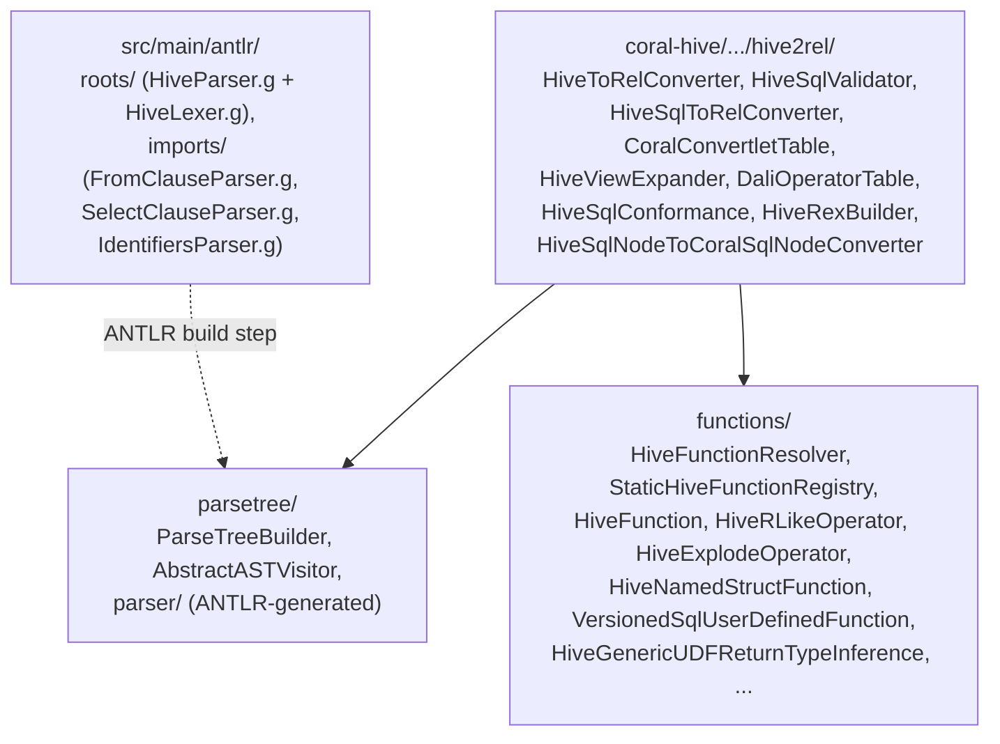

# 06 — coral-hive: the reference frontend

`coral-hive` is the most-used frontend in the codebase and the template every other dialect frontend imitates. It parses HiveQL (and, by extension, the Hive-compatible subset of Spark SQL) into Coral IR by composing six pieces: an ANTLR-generated lexer/parser that emits Hive's own `ASTNode` tree, a `ParseTreeBuilder` that translates that tree into Calcite `SqlNode`s, a function resolver that binds every call to a `SqlOperator`, a small normalization shuttle, the Hive-tweaked validator and `SqlToRelConverter`, and a minimal convertlet table. After this chapter you can navigate `parsetree/`, `functions/`, and the top-level `hive2rel/` package; you understand how Hive function resolution actually works, including the Dali UDF path; and you can recognize the `FuzzyUnionSqlRewriter` and `HiveViewExpander` flows when they show up in a PR.

## Package layout



`HiveToRelConverter` extends `coral-common`'s `ToRelConverter` and fills in the five abstract hooks [chapter 04](04-coral-common.md) lays out. Each hook resolves to one class in the top-level package, so reading `HiveToRelConverter` is the fastest way to find the rest.

## ANTLR grammar

Hive's grammar lives under `coral-hive/src/main/antlr/`, split between two folders that ANTLR processes together:

- `roots/com/linkedin/coral/hive/hive2rel/parsetree/parser/HiveParser.g` and `HiveLexer.g` are the root lexer and parser grammars. These are inherited (with minor LinkedIn patches) from Apache Hive.
- `imports/` holds `FromClauseParser.g`, `SelectClauseParser.g`, and `IdentifiersParser.g` — three sub-grammars that the root parser composes via ANTLR's `import` directive.

ANTLR compiles these into Java sources under `coral-hive/src/main/java/com/linkedin/coral/hive/hive2rel/parsetree/parser/` (the directory is generated; the parser-related Java classes shipped as source files — `CoralParseDriver`, `ParseDriver`, `Node` — wrap the ANTLR output). The parser produces an `ASTNode` tree: every node carries an integer `type` (one of the `HiveParser.TOK_*` constants such as `TOK_SELECT`, `TOK_FUNCTION`, `TOK_TABLE_OR_COL`) and a `text` string. There is no polymorphism — every traversal switches on the type code.

You will never edit ANTLR output by hand; the generated sources flow through the build. PRs that touch a `.g` file must trigger the ANTLR regeneration step in Gradle for downstream code to compile. If you see a grammar change in a PR without an accompanying refresh, that is a red flag — [chapter 16](16-pr-review-companion.md)'s PR checklist calls it out.

## ParseTreeBuilder

[`coral-hive/src/main/java/com/linkedin/coral/hive/hive2rel/parsetree/ParseTreeBuilder.java`](../coral-hive/src/main/java/com/linkedin/coral/hive/hive2rel/parsetree/ParseTreeBuilder.java) is where `ASTNode` becomes `SqlNode`. The class extends `AbstractASTVisitor<SqlNode, ParseContext>`, an internal walker that dispatches on `ASTNode.getType()` to a named `visitXxx(ASTNode, C ctx)` method — `visitSelect`, `visitFunction`, `visitJoin`, `visitTabRefNode`, and so on. `AbstractASTVisitor` exists because Hive's AST is untyped and visitor-hostile; the dispatch table reproduces the missing polymorphism.

Three entry points matter:

- `processSql(String sql)` — public method for free SQL. Internally calls `process(sql, null)`. Used by `convertSql` paths in `ToRelConverter`.
- `process(String sql, Table hiveView)` — public method that runs `CoralParseDriver.parse(sql)` to get the `ASTNode` root and then hands it to `processAST`. The optional `hiveView` is the HMS table whose properties hold the Dali UDF mapping.
- `processAST(ASTNode node, Table hiveView)` — private method that builds a `ParseContext(hiveView)` and calls `visit(node, ctx)`. The `ParseContext` is the per-traversal state carrier (currently holds the optional Hive view table and a fetch limit).

The visitor methods walk the tree depth-first. `visitSelect` returns a `SqlSelect`; `visitFunction` returns a `SqlCall` whose operator was looked up via `HiveFunctionResolver`; `visitJoin` builds a `SqlJoin` with the right `JoinConditionType`; `visitTabnameNode` builds a multi-part `SqlIdentifier`. The interesting machinery shows up around Hive constructs that have no direct Calcite analogue:

- `visitLateralView` and `visitLateralViewOuter` rewrite Hive's `LATERAL VIEW EXPLODE(arr) t AS col` into a Calcite `SqlJoin` with an `UNNEST` table function on the right side. Map operands, posexplode, and the OUTER variant each hit a slightly different branch. The OUTER branch synthesizes an `if(b IS NOT NULL AND cardinality(b) > 0, b, ARRAY[null])` wrapper so empty arrays do not silently drop rows.
- `visitLateralViewUDTF` handles user-defined table functions. It pulls the UDTF's return field names out of `StaticHiveFunctionRegistry.UDTF_RETURN_FIELD_NAME_MAP` and rewrites the lateral view into a `LATERAL COLLECTION_TABLE(...) AS t(col1, col2, ...)` shape that Calcite's validator accepts.
- `visitLateralViewJsonTuple` rewrites `LATERAL VIEW json_tuple(json, p1, p2) jt AS a, b` into a lateral subquery of `IF(p_i matches a safe-key regex, CAST(get_json_object(json, '$["p_i"]') AS VARCHAR), NULL) AS a_i`. This keeps the json-tuple semantics intact while reusing standard operators downstream.

Function resolution happens during the walk. `visitFunctionInternal` is the workhorse:

```java
String functionName = functionNode.getText();
List<SqlNode> sqlOperands = visitChildren(children, ctx);
Function hiveFunction = functionResolver.tryResolve(functionName,
    ctx.hiveTable.orElse(null),
    sqlOperands.size() - 1);
return hiveFunction.createCall(sqlOperands.get(0),
    sqlOperands.subList(1, sqlOperands.size()),
    quantifier);
```

That single `tryResolve` call is where every `lower(b)`, every `length(s)`, and every Dali UDF reference is bound to a concrete `SqlOperator`. `visitFunctionInternal` also does two surface tweaks: it folds window-spec children (`TOK_WINDOWSPEC`) into a Calcite `OVER` call, and it rewrites the SQL standard name `SUBSTRING` to `SUBSTR` so Calcite's stock operator does not override Hive's registration.

`visitBinaryOperator` and `visitUnaryOperator` go through `functionResolver.resolveBinaryOperator` / `resolveUnaryOperator`, which consult `SqlStdOperatorTable` plus a couple of Hive additions (`REGEXP`, `RLIKE`). The whole pass returns a complete, but unvalidated and untyped, `SqlNode` tree.

## Function resolution

`HiveFunctionResolver` (`coral-hive/.../functions/HiveFunctionResolver.java`) is the brain. It holds three things: a `FunctionRegistry` (concretely `StaticHiveFunctionRegistry`), a `ConcurrentHashMap<String, Function>` "dynamic" registry for Dali UDFs discovered at runtime, and an aggregated `List<SqlOperator>` that adds the Hive-only `HiveRLikeOperator.REGEXP` and `HiveRLikeOperator.RLIKE` on top of `SqlStdOperatorTable.instance().getOperatorList()`.

The two methods that matter:

- `resolve(String functionName)` returns the static-registry matches if any; otherwise it returns the dynamic-registry match (or empty). This is the read path `DaliOperatorTable` uses during validation.
- `tryResolve(String name, Table hiveTable, int numOfOperands)` returns a single `Function` (the `coral-common` wrapper around a `SqlOperator`) or throws `UnknownSqlFunctionException`. It first tries the static registry by name; if that misses and a `Table` is in scope, it falls into `tryResolveAsDaliFunction`.

The Dali path is the interesting half. `tryResolveAsDaliFunction` reads the view's `TBLPROPERTIES('functions' = 'fnName:com.linkedin.X.Y;fnName2:...')` via `HiveCalciteTableAdapter.getDaliFunctionParams()`, looks up `fnName` to get a fully-qualified class name, optionally strips a `coral_udf_version_x_y_z.` prefix (the versioned-UDF convention), and tries the static registry again under that class name. If it lands, the resolver wraps the operator in a `VersionedSqlUserDefinedFunction` that also carries the Ivy `dependencies` TBLPROPERTY so backends downstream can register the JAR. If it misses, it falls into `resolveDaliFunctionDynamically`, which constructs a stand-in `SqlUserDefinedFunction` with `HiveGenericUDFReturnTypeInference` for return-type derivation and adds the result to the dynamic registry.

### StaticHiveFunctionRegistry

`StaticHiveFunctionRegistry` (`coral-hive/.../functions/StaticHiveFunctionRegistry.java`) is an 800-line static initializer that hard-codes the catalog of Hive built-ins. It exposes one method, `lookup(String name)`, against a `Multimap<String, Function>` keyed by lowercased function name. The entries are populated in a single `static {}` block that calls one of three registration helpers per function:

- `addFunctionEntry("lower", LOWER)` — register a name against a pre-built Calcite `SqlOperator` (typical for things `SqlStdOperatorTable` already implements).
- `createAddUserDefinedFunction("regexp_replace", FunctionReturnTypes.STRING, STRING_STRING_STRING)` — build a fresh `SqlUserDefinedFunction` with the given return-type inference and operand-type checker, then register it.
- `createAddUserDefinedTableFunction(...)` — same, plus add the UDTF's return field names to `UDTF_RETURN_FIELD_NAME_MAP` so `ParseTreeBuilder.visitLateralViewUDTF` can pick them up.

The block covers roughly the full set of Hive functions: aggregates (`sum`, `count`, `collect_list`), window functions (`row_number`, `lag`, `lead`), string functions (`concat`, `lower`, `substr`, `regexp_extract`, `get_json_object`), math (`pow`, `sqrt`, `pmod`, `round`), date/time (`from_unixtime`, `to_date`, `datediff`), complex-type constructors (`array`, `map`, `struct`, `named_struct`), Hive-only specials (`reflect`, `java_method`, `in`, `if`, `coalesce`), and the `tok_boolean`/`tok_int`/`tok_string`/... CAST tokens.

For a PR reviewer, two facts matter. First, this is the file where new Hive functions are added — there is no autoloading, no annotation scan, no plugin point. Second, every entry needs a return-type inference and an operand-type checker; the choice of `FunctionReturnTypes.STRING` versus `ReturnTypes.VARCHAR_2000` versus `ARG0_NULLABLE` is not cosmetic. A wrong return type silently corrupts downstream schema derivation.

### DaliOperatorTable

`DaliOperatorTable` (`coral-hive/.../DaliOperatorTable.java`) is the `SqlOperatorTable` glue between `HiveFunctionResolver` and Calcite's validator. It wraps the resolver and implements the one method Calcite needs:

```java
public void lookupOperatorOverloads(SqlIdentifier sqlIdentifier,
    SqlFunctionCategory sqlFunctionCategory, SqlSyntax sqlSyntax,
    List<SqlOperator> list, SqlNameMatcher sqlNameMatcher) {
  String functionName = Util.last(sqlIdentifier.names);
  Collection<Function> functions = funcResolver.resolve(functionName);
  functions.stream().map(Function::getSqlOperator)
    .collect(Collectors.toCollection(() -> list));
}
```

`HiveToRelConverter.getOperatorTable()` returns `ChainedSqlOperatorTable.of(SqlStdOperatorTable.instance(), new DaliOperatorTable(functionResolver))`, so the validator sees Calcite's standard operators first and Dali/Hive registrations second.

`getOperatorList()` returns an empty `ImmutableList` — Calcite uses it only in optimizer paths Coral does not exercise.

### How a typical UDF lookup goes

Trace `lower(b)` from `ParseTreeBuilder.visitFunctionInternal`:

1. `tryResolve("lower", hiveTable, 1)` consults the static registry.
2. `StaticHiveFunctionRegistry.lookup("lower")` returns `Function("lower", SqlStdOperatorTable.LOWER)` — `addFunctionEntry("lower", LOWER)` was called in the static block.
3. `tryResolve` returns the single `Function`.
4. `ParseTreeBuilder` calls `hiveFunction.createCall(SqlIdentifier("lower"), [SqlIdentifier("b")], null)` to build a `SqlBasicCall` whose operator is `LOWER`.

For a Dali UDF like `com.linkedin.foo.MyUdf` aliased as `my_udf` in the view's `TBLPROPERTIES`:

1. `tryResolve("my_udf", hiveTable, 1)` consults the static registry — misses.
2. Falls into `tryResolveAsDaliFunction`. Reads `hiveTable.getParameters().get("functions")`, splits to a map, finds `"my_udf" -> "com.linkedin.foo.MyUdf"`.
3. Tries the static registry under `com.linkedin.foo.MyUdf` (the class name). If LinkedIn has registered the class — yes, the registry has hundreds of Dali UDFs registered by class name — return a `VersionedSqlUserDefinedFunction` wrapping the operator plus the Ivy dependency.
4. If the class is not registered, `resolveDaliFunctionDynamically` builds a synthetic `SqlUserDefinedFunction` with `HiveGenericUDFReturnTypeInference`, which calls the class's `getReturnType` at validation time. Cached in the dynamic registry.

This is also the path `DaliOperatorTable.lookupOperatorOverloads` runs during validation. The validator does not know about `tryResolve` — it asks the operator table, which asks the resolver, which consults both registries.

## SqlNode normalization

After `ParseTreeBuilder` returns, `HiveToRelConverter.toSqlNode` runs two more passes before validation:

```java
public SqlNode toSqlNode(String sql, Table hiveView) {
  final SqlNode sqlNode = parseTreeBuilder.process(trimParenthesis(sql), hiveView);
  if (hiveView != null) {
    sqlNode.accept(new FuzzyUnionSqlRewriter(hiveView.getTableName(), this));
  }
  return sqlNode.accept(new HiveSqlNodeToCoralSqlNodeConverter(getSqlValidator(), sqlNode));
}
```

`HiveSqlNodeToCoralSqlNodeConverter` (`coral-hive/.../HiveSqlNodeToCoralSqlNodeConverter.java`) is a `SqlShuttle` that wraps a `SqlCallTransformers` chain. Today the chain has exactly one entry — `ShiftArrayIndexTransformer`, which rewrites Hive's 0-based array access into Coral IR's canonical form. The shuttle exists less for what it does today and more as the named hook where normalization passes belong; new Hive-to-IR transformers slot in here.

The class is also the first concrete user of the `SqlCallTransformer` pattern. The pattern itself — `condition(SqlCall)` decides whether to fire, `transform(SqlCall)` rewrites — gets its full treatment in [chapter 07](07-transformers-pattern.md), alongside the much larger backend chains.

## Validation

`HiveSqlValidator` (`coral-hive/.../HiveSqlValidator.java`) extends Calcite's `SqlValidatorImpl`. The constructor takes the operator table, the catalog reader, the type factory, and a `SqlConformance` — Hive paths use `HiveSqlConformance.HIVE_SQL`; Trino paths reuse this class but with a `TrinoSqlConformance` instance ([chapter 09](09-coral-trino.md)). The class overrides four methods:

- The constructor calls `setDefaultNullCollation(NullCollation.LOW)` so unordered `NULL`s sort before other values, matching Hive's `ORDER BY`.
- `inferUnknownTypes` short-circuits bare `NULL` literals to the explicit `SqlTypeName.NULL` type instead of inferring from context. Without this, `SELECT NULL` and `SELECT 1, NULL` produce different inferred types for the `NULL` literal.
- `expand` checks whether the expression is a `FunctionFieldReferenceOperator.DOT` call (Coral's struct-field-access operator built by `ParseTreeBuilder` when it sees `f(x).field`) and returns it unchanged if so. Calcite's standard `expand` would rewrite `DOT` calls into `SqlIdentifier`s with extra name components, which breaks struct-returning function semantics downstream.
- `getLogicalSourceRowType` / `getLogicalTargetRowType` call `JavaTypeFactory.toSql(...)` on the parent's return — converts internal Java types back to SQL types for INSERT row-type matching.

`HiveSqlConformance` (`coral-hive/.../HiveSqlConformance.java`) is a tiny `SqlDelegatingConformance(PRAGMATIC_2003)` subclass that flips three flags: `allowNiladicParentheses()`, `isSortByAlias()`, `isHavingAlias()`. Hive lets you write `current_timestamp()` with empty parens, sort by output-list alias, and reference an output-list alias in `HAVING`; Calcite's `PRAGMATIC_2003` doesn't enable any of those by default.

## SqlToRelConverter

`HiveSqlToRelConverter` (`coral-hive/.../HiveSqlToRelConverter.java`) is package-private and extends Calcite's `SqlToRelConverter`. It overrides exactly what is needed to make Hive's UNNEST and view-schema-laxness work; everything else is inherited.

- `convertQuery(SqlNode, boolean needsValidation, boolean top)` is reimplemented (not `super`-called) for two reasons given in the class comments: it skips the parent's "validate that converted RelNode rowType matches the validated SqlNode type" assertion because Hive views are routinely lax about their declared schema, and it skips a couple of private base-class methods Coral does not need. The body still runs `convertQueryRecursive(query, top, null).rel` to do the actual conversion — same machinery, looser invariants.
- `convertFrom(Blackboard bb, SqlNode from)` adds one extra case to the standard dispatch: when the FROM expression's kind is `UNNEST`, route to `convertUnnestFrom` instead of the base class.
- `convertUnnestFrom(Blackboard bb, SqlNode from)` builds a `HiveUncollect` (the `coral-common` subclass of Calcite's `Uncollect`) instead of a plain `Uncollect`. It also names un-aliased unnest columns with `CoralSqlUnnestOperator.ARRAY_ELEMENT_COLUMN_NAME` ("col") — Hive's default name when `LATERAL VIEW EXPLODE(arr) t` is written without `AS col`.

`HiveUncollect`'s job — making `UNNEST(array<struct<...>>)` keep the struct intact as a single column instead of fanning out into separate columns — is implemented in `coral-common`; [chapter 04](04-coral-common.md) walks the override. From `coral-hive`'s perspective, `convertUnnestFrom` is the one place where the override gets installed.

`HiveToRelConverter.getSqlToRelConverter()` constructs the converter once, lazily, passing in `HiveViewExpander`, the validator, the catalog reader, a fresh `RelOptCluster` whose `RexBuilder` is `HiveRexBuilder` (case-insensitive struct field access — see [chapter 02](02-calcite-primer.md)), the convertlet table, and a `Config` whose `RelBuilderFactory` is `HiveRelBuilder.LOGICAL_BUILDER`.

## CoralConvertletTable

`CoralConvertletTable` (`coral-hive/.../CoralConvertletTable.java`) is a `ReflectiveConvertletTable` subclass with exactly two custom rules:

- `convertFunctionFieldReferenceOperator(SqlRexContext, FunctionFieldReferenceOperator, SqlCall)` — handles the `.` operator Coral uses to access a field of a struct-returning function call. The custom convertlet recursively converts the left operand to a `RexNode`, strips quotes from the right-operand field name, and emits `cx.getRexBuilder().makeFieldAccess(funcExpr, fieldName, false)`. Without this, `StandardConvertletTable` would not know what to do with Coral's `DOT` operator.
- `convertCast(SqlRexContext, SqlCastFunction, SqlCall)` — uses `cx.getRexBuilder().makeAbstractCast(castType, leftRex)` instead of letting `StandardConvertletTable.convertCast` apply its standard simplifications. Calcite's stock convertlet aggressively folds away casts it considers redundant; Hive's type rules disagree, and folding loses information backends need. The override preserves every cast.

The fall-through is the standard `ReflectiveConvertletTable` trick:

```java
@Override
public SqlRexConvertlet get(SqlCall call) {
  SqlRexConvertlet convertlet = super.get(call);
  return convertlet != null ? convertlet : StandardConvertletTable.INSTANCE.get(call);
}
```

`super.get(call)` walks the reflectively-registered methods (the two listed above); if none match, defer to `StandardConvertletTable.INSTANCE`. The transformer pattern in [chapter 07](07-transformers-pattern.md) is structurally similar — a small chain on top, a standard fall-through underneath.

## View expansion

`HiveViewExpander` (`coral-hive/.../HiveViewExpander.java`) implements `RelOptTable.ViewExpander`, the Calcite hook that fires when the converter encounters a view in a FROM clause. The class is one method:

```java
public RelRoot expandView(RelDataType rowType, String queryString,
    List<String> schemaPath, List<String> viewPath) {
  String dbName = Util.last(schemaPath);
  String tableName = viewPath.get(0);
  SqlNode sqlNode = hiveToRelConverter.processView(dbName, tableName)
      .accept(new FuzzyUnionSqlRewriter(tableName, hiveToRelConverter));
  return hiveToRelConverter.getSqlToRelConverter().convertQuery(sqlNode, true, true);
}
```

That is the recursive expansion path. `processView` is the `ToRelConverter` method covered in [chapter 04](04-coral-common.md) — it pulls the view text out of the catalog, routes through `toSqlNode`, and returns a `SqlNode`. `HiveViewExpander` then re-runs `FuzzyUnionSqlRewriter` over the inner view's `SqlNode` (the rewriter is idempotent and re-applies cleanly per view), then converts to `RelNode` via the same `getSqlToRelConverter()` the outer query is using. Because `expandView` calls into `HiveToRelConverter`, which calls `getSqlToRelConverter().convertQuery`, which calls `expandView` again for nested views, the whole flow is recursive — a five-deep nested view chain expands all the way to its base tables before the outer plan finishes converting.

`FuzzyUnionSqlRewriter` itself lives in `coral-common`. Its job is to reconcile UNION branches whose struct schemas drifted apart after view deployment — a view defined as `SELECT * FROM a UNION ALL SELECT * FROM b` deploys clean when `a` and `b` match, but Avro evolution can add a field to `b` later. The rewriter wraps every branch in `generic_project(col, 'col', hiveTypeString) AS col` to restore the deployed schema, leaving backends to materialize `generic_project` per engine. Full treatment in [chapter 15](15-linkedin-specifics.md).

## Reviewer cheat sheet

For PRs that touch `coral-hive`:

- **Adding a Hive built-in function.** Add an entry to `StaticHiveFunctionRegistry`'s static block using one of `addFunctionEntry` / `createAddUserDefinedFunction` / `createAddUserDefinedTableFunction`. Pick a `SqlReturnTypeInference` and `SqlOperandTypeChecker` that match Hive's semantics — `FunctionReturnTypes.STRING` versus `ReturnTypes.VARCHAR_2000` is not a stylistic choice. Add a test in `HiveToRelConverterTest` (or one of its companions) that runs the function and asserts the converted RelNode shape.
- **Adding a UDTF.** Use `createAddUserDefinedTableFunction(name, returnFieldNames, returnFieldTypes, operandTypeChecker)` — the helper also writes the return field names to `UDTF_RETURN_FIELD_NAME_MAP` so `ParseTreeBuilder.visitLateralViewUDTF` can find them. Forgetting the map registration produces "User defined table function X is not registered" at parse time.
- **Grammar changes.** A `.g` file change in `src/main/antlr/` must be accompanied by regeneration; CI will fail otherwise. Look for build-script changes in the same PR if the diff touches grammar.
- **Hive-specific operator semantics.** New behavior often belongs in a `SqlCallTransformer` rather than in `ParseTreeBuilder`. [Chapter 07](07-transformers-pattern.md) walks the framework.
- **View-handling changes.** Anything that touches `HiveViewExpander` or `FuzzyUnionSqlRewriter` is load-bearing for every Dali view at LinkedIn. Demand tests against nested views with three or more levels of nesting, and against views with UNION ALL whose branches drifted.
- **Cast folding.** Changes to `CoralConvertletTable.convertCast` ripple into every backend. The current behavior (always emit an abstract cast) is intentional — proposals to "optimize" it should answer how Spark and Trino unparsing react when the cast is folded.

## Files this chapter discusses

- [`coral-hive/src/main/antlr/roots/com/linkedin/coral/hive/hive2rel/parsetree/parser/HiveParser.g`](../coral-hive/src/main/antlr/roots/com/linkedin/coral/hive/hive2rel/parsetree/parser/HiveParser.g)
- [`coral-hive/src/main/antlr/roots/com/linkedin/coral/hive/hive2rel/parsetree/parser/HiveLexer.g`](../coral-hive/src/main/antlr/roots/com/linkedin/coral/hive/hive2rel/parsetree/parser/HiveLexer.g)
- [`coral-hive/src/main/antlr/imports/FromClauseParser.g`](../coral-hive/src/main/antlr/imports/FromClauseParser.g)
- [`coral-hive/src/main/antlr/imports/SelectClauseParser.g`](../coral-hive/src/main/antlr/imports/SelectClauseParser.g)
- [`coral-hive/src/main/antlr/imports/IdentifiersParser.g`](../coral-hive/src/main/antlr/imports/IdentifiersParser.g)
- [`coral-hive/src/main/java/com/linkedin/coral/hive/hive2rel/HiveToRelConverter.java`](../coral-hive/src/main/java/com/linkedin/coral/hive/hive2rel/HiveToRelConverter.java)
- [`coral-hive/src/main/java/com/linkedin/coral/hive/hive2rel/HiveSqlValidator.java`](../coral-hive/src/main/java/com/linkedin/coral/hive/hive2rel/HiveSqlValidator.java)
- [`coral-hive/src/main/java/com/linkedin/coral/hive/hive2rel/HiveSqlToRelConverter.java`](../coral-hive/src/main/java/com/linkedin/coral/hive/hive2rel/HiveSqlToRelConverter.java)
- [`coral-hive/src/main/java/com/linkedin/coral/hive/hive2rel/HiveSqlNodeToCoralSqlNodeConverter.java`](../coral-hive/src/main/java/com/linkedin/coral/hive/hive2rel/HiveSqlNodeToCoralSqlNodeConverter.java)
- [`coral-hive/src/main/java/com/linkedin/coral/hive/hive2rel/CoralConvertletTable.java`](../coral-hive/src/main/java/com/linkedin/coral/hive/hive2rel/CoralConvertletTable.java)
- [`coral-hive/src/main/java/com/linkedin/coral/hive/hive2rel/HiveViewExpander.java`](../coral-hive/src/main/java/com/linkedin/coral/hive/hive2rel/HiveViewExpander.java)
- [`coral-hive/src/main/java/com/linkedin/coral/hive/hive2rel/DaliOperatorTable.java`](../coral-hive/src/main/java/com/linkedin/coral/hive/hive2rel/DaliOperatorTable.java)
- [`coral-hive/src/main/java/com/linkedin/coral/hive/hive2rel/HiveSqlConformance.java`](../coral-hive/src/main/java/com/linkedin/coral/hive/hive2rel/HiveSqlConformance.java)
- [`coral-hive/src/main/java/com/linkedin/coral/hive/hive2rel/HiveRexBuilder.java`](../coral-hive/src/main/java/com/linkedin/coral/hive/hive2rel/HiveRexBuilder.java)
- [`coral-hive/src/main/java/com/linkedin/coral/hive/hive2rel/parsetree/ParseTreeBuilder.java`](../coral-hive/src/main/java/com/linkedin/coral/hive/hive2rel/parsetree/ParseTreeBuilder.java)
- [`coral-hive/src/main/java/com/linkedin/coral/hive/hive2rel/parsetree/AbstractASTVisitor.java`](../coral-hive/src/main/java/com/linkedin/coral/hive/hive2rel/parsetree/AbstractASTVisitor.java)
- [`coral-hive/src/main/java/com/linkedin/coral/hive/hive2rel/functions/HiveFunctionResolver.java`](../coral-hive/src/main/java/com/linkedin/coral/hive/hive2rel/functions/HiveFunctionResolver.java)
- [`coral-hive/src/main/java/com/linkedin/coral/hive/hive2rel/functions/StaticHiveFunctionRegistry.java`](../coral-hive/src/main/java/com/linkedin/coral/hive/hive2rel/functions/StaticHiveFunctionRegistry.java)
- [`coral-hive/src/main/java/com/linkedin/coral/hive/hive2rel/functions/HiveFunction.java`](../coral-hive/src/main/java/com/linkedin/coral/hive/hive2rel/functions/HiveFunction.java)
- [`coral-hive/src/main/java/com/linkedin/coral/hive/hive2rel/functions/VersionedSqlUserDefinedFunction.java`](../coral-hive/src/main/java/com/linkedin/coral/hive/hive2rel/functions/VersionedSqlUserDefinedFunction.java)
- [`coral-hive/src/main/java/com/linkedin/coral/hive/hive2rel/functions/HiveGenericUDFReturnTypeInference.java`](../coral-hive/src/main/java/com/linkedin/coral/hive/hive2rel/functions/HiveGenericUDFReturnTypeInference.java)
- [`coral-common/src/main/java/com/linkedin/coral/common/FuzzyUnionSqlRewriter.java`](../coral-common/src/main/java/com/linkedin/coral/common/FuzzyUnionSqlRewriter.java)

## Read next

- **[Chapter 07](07-transformers-pattern.md)** — the `SqlCallTransformer` framework. `HiveSqlNodeToCoralSqlNodeConverter` is its first user; backends are where it gets dense.
- **[Chapter 08](08-coral-spark.md)** — `coral-spark`, the most-used backend, consumes the RelNode this chapter's pipeline produces.
- **[Chapter 15](15-linkedin-specifics.md)** — `FuzzyUnionSqlRewriter`, Dali UDFs, and the rest of the LinkedIn-specific machinery that `coral-hive` integrates with.
- **[Chapter 16](16-pr-review-companion.md)** — reviewer's checklist, including the full per-PR rules for `StaticHiveFunctionRegistry` additions and grammar changes.
