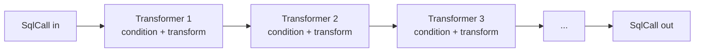
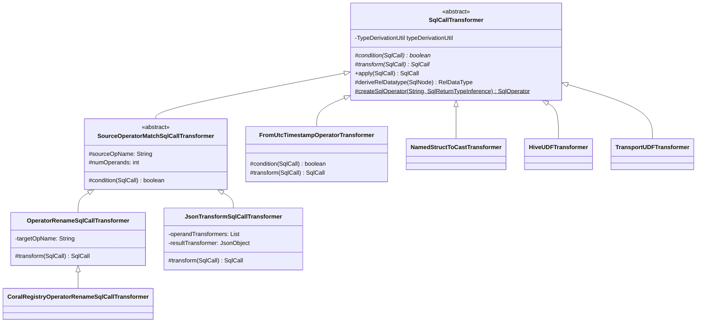

# 07 — The `SqlCallTransformer` pattern

This is the most-touched code surface in Coral. Every backend uses it; most PRs touch one. After this chapter you can read or write a transformer, predict what changing the order of a chain will do, and recognize the four anti-patterns reviewers catch on these PRs.

## The interface

`SqlCallTransformer` is an abstract class in [`coral-common/src/main/java/com/linkedin/coral/common/transformers/SqlCallTransformer.java`](../coral-common/src/main/java/com/linkedin/coral/common/transformers/SqlCallTransformer.java). Two abstract methods define a transformer:

```java
protected abstract boolean condition(SqlCall sqlCall);
protected abstract SqlCall transform(SqlCall sqlCall);
```

`condition()` is the guard: "should I fire on this call?" `transform()` is the rewrite: "given that I fire, what does the new call look like?" A non-abstract template method `apply(SqlCall)` ties them together:

```java
public SqlCall apply(SqlCall sqlCall) {
  if (condition(sqlCall)) {
    return transform(sqlCall);
  } else {
    return sqlCall;
  }
}
```

That is the entire framework: a guarded rewrite over a `SqlCall`. Subclasses fill in `condition` and `transform` and inherit `apply`.

The class also exposes two protected helpers and one static helper:

- `deriveRelDatatype(SqlNode)` — looks up the Calcite-derived type of a `SqlNode` by delegating to a `TypeDerivationUtil`. Only available if the transformer was constructed with one (more on this below).
- `leastRestrictive(List<RelDataType>)` — Calcite's type-promotion lattice, also routed through `TypeDerivationUtil`.
- `createSqlOperator(String functionName, SqlReturnTypeInference typeInference)` — static. Builds a `SqlUserDefinedFunction` with the given name and return-type inference. Every transformer that emits a new operator goes through this.

### Where `TypeDerivationUtil` fits

A transformer that needs to look at the *type* of an operand (not just its position in the call) must be constructed with a `TypeDerivationUtil`. The two-arg constructor exists for exactly this:

```java
public SqlCallTransformer(TypeDerivationUtil typeDerivationUtil) { ... }
```

`TypeDerivationUtil` (in [`coral-common/src/main/java/com/linkedin/coral/common/utils/TypeDerivationUtil.java`](../coral-common/src/main/java/com/linkedin/coral/common/utils/TypeDerivationUtil.java)) wraps a `SqlValidator` and the top-level `SqlNode`. Given any `SqlNode` you ask it about, it constructs a synthetic `SELECT <node>` against the surrounding query, runs the validator, and returns the validated type. The implementation iterates over every top-level `SqlSelect` it found during construction so it works even when the query is a UNION ALL of selects with different `FROM` clauses.

Transformers without type dependencies (e.g., `OperatorRenameSqlCallTransformer` — same operands, new name) use the no-arg constructor and never call `deriveRelDatatype`. Transformers that branch on operand type — `FromUtcTimestampOperatorTransformer`, `NamedStructToCastTransformer`, `SubstrOperatorTransformer` — require it. The split between `CoralToTrinoSqlCallConverter` and `DataTypeDerivedSqlCallConverter` in coral-trino exists because the latter needs a built `TypeDerivationUtil` and the former does not.

## Composition

`SqlCallTransformers` (plural) is a thin immutable container:

```java
public static SqlCallTransformers of(SqlCallTransformer... sqlCallTransformers) { ... }

public SqlCall apply(SqlCall sqlCall) {
  for (SqlCallTransformer sqlCallTransformer : sqlCallTransformers) {
    sqlCall = sqlCallTransformer.apply(sqlCall);
  }
  return sqlCall;
}
```

Each transformer sees the *output* of the previous transformer. The chain is mechanical and unconditional — every transformer's `apply` runs, and a non-matching `condition` returns the input untouched. There is no early-exit, no priority weighting, no `match.first()` semantics. Order is everything.



The container is consumed inside a Calcite `SqlShuttle`. Both `CoralToTrinoSqlCallConverter` and `CoralToSparkSqlCallConverter` extend `SqlShuttle` and override `visit(SqlCall)` to call `sqlCallTransformers.apply(...)` as the shuttle recurses. That gives you whole-tree coverage: every `SqlCall` in the AST gets fed through every transformer in the chain.

## Generic implementations in `coral-common`

Three concrete transformers live alongside the base class. New transformers should subclass one of these before falling back to extending `SqlCallTransformer` directly.

### `SourceOperatorMatchSqlCallTransformer`

The simplest filter: match by operator name plus arity. The body of `condition` is one line:

```java
return sourceOpName.equalsIgnoreCase(sqlCall.getOperator().getName())
    && sqlCall.getOperandList().size() == numOperands;
```

It remains abstract — subclasses still implement `transform`. Anonymous subclasses of this class show up inline inside `SqlCallTransformers.of(...)` calls when the rewrite is trivial. For example, in `CoralToTrinoSqlCallConverter`:

```java
new SourceOperatorMatchSqlCallTransformer("item", 2) {
  @Override
  protected SqlCall transform(SqlCall sqlCall) {
    return TrinoElementAtFunction.INSTANCE.createCall(SqlParserPos.ZERO, sqlCall.getOperandList());
  }
}
```

That replaces Calcite's `item` (array subscript) with Trino's `element_at`, preserving operands.

### `OperatorRenameSqlCallTransformer`

Subclass of `SourceOperatorMatchSqlCallTransformer`. The single most common shape: same operands, new name. The whole `transform` is:

```java
return createSqlOperator(targetOpName, sourceOperator.getReturnTypeInference())
    .createCall(new SqlNodeList(sqlCall.getOperandList(), SqlParserPos.ZERO));
```

The source operator's return-type inference is preserved so downstream type derivation still works. Usage is one line at the call site: `new OperatorRenameSqlCallTransformer(SqlStdOperatorTable.RAND, 0, "RANDOM")`.

### `CoralRegistryOperatorRenameSqlCallTransformer`

Subclass of `OperatorRenameSqlCallTransformer` in `coral-trino/src/main/java/com/linkedin/coral/trino/rel2trino/transformers/`. It exists to spare callers from importing the source operator: instead of `SqlStdOperatorTable.X`, you pass the Hive function name as a string and the transformer looks it up in `StaticHiveFunctionRegistry`. Used for Hive-name-only renames like `"nvl" → "coalesce"`, `"base64" → "to_base64"`, `"array_contains" → "contains"`.

### `JsonTransformSqlCallTransformer`

Subclass of `SourceOperatorMatchSqlCallTransformer`. The escape hatch for non-trivial structural rewrites that you'd rather not write Java for. The constructor takes three optional JSON strings:

- `operandTransformers` — array of per-position expressions to compute new operands.
- `resultTransformer` — single expression that wraps the entire emitted call.
- `operatorTransformers` — regex-based override of the emitted operator name based on a source operand's value.

The JSON DSL allows `op` (one of a fixed set: `+`, `-`, `*`, `/`, `^`, `%`, `date`, `timestamp`, `hive_pattern_to_trino`), `input` (a source operand index, 1-based, with `0` meaning "the call result"), and `value` (a string/boolean/number literal). For example, the Hive→Trino translation of `pmod(a, b)` is configured as:

```java
new JsonTransformSqlCallTransformer(hiveToCoralSqlOperator("pmod"), 2, "mod",
    "[{\"op\":\"+\",\"operands\":[{\"op\":\"%\",\"operands\":[{\"input\":1},{\"input\":2}]},{\"input\":2}]},{\"input\":2}]",
    null, null)
```

That emits `mod(((a % b) + b), b)` — Hive's positive-modulo semantics expressed in terms of Trino's `mod`. Without `JsonTransformSqlCallTransformer` this would be a 40-line Java class; with it, it's one JSON string in a list.

### Class hierarchy



## Dialect-specific transformers

The dialect modules each carry a `transformers/` subpackage. `coral-trino/src/main/java/com/linkedin/coral/trino/rel2trino/transformers/` has roughly twenty classes; `coral-spark/src/main/java/com/linkedin/coral/spark/transformers/` has four. Chapters 08 and 09 enumerate them. A few are worth naming here for the patterns they illustrate:

- **`FromUtcTimestampOperatorTransformer`** (coral-trino) — the textbook transformer for "Trino has no direct equivalent." Walked in detail in the next section.
- **`NamedStructToCastTransformer`** (coral-trino) — rewrites `named_struct('abc', 123, 'def', 'xyz')` to `CAST(ROW(123, 'xyz') AS ROW(abc INTEGER, def CHAR(3)))`. Demonstrates the type-aware path: it uses `deriveRelDatatype` to figure out each value's type, then builds a `SqlRowTypeSpec` to cast through. The class also installs an anonymous `SqlCastFunction` override of `deriveType` so nested `named_struct` calls (inner already rewritten, outer not yet) keep type-deriving correctly.
- **`HiveUDFTransformer`** (both modules) — same name, different jobs. The coral-trino version maps a Hive UDF class name like `com.linkedin.stdudfs.parsing.hive.Ip2Str` to its short Trino-side name `ip2str` (no JAR registration; Trino owns the registry). The coral-spark version does the same rename and *also* emits a `SparkUDFInfo` so the caller can `ADD JAR` and register at runtime.
- **`TransportUDFTransformer`** (coral-spark) — LinkedIn-specific. Detects a known Transport UDF class name, replaces the operator with the engine-specific Spark name, records the Ivy URL (Scala 2.11 vs. 2.12) into `SparkUDFInfo`. [Chapter 15](15-linkedin-specifics.md) covers Transport UDFs in detail; the point here is that one transformer encapsulates "swap operator + emit side-effect metadata."

## Worked example: `FromUtcTimestampOperatorTransformer`

`from_utc_timestamp(ts, tz)` is a Hive function: take a value `ts` interpreted as UTC, return the wall-clock representation in time zone `tz`. Trino has no single-call equivalent. The Hive semantics also depend on the *type* of `ts` — an `INT` is interpreted as seconds-since-epoch; a `DOUBLE` is seconds with subsecond precision; a `TIMESTAMP` or `DATE` is wall-clock UTC. The rewrite differs per input type.

The transformer's `condition` is intentionally broad — match anything named `from_utc_timestamp`:

```java
@Override
protected boolean condition(SqlCall sqlCall) {
  return sqlCall.getOperator().getName().equalsIgnoreCase(FROM_UTC_TIMESTAMP);
}
```

`transform` then branches on the operand's `SqlTypeName`:

- **Integer-family input** (`BIGINT`, `INTEGER`, `SMALLINT`, `TINYINT`): cast to `BIGINT`, multiply by 1,000,000 to get nanoseconds, call `from_unixtime_nanos`, apply `at_timezone` with `$canonicalize_hive_timezone_id(tz)`, cast back to `TIMESTAMP(3)`. The emitted shape:

  ```sql
  CAST(at_timezone(from_unixtime_nanos(CAST(ts AS BIGINT) * 1000000),
                   $canonicalize_hive_timezone_id(tz)) AS TIMESTAMP(3))
  ```

- **Decimal/double-family input** (`DOUBLE`, `FLOAT`, `DECIMAL`): cast to `DOUBLE`, call `timestamp_from_unixtime`, apply `at_timezone`, cast to `TIMESTAMP(3)`.

- **Timestamp/date-family input**: tag with UTC via `with_timezone`, convert to `to_unixtime`, back through `timestamp_from_unixtime`, `at_timezone`, cast.

`$canonicalize_hive_timezone_id` is a Trino internal function that maps Hive's legacy time-zone strings to Trino's accepted set. Each emitted `SqlOperator` is built via `createSqlOperator` with an explicit return-type inference; the comment in the source notes that several should really be `TIMESTAMP WITH TIME ZONE` but Calcite lacks the type, and since the output is only unparsed to SQL (not type-checked at runtime) the placeholder `TIMESTAMP` is fine.

The transformer requires `TypeDerivationUtil` — its only-arg constructor accepts one — because the branching needs `deriveRelDatatype(operands.get(0))` to read the input type. This is the canonical reason to put a transformer in `DataTypeDerivedSqlCallConverter` rather than `CoralToTrinoSqlCallConverter`.

## Composition example: `CoralToTrinoSqlCallConverter`

The Trino backend stitches roughly twenty transformers into a single `SqlCallTransformers.of(...)`. The first few entries:

```java
SqlCallTransformers.of(
    new SqlSelectAliasAppenderTransformer(),
    // conditional functions
    new CoralRegistryOperatorRenameSqlCallTransformer("nvl", 2, "coalesce"),
    // array and map functions
    new MapValueConstructorTransformer(),
    new SourceOperatorMatchSqlCallTransformer("item", 2) { ... },
    new CollectListOrSetFunctionTransformer(),
    // math functions
    new OperatorRenameSqlCallTransformer(SqlStdOperatorTable.RAND, 0, "RANDOM"),
    new JsonTransformSqlCallTransformer(SqlStdOperatorTable.RAND, 1, "RANDOM", "[]", null, null),
    ...
    new ToDateOperatorTransformer(...),
    new CurrentTimestampTransformer(),
    new FromUnixtimeOperatorTransformer(),
    new HiveUDFTransformer(),
    new ReturnTypeAdjustmentTransformer(configs),
    new UnnestOperatorTransformer(),
    new AsOperatorTransformer(),
    new JoinSqlCallTransformer(),
    new NullOrderingTransformer(),
    new SubstrIndexTransformer());
```

Order matters. Two examples:

- `HiveUDFTransformer` runs *after* the named renames. A Hive UDF whose class name happens to collide with one of the renames would otherwise lose its `VersionedSqlUserDefinedFunction` operator before reaching the UDF handler. Putting it late ensures the renames only fire on Calcite/Hive built-ins.
- `ReturnTypeAdjustmentTransformer` runs *after* the operator renames. Its job is to inject casts where the renamed Trino operator produces a different return type than the original Coral operator. A rename followed by a type adjustment behaves correctly; the reverse would adjust the type of a call that's about to be renamed and then the new operator's type inference would override the cast.

`CoralToSparkSqlCallConverter`'s composition shows the same discipline in miniature. Roughly twenty `TransportUDFTransformer` instances (one per LinkedIn UDF class) sit at the head, followed by the built-in `CARDINALITY → size` rename, then `HiveUDFTransformer` as the catch-all. The class's own javadoc states: "we need to apply `TransportUDFTransformer` before `HiveUDFTransformer` because we should try to transform a UDF to an equivalent Transport UDF before falling back to LinkedIn Hive UDF." The chain order encodes that priority.

## Anti-patterns reviewers catch

These are the four that show up on transformer PRs.

1. **Mutating the input `SqlCall` instead of building a new one.** `SqlCall` is treated as immutable in Coral. `transform` must construct a fresh `SqlCall` via `operator.createCall(...)`; rewriting fields of the input leaks state across passes and can corrupt the Calcite `SqlNode` tree the shuttle is walking.
2. **Condition too broad.** A `condition` that returns `true` based only on the operator name is fine when the name is unique (`from_utc_timestamp`). It's a bug when the name is shared (`cast`, `+`, `coalesce`) or when arity matters. `SourceOperatorMatchSqlCallTransformer` checks both name *and* `numOperands`; new transformers should at least match that bar. A common review comment: "this also fires on the 3-arg form — add an arity check."
3. **Silent type narrowing in `transform()`.** The new operator's `SqlReturnTypeInference` should match (or properly cast back to) the source operator's return type. When a transformer emits a Trino operator with a different return type than its Coral source, downstream type derivation drifts. The fix is either to pass `sourceOperator.getReturnTypeInference()` into `createSqlOperator` (the pattern `OperatorRenameSqlCallTransformer` uses) or to wrap the result in an explicit `CAST` (the pattern `FromUtcTimestampOperatorTransformer` uses).
4. **Missing `unparse` override on a custom `SqlOperator`.** A new operator built via `createSqlOperator` inherits Calcite's default unparse, which writes `OPNAME(operand1, operand2)`. For operators that need different syntax — `CAST(x AS T)`, infix `||`, special keyword forms — the operator must override `unparse(SqlWriter, SqlCall, int, int)`. `JsonTransformSqlCallTransformer`'s entry for `timestamp` demonstrates the pattern: it builds an anonymous `SqlUserDefinedFunction` whose `unparse` writes `CAST(x AS TIMESTAMP)` instead of `TIMESTAMP(x)`. A transformer whose rewrite works in unit tests of the SqlNode tree but produces broken SQL when serialized usually has this bug.

A fifth class of bug isn't a code anti-pattern but a coordination one: **adding a transformer to one backend and forgetting the other.** A Hive→Trino fix for, say, `pmod` semantics often applies to Hive→Spark as well. Reviewers should check whether the parallel coral-spark chain also needs the same entry (and vice versa). The dialect-specific subpackages don't share code, so the mirror has to be applied by hand.

## Where to put a new transformer

The placement rule is simple and load-bearing:

- **Dialect-agnostic transformers** — pure structural rewrites that any dialect could reuse — live in `coral-common/src/main/java/com/linkedin/coral/common/transformers/`. Today that's the four classes covered above. New utility transformers (e.g., a generic alias appender, a generic JSON-driven rewriter) belong here.
- **Dialect-specific transformers** — anything that names a Trino-specific operator, a Spark-specific operator, or a LinkedIn UDF — live in the backend module's `transformers/` subpackage. The convention is `coral-<dialect>/src/main/java/com/linkedin/coral/<dialect>/rel2<dialect>/transformers/` for the Hive→dialect direction.

A type-dependent transformer in coral-trino additionally lives behind `DataTypeDerivedSqlCallConverter` rather than `CoralToTrinoSqlCallConverter`, because only the former wires up a `TypeDerivationUtil`. If your transformer calls `deriveRelDatatype`, register it there.

## Files this chapter discusses

- [`coral-common/src/main/java/com/linkedin/coral/common/transformers/SqlCallTransformer.java`](../coral-common/src/main/java/com/linkedin/coral/common/transformers/SqlCallTransformer.java)
- [`coral-common/src/main/java/com/linkedin/coral/common/transformers/SqlCallTransformers.java`](../coral-common/src/main/java/com/linkedin/coral/common/transformers/SqlCallTransformers.java)
- [`coral-common/src/main/java/com/linkedin/coral/common/transformers/SourceOperatorMatchSqlCallTransformer.java`](../coral-common/src/main/java/com/linkedin/coral/common/transformers/SourceOperatorMatchSqlCallTransformer.java)
- [`coral-common/src/main/java/com/linkedin/coral/common/transformers/OperatorRenameSqlCallTransformer.java`](../coral-common/src/main/java/com/linkedin/coral/common/transformers/OperatorRenameSqlCallTransformer.java)
- [`coral-common/src/main/java/com/linkedin/coral/common/transformers/JsonTransformSqlCallTransformer.java`](../coral-common/src/main/java/com/linkedin/coral/common/transformers/JsonTransformSqlCallTransformer.java)
- [`coral-common/src/main/java/com/linkedin/coral/common/utils/TypeDerivationUtil.java`](../coral-common/src/main/java/com/linkedin/coral/common/utils/TypeDerivationUtil.java)
- [`coral-trino/src/main/java/com/linkedin/coral/trino/rel2trino/CoralToTrinoSqlCallConverter.java`](../coral-trino/src/main/java/com/linkedin/coral/trino/rel2trino/CoralToTrinoSqlCallConverter.java)
- [`coral-trino/src/main/java/com/linkedin/coral/trino/rel2trino/DataTypeDerivedSqlCallConverter.java`](../coral-trino/src/main/java/com/linkedin/coral/trino/rel2trino/DataTypeDerivedSqlCallConverter.java)
- [`coral-trino/src/main/java/com/linkedin/coral/trino/rel2trino/transformers/FromUtcTimestampOperatorTransformer.java`](../coral-trino/src/main/java/com/linkedin/coral/trino/rel2trino/transformers/FromUtcTimestampOperatorTransformer.java)
- [`coral-trino/src/main/java/com/linkedin/coral/trino/rel2trino/transformers/NamedStructToCastTransformer.java`](../coral-trino/src/main/java/com/linkedin/coral/trino/rel2trino/transformers/NamedStructToCastTransformer.java)
- [`coral-trino/src/main/java/com/linkedin/coral/trino/rel2trino/transformers/CoralRegistryOperatorRenameSqlCallTransformer.java`](../coral-trino/src/main/java/com/linkedin/coral/trino/rel2trino/transformers/CoralRegistryOperatorRenameSqlCallTransformer.java)
- [`coral-trino/src/main/java/com/linkedin/coral/trino/rel2trino/transformers/HiveUDFTransformer.java`](../coral-trino/src/main/java/com/linkedin/coral/trino/rel2trino/transformers/HiveUDFTransformer.java)
- [`coral-spark/src/main/java/com/linkedin/coral/spark/CoralToSparkSqlCallConverter.java`](../coral-spark/src/main/java/com/linkedin/coral/spark/CoralToSparkSqlCallConverter.java)
- [`coral-spark/src/main/java/com/linkedin/coral/spark/transformers/HiveUDFTransformer.java`](../coral-spark/src/main/java/com/linkedin/coral/spark/transformers/HiveUDFTransformer.java)
- [`coral-spark/src/main/java/com/linkedin/coral/spark/transformers/TransportUDFTransformer.java`](../coral-spark/src/main/java/com/linkedin/coral/spark/transformers/TransportUDFTransformer.java)

## Read next

- [Chapter 08](08-coral-spark.md) — coral-spark, the smaller transformer collection (UDF-heavy).
- [Chapter 09](09-coral-trino.md) — coral-trino, the larger transformer collection (semantic-rewrite-heavy).
- [Chapter 16](16-pr-review-companion.md) — PR review companion, transformer-specific review checklist.
