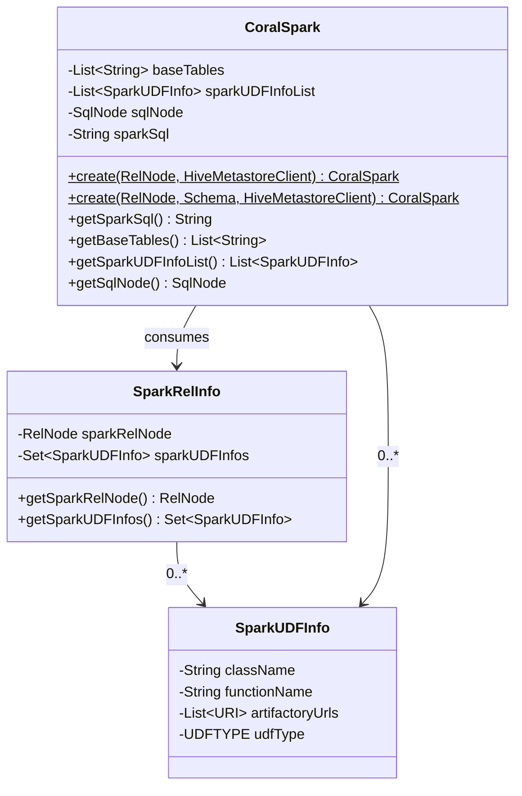

# 08 — coral-spark: Hive → Spark SQL

`coral-spark` is the backend that turns a Coral IR `RelNode` into a Spark SQL string plus the metadata Spark needs to register any UDFs the query references. The module is small — one entry class (`CoralSpark`), a six-stage internal pipeline, four `SqlCallTransformer`s for UDF/union handling, a `SqlDialect`, and two container types. After this chapter you can trace `CoralSpark.create()` end to end, know why TransportUDF detection runs before HiveUDF fallback, and identify what work `IRRelToSparkRelTransformer` does that the later SqlNode stages can't.

## The public API

Two static factory methods on `CoralSpark`, both in [`coral-spark/src/main/java/com/linkedin/coral/spark/CoralSpark.java`](../coral-spark/src/main/java/com/linkedin/coral/spark/CoralSpark.java):

```java
public static CoralSpark create(RelNode irRelNode, HiveMetastoreClient hmsClient);
public static CoralSpark create(RelNode irRelNode, Schema schema, HiveMetastoreClient hmsClient);
```

The first form is the standard one — pass an IR `RelNode` (typically the output of `HiveToRelConverter.convertView(...)`) and an `HiveMetastoreClient`, get back a `CoralSpark` value. The HMS client is not used for the main translation; it exists so `DataTypeDerivedSqlCallConverter` can construct a fresh `HiveToRelConverter` and reach its `SqlValidator` for type derivation on subtrees (see "Stage 5" below).

The second form takes an Avro `Schema` and aligns the outermost `SELECT` list's aliases to the Avro field names. Internally it pulls the field names off the schema and delegates to `createWithAlias(RelNode, List<String>, HiveMetastoreClient)`, which runs the standard pipeline and then visits the outer `SqlNode` with `AddExplicitAlias`. The schema-aware variant is what `coral-service` and any caller producing Avro-typed output use to keep the column names stable across translation passes.

The returned `CoralSpark` exposes four getters:

| Getter | Returns |
|---|---|
| `getSparkSql()` | Final Spark SQL string. Fully expanded — no view references. |
| `getBaseTables()` | `List<String>` of `db.table` for every `TableScan` in the final `RelNode`. |
| `getSparkUDFInfoList()` | `List<SparkUDFInfo>` — every UDF the SQL references that Spark must register before running it. |
| `getSqlNode()` | The Spark-flavored `SqlNode` AST, in case the caller wants to inspect or re-emit. |

`getBaseTables` runs `RelOptUtil.findAllTables(sparkRelNode)`, drops the schema prefix from each three-part name, and joins the last two segments with a dot. That's why a base table comes back as `default.foo` rather than `hive.default.foo`.

## The six-stage internal pipeline

```mermaid
graph LR
    IR[IR RelNode] -->|IRRelToSparkRelTransformer| SR[Spark RelNode + SparkUDFInfo set]
    SR -->|CoralRelToSqlNodeConverter| SN1[Coral SqlNode]
    SN1 -->|DataTypeDerivedSqlCallConverter| SN2[Type-adjusted SqlNode]
    SN2 -->|CoralSqlNodeToSparkSqlNodeConverter| SN3[Spark-shaped SqlNode]
    SN3 -->|CoralToSparkSqlCallConverter| SN4[UDF-resolved SqlNode]
    SN4 -->|SparkSqlRewriter| SN5[Cleaned SqlNode]
    SN5 -->|SparkSqlDialect.toSqlString| OUT[Spark SQL string]
```



Six stages, six classes. The order in `CoralSpark.create` matches the diagram exactly, with `constructSparkSqlNode` wrapping stages 2-5 and `constructSparkSQL` running stage 6.

### Stage 1 — `IRRelToSparkRelTransformer`

`IRRelToSparkRelTransformer.transform(RelNode)` (in [`coral-spark/src/main/java/com/linkedin/coral/spark/IRRelToSparkRelTransformer.java`](../coral-spark/src/main/java/com/linkedin/coral/spark/IRRelToSparkRelTransformer.java)) is the only stage that operates on `RelNode` rather than `SqlNode`. It returns a `SparkRelInfo` carrying the transformed `RelNode` plus a `Set<SparkUDFInfo>` that downstream stages mutate as they discover more UDFs.

The class is a pair of nested shuttles. The outer `RelShuttleImpl` overrides every `visit(Logical*)` method to recurse into children, then post-process the node with the inner `SparkRexConverter` `RexShuttle`. The shuttle handles all standard Calcite logical operators (`LogicalProject`, `LogicalFilter`, `LogicalJoin`, `LogicalUnion`, `LogicalAggregate`, `LogicalSort`, `LogicalCorrelate`, `LogicalValues`, `LogicalMatch`, `LogicalIntersect`, `LogicalMinus`, `LogicalExchange`, `TableScan`, `TableFunctionScan`) plus a catch-all `visit(RelNode)`.

`SparkRexConverter` does one thing in the current code: **1-based to 0-based array index conversion**. Coral IR represents `arr[i]` with a 1-based index (Hive semantics); Spark expects 0-based. When the converter sees `SqlStdOperatorTable.ITEM` over an `ArraySqlType`, it either folds the literal (`i` → `i-1`) or wraps the index in `MINUS(i, 1)` for non-literal cases.

UDF rewriting that the javadoc still mentions (`com.linkedin.dali.udf.date.hive.EpochToEpochMilliseconds` → `epochToEpochMilliseconds`) is now done at the SqlNode layer by `TransportUDFTransformer` and `HiveUDFTransformer`. The javadoc is out of date — read the code.

The reason this stage exists at the `RelNode` layer instead of after `CoralRelToSqlNodeConverter` is that `SqlStdOperatorTable.ITEM` and `ArraySqlType` are easier to detect against typed `RexNode`s than against partially typed `SqlNode`s. Anything that needs the runtime type of an expression with no ambiguity belongs here.

### Stage 2 — `CoralRelToSqlNodeConverter`

`coral-spark/.../CoralSpark.java#constructSparkSqlNode` creates a fresh `CoralRelToSqlNodeConverter` (lives in [`coral-hive/src/main/java/com/linkedin/coral/transformers/CoralRelToSqlNodeConverter.java`](../coral-hive/src/main/java/com/linkedin/coral/transformers/CoralRelToSqlNodeConverter.java), package `com.linkedin.coral.transformers`) and calls `convert(sparkRelNode)`. This is the inverse of stage 5 in [chapter 03](03-pipeline-deep-dive.md)'s Hive frontend — it walks the `RelNode` tree and emits a Calcite `SqlNode` AST. The converter is dialect-neutral; Spark-specific shape comes from the later shuttles.

### Stage 3 — `DataTypeDerivedSqlCallConverter`

`DataTypeDerivedSqlCallConverter` is the only stage that needs the `HiveMetastoreClient` parameter. Its constructor builds a fresh `HiveToRelConverter(mscClient)` to borrow its `SqlValidator`, then wraps the validator in a `TypeDerivationUtil` bound to the top `SqlNode`. The validator/util pair lets transformers ask "what `RelDataType` would Calcite infer for this `SqlCall`?" mid-shuttle, without re-running the full validator pass.

The converter assembles a single-transformer chain holding `ExtractUnionFunctionTransformer` and applies it to every `SqlCall` it visits. That transformer rewrites `extract_union(col)` calls into `coalesce_struct(col, schemaString)` (or `coalesce_struct(col, ordinal+1)` for the two-arg form). The schema-string injection only fires when `extract_union` is operating on a column that contains a single-uniontype somewhere in its tree — Spark unwraps single uniontypes at Avro-read time, and `coalesce_struct` needs the original Hive shape to reconstruct the boundary. Read `ExtractUnionFunctionTransformer.containsSingleUnionType()` for the recursive check.

The class lives between stages 2 and 4 because it needs both `RelNode`-level type knowledge (via `TypeDerivationUtil`) and `SqlCall`-level rewriting (because the downstream UDF transformers expect to see `coalesce_struct`, not `extract_union`).

### Stage 4 — `CoralSqlNodeToSparkSqlNodeConverter`

The first purely Spark-specific shape transform. The class is a `SqlShuttle` that dispatches on `sqlCall.getOperator().kind` to three handlers:

- **`JOIN`** — when the join is `JoinType.COMMA` (a comma join coming out of `LogicalCorrelate`), the shuttle replaces the `SqlJoin` with a `SqlLateralJoin`. That custom operator emits `LATERAL VIEW ...` and prefixes `OUTER` when the right child's `UNNEST` wraps an `IF(... IS NOT NULL ..., ..., ARRAY(NULL))` pattern. Spark needs `LATERAL VIEW` for lateral correlation; Calcite's default `SqlJoin` would emit `FROM t, EXPLODE(...)` which Spark won't accept.
- **`AS`** — for the right-hand side of a lateral join, Spark wants `EXPLODE(arr) t0 AS ccol`, not Calcite's default `EXPLODE(arr) t0 (ccol)`. The shuttle swaps the operator for `SqlLateralViewAsOperator`. If the underlying function is `POSEXPLODE` (i.e., `CoralSqlUnnestOperator` with `withOrdinality`), it also reorders the alias operands from `(val, pos)` back to `(pos, val)` — undoing the swap `ParseTreeBuilder.visitLateralViewExplode` performed to make Calcite's validator happy.
- **`UNNEST`** — collapses the `EXPLODE(IF(arr IS NOT NULL AND size(arr) > 0, arr, ARRAY(NULL)))` pattern back to `EXPLODE(arr)`. Spark recognizes `LATERAL VIEW OUTER EXPLODE` directly; the IF wrapper is a Hive-side null-safety idiom that doesn't survive translation.

Other `SqlCall`s pass through unchanged.

### Stage 5 — `CoralToSparkSqlCallConverter`

The UDF resolution stage and the largest transformer chain in the module. `CoralToSparkSqlCallConverter` is a `SqlShuttle` whose constructor builds a `SqlCallTransformers.of(...)` with the following order:

1. Roughly two dozen `TransportUDFTransformer` instances, one per known mapping from a LinkedIn Hive UDF class name to its Spark Transport UDF counterpart (with Ivy URLs for both Scala 2.11 and Scala 2.12 builds).
2. `OperatorRenameSqlCallTransformer(SqlStdOperatorTable.CARDINALITY, 1, "size")` — Spark calls it `size`, Calcite calls it `CARDINALITY`.
3. `HiveUDFTransformer` — the fallback for any unresolved UDF whose name still looks like a Java FQCN.
4. `FuzzyUnionGenericProjectTransformer` — for `generic_project` calls emitted by `FuzzyUnionSqlRewriter` upstream.

**Order matters.** `TransportUDFTransformer`s come first so a known Transport UDF rewrites to its registered Spark counterpart (and the matching Artifactory artifact is recorded in `SparkUDFInfo`). If none of them fire, `HiveUDFTransformer` catches anything whose name still contains a `.` — that's the Hive class-name format — and falls back to registering it as a `HIVE_CUSTOM_UDF`. The deep-dive section below walks both transformers.

### Stage 6 — `SparkSqlRewriter` + `SparkSqlDialect.toSqlString`

`SparkSqlRewriter` is a `SqlShuttle` that does final AST cleanup the dialect's unparser can't express:

- Strip `CAST(x AS ROW(...))` — Spark has no row-cast syntax; emit `x` (or `named_struct(...)`, depending on the source) instead. The traversal is recursive through `SqlArrayTypeSpec` and `SqlMapTypeSpec` so a nested struct-cast inside a map value also gets stripped.
- Rewrite `VARCHAR(n)` → `STRING` and `VARBINARY` → `BINARY`. Spark's current SQL reference doesn't list `VARCHAR`/`VARBINARY`.
- Normalize negative interval literals so `INTERVAL -'7' DAY` becomes `INTERVAL '-7' DAY`. Spark accepts the HiveQL style; the ANSI style with a leading sign confuses the parser.

`SparkSqlDialect.INSTANCE.toSqlString(sqlNode)` then produces the final string. The dialect lives in [`coral-spark/src/main/java/com/linkedin/coral/spark/dialect/SparkSqlDialect.java`](../coral-spark/src/main/java/com/linkedin/coral/spark/dialect/SparkSqlDialect.java) and is the only file in `dialect/`. Its responsibilities:

- **Identifier quoting** — `withIdentifierQuoteString("`")`, so `db.table` becomes `db.\`table\`` only when the unquoted name is a reserved keyword. The reserved-keyword list is hard-coded (`identifierNeedsQuote(String)` does a case-insensitive lookup).
- **Casing** — `withUnquotedCasing(Casing.UNCHANGED).withQuotedCasing(Casing.UNCHANGED)`. Function names stay as written.
- **`UNNEST` → `EXPLODE` / `POSEXPLODE`** — `unparseCall` intercepts `SqlUnnestOperator`s; if the operator is `CoralSqlUnnestOperator` with `withOrdinality`, it writes `POSEXPLODE`, else `EXPLODE`.
- **`ARRAY[...]` → `ARRAY(...)`** and `MAP[...] → MAP(...)`, via the `SqlMultisetValueConstructor` branch in `unparseCall`.
- **`SUBSTRING(a FROM 1 FOR 5)` → `SUBSTRING(a, 1, 5)`** — Spark doesn't accept the ANSI form.
- **`LIMIT n` instead of `OFFSET ... FETCH ...`** — `unparseOffsetFetch` calls `unparseFetchUsingLimit`.
- **`allowsAs() == false`** — suppresses the `AS` keyword on table aliases (Spark accepts both, but Hive-compat output prefers `t0` over `AS t0`).
- **`supportsCharSet() == false`** — strips trailing `CHARACTER SET ...` from type specs.

`SparkSqlRewriter` and `SparkSqlDialect` exist as a pair because some rewrites are easier on the AST and others are easier as unparse hooks. The class doc on `SparkSqlRewriter` calls itself an "alternative temporary option" for cases the dialect can't express cleanly.

## AddExplicitAlias

`AddExplicitAlias` (in [`coral-spark/src/main/java/com/linkedin/coral/spark/AddExplicitAlias.java`](../coral-spark/src/main/java/com/linkedin/coral/spark/AddExplicitAlias.java)) is a `SqlShuttle` invoked only by the schema-aware `create(RelNode, Schema, HiveMetastoreClient)`. It visits the outermost `SqlSelect`, asserts the select list length matches the Avro field count, and replaces each select-list item with `AS(item, fieldName)`. If the item already had an `AS`, it strips the existing alias and substitutes the new one.

The shuttle is gated by `isOutermostLevel` so it touches only the top `SELECT`, not nested ones. It also skips `SELECT *` entirely (the caller checks `isSelectStar(sparkSqlNode)` before invoking the shuttle) — there's no way to attach explicit aliases to a star projection.

The use case: the caller computed an Avro schema via `coral-schema` from the same view definition, and wants the Spark SQL output to land columns under the same names so downstream Avro serialization lines up. Without this pass, the Spark output's column names come from Calcite's deparser, which often picks `$f0` for unaliased expressions.

## UDF handling deep dive

Coral's job for Spark UDFs is twofold: rewrite the `SqlCall` in the AST to use the function name Spark will see at registration time, and record a `SparkUDFInfo` so the caller can `ADD JAR` and `CREATE TEMPORARY FUNCTION` before executing the query.

### `SparkUDFInfo`

Four fields ([`coral-spark/src/main/java/com/linkedin/coral/spark/containers/SparkUDFInfo.java`](../coral-spark/src/main/java/com/linkedin/coral/spark/containers/SparkUDFInfo.java)):

- `className` — the Spark UDF's Java class. For a Transport UDF, this is the `com.linkedin.stdudfs.*.spark.*` class. For a Hive fallback, it's the original Hive class.
- `functionName` — the short name the SQL will reference. Pulled from `VersionedSqlUserDefinedFunction.getOriginalViewTextFunctionName()` — that's the name the view-creator chose in `TBLPROPERTIES('functions' = 'short_name:com.linkedin.FQCN')`.
- `artifactoryUrls` — a `List<URI>` of `ivy://` coordinates. Always size 1 in the current code; the API is `List` for forward compatibility.
- `udfType` — one of `HIVE_BUILTIN_FUNCTION`, `HIVE_CUSTOM_UDF`, `TRANSPORTABLE_UDF`. Tells the caller which registration mechanism to use.

`equals`/`hashCode` cover all four fields, which is why `IRRelToSparkRelTransformer` accumulates into a `Set<SparkUDFInfo>` — a UDF referenced in two places yields one entry, not two.

### `TransportUDFTransformer`

`coral-spark/.../transformers/TransportUDFTransformer.java`. One transformer instance per (Hive class name, Spark class name, 2.11 Ivy URL, 2.12 Ivy URL) tuple. The `CoralToSparkSqlCallConverter` constructor instantiates twenty-plus of them, one per known LinkedIn UDF mapping.

`condition(SqlCall)`:

1. The call's operator must be a `VersionedSqlUserDefinedFunction` (the Dali-side wrapper for a UDF). Built-in operators and identifiers fall through.
2. The operator name must equal the transformer's `hiveUDFClassName` (case-insensitive).
3. The active Spark session's Scala version must have a non-null Ivy URL in this transformer. If both URLs are null for the relevant Scala version, the transformer throws `UnsupportedUDFException`.

Scala version detection: `getScalaVersionOfSpark()` calls `SparkSession.active().version()`. Spark 2.x maps to `SCALA_2_11`; Spark 3.x maps to `SCALA_2_12`. If no active session exists (or the Spark class isn't on the classpath at all), the method warns and defaults to `SCALA_2_11`.

`transform(SqlCall)`:

1. Add a new `SparkUDFInfo` with `udfType = TRANSPORTABLE_UDF`, the Spark class name, and the Ivy URL for the active Scala version.
2. Build a fresh `SqlOperator` whose name is the short function name (from `getOriginalViewTextFunctionName()`).
3. Re-emit the call with the new operator and the original operand list.

### `HiveUDFTransformer`

`coral-spark/.../transformers/HiveUDFTransformer.java`. Fires last in the UDF chain (after every `TransportUDFTransformer`), as the catch-all for anything that still has a Java FQCN as its operator name.

`condition`: operator is a `VersionedSqlUserDefinedFunction`, operator name contains a `.`, and the name is not literally `.`. The dot is the marker that the Dali resolver couldn't translate to a short name during `ParseTreeBuilder` — it's still wearing its FQCN.

`transform`:

1. Throw `UnsupportedUDFException` for known-broken Hive UDFs — `com.linkedin.dali.udf.userinterfacelookup.hive.UserInterfaceLookup`, `com.linkedin.dali.udf.portallookup.hive.PortalLookup`, plus the test sentinel. These UDFs register successfully but fail at execution time; the comment explains the proactive failure is so callers can fall back to Spark's stable execution path.
2. Pull the Ivy dependencies from `operator.getIvyDependencies()` (the `dependencies` TBLPROPERTY upstream).
3. Add a `SparkUDFInfo` with `udfType = HIVE_CUSTOM_UDF`, the Hive class name, the short function name, and the dependency URIs.
4. Rebuild the call with the short function name.

The detection order — Transport first, Hive fallback — matters because a UDF with both a Transport and a Hive implementation should prefer the Spark-native Transport version. The Hive fallback exists for UDFs that nobody has written a Transport equivalent for; Spark will register them via the `org.apache.spark.sql.hive` shim.

### `FuzzyUnionGenericProjectTransformer`

`coral-spark/.../transformers/FuzzyUnionGenericProjectTransformer.java`. Pairs with `FuzzyUnionSqlRewriter` upstream (see [chapter 15](15-linkedin-specifics.md)).

`condition`: the operator is a `GenericProjectFunction` and the call has three operands — `(col, col_name, hive_type_string)`. That's the shape the rewriter emits.

`transform`: register the `GenericProject` Spark UDF (`com.linkedin.genericprojectudf.GenericProject` at `ivy://com.linkedin.GenericProject:GenericProject-impl:+`), and rewrite the call to drop the `col_name` argument — Spark's `GenericProject` expects `(col, hive_type_string)` only.

## SparkRelInfo and the data flow



`SparkRelInfo` is a tuple `(sparkRelNode, sparkUDFInfos)`. Stage 1 builds it; `CoralSpark.create` peels both fields apart. The `Set<SparkUDFInfo>` is shared by reference into stages 3-5, so any UDF those stages discover ends up in the final `getSparkUDFInfoList()`. Stage 4 doesn't touch UDFs, but it can introduce calls (e.g., `SqlLateralJoin`) whose contents may later resolve to UDFs through stage 5.

## Reviewer cheat sheet

- **A change touching `IRRelToSparkRelTransformer`** is operating on `RelNode`/`RexNode`, not `SqlNode`. Verify the change preserves row types and that any new logic is symmetric across the standard logical operators the outer shuttle visits.
- **A new entry in `CoralToSparkSqlCallConverter`'s constructor** means a new UDF mapping. Confirm both Scala URLs are present (or that `null` is intentional and `UnsupportedUDFException` is the desired runtime behavior on the missing platform), and that the transformer sits *before* `HiveUDFTransformer` in the chain.
- **A change adding a `SqlCallTransformer` to `DataTypeDerivedSqlCallConverter`** means the transformer needs `RelDataType` inference. Verify the transformer constructor accepts a `TypeDerivationUtil` and that the type derivation happens off the *top* `SqlNode`, not a fragment.
- **A change to `SparkSqlDialect`** affects unparse output for every Spark query Coral emits. Diff the dialect's reserved-keyword list and the `unparseCall` switch carefully — the existing list is hand-maintained.
- **A change to `SparkSqlRewriter`** should justify why the rewrite can't live in the dialect's `unparseCall` instead. The rewriter is for cases the dialect's API can't reach.

## Files this chapter discusses

- [`coral-spark/src/main/java/com/linkedin/coral/spark/CoralSpark.java`](../coral-spark/src/main/java/com/linkedin/coral/spark/CoralSpark.java)
- [`coral-spark/src/main/java/com/linkedin/coral/spark/IRRelToSparkRelTransformer.java`](../coral-spark/src/main/java/com/linkedin/coral/spark/IRRelToSparkRelTransformer.java)
- [`coral-spark/src/main/java/com/linkedin/coral/spark/CoralSqlNodeToSparkSqlNodeConverter.java`](../coral-spark/src/main/java/com/linkedin/coral/spark/CoralSqlNodeToSparkSqlNodeConverter.java)
- [`coral-spark/src/main/java/com/linkedin/coral/spark/CoralToSparkSqlCallConverter.java`](../coral-spark/src/main/java/com/linkedin/coral/spark/CoralToSparkSqlCallConverter.java)
- [`coral-spark/src/main/java/com/linkedin/coral/spark/DataTypeDerivedSqlCallConverter.java`](../coral-spark/src/main/java/com/linkedin/coral/spark/DataTypeDerivedSqlCallConverter.java)
- [`coral-spark/src/main/java/com/linkedin/coral/spark/SparkSqlRewriter.java`](../coral-spark/src/main/java/com/linkedin/coral/spark/SparkSqlRewriter.java)
- [`coral-spark/src/main/java/com/linkedin/coral/spark/AddExplicitAlias.java`](../coral-spark/src/main/java/com/linkedin/coral/spark/AddExplicitAlias.java)
- [`coral-spark/src/main/java/com/linkedin/coral/spark/transformers/TransportUDFTransformer.java`](../coral-spark/src/main/java/com/linkedin/coral/spark/transformers/TransportUDFTransformer.java)
- [`coral-spark/src/main/java/com/linkedin/coral/spark/transformers/HiveUDFTransformer.java`](../coral-spark/src/main/java/com/linkedin/coral/spark/transformers/HiveUDFTransformer.java)
- [`coral-spark/src/main/java/com/linkedin/coral/spark/transformers/ExtractUnionFunctionTransformer.java`](../coral-spark/src/main/java/com/linkedin/coral/spark/transformers/ExtractUnionFunctionTransformer.java)
- [`coral-spark/src/main/java/com/linkedin/coral/spark/transformers/FuzzyUnionGenericProjectTransformer.java`](../coral-spark/src/main/java/com/linkedin/coral/spark/transformers/FuzzyUnionGenericProjectTransformer.java)
- [`coral-spark/src/main/java/com/linkedin/coral/spark/containers/SparkUDFInfo.java`](../coral-spark/src/main/java/com/linkedin/coral/spark/containers/SparkUDFInfo.java)
- [`coral-spark/src/main/java/com/linkedin/coral/spark/containers/SparkRelInfo.java`](../coral-spark/src/main/java/com/linkedin/coral/spark/containers/SparkRelInfo.java)
- [`coral-spark/src/main/java/com/linkedin/coral/spark/dialect/SparkSqlDialect.java`](../coral-spark/src/main/java/com/linkedin/coral/spark/dialect/SparkSqlDialect.java)
- [`coral-hive/src/main/java/com/linkedin/coral/transformers/CoralRelToSqlNodeConverter.java`](../coral-hive/src/main/java/com/linkedin/coral/transformers/CoralRelToSqlNodeConverter.java)

## Read next

- [Chapter 03](03-pipeline-deep-dive.md) — the full Hive-to-Spark pipeline; this chapter zoomed into its stages 6-7.
- [Chapter 07](07-transformers-pattern.md) — the `SqlCallTransformer` framework the UDF transformers extend.
- [Chapter 11](11-coral-spark-catalog.md) — coral-spark-catalog, the Spark runtime integration that calls `CoralSpark.create(...)`.
- [Chapter 15](15-linkedin-specifics.md) — Transport UDFs, fuzzy unions, and the rest of the LinkedIn-side terminology.
- [Chapter 16](16-pr-review-companion.md) — PR review companion.
