# 09 — coral-trino: bidirectional translation

`coral-trino` is the only module in Coral that is both a frontend and a backend. The `rel2trino` package emits Trino SQL from Coral IR and is the production path; the `trino2rel` package parses Trino SQL into Coral IR and is POC quality. The backend hosts the largest transformer chain in the codebase — about twenty `SqlCallTransformer` classes coordinated through two shuttles — and is where most Trino-specific semantic divergence (timezone handling, NULL ordering, `UNNEST` over array-of-struct, named struct construction) gets paved over. After this chapter you can trace a query through `HiveToTrinoConverter`, locate the right transformer for a Trino-specific quirk, and explain why the Trino parser is shaded.

## Why this module is special

Every other backend in Coral is one-directional. `coral-spark` only emits; `coral-hive` only parses. `coral-trino` does both:

- **`rel2trino`** — Coral IR (`RelNode`) → Trino SQL. The production direction, used by `coral-service`, `coral-benchmark`, and any LinkedIn caller that translates a Dali view to a Trino query at runtime.
- **`trino2rel`** — Trino SQL → Coral IR (`RelNode`). POC quality. Base-table queries work; view-rewriting hooks (`TrinoViewExpander`, `Trino2CoralOperatorTransformerMap`) exist but the operator transformer map only registers one function (`strpos → instr`). LinkedIn's actual round-trip story stays Hive-defined; this direction is a place to grow into.

The asymmetry is structural, not accidental: LinkedIn's metadata layer (Dali) stores view definitions as HiveQL, so the Hive frontend is doing the heavy lifting for every translation, and the Trino backend has to absorb every dialect mismatch on the emit side. This chapter focuses on `rel2trino` because that is where the work lives.

## Hive → Trino pipeline

`HiveToTrinoConverter` is the convenience entry point. It composes two converters and exposes two methods: `toTrinoSql(String hiveSql)` and `toTrinoSql(String dbName, String viewName)`. Each method runs the same two-stage flow.

```mermaid
graph LR
    HSQL[Hive SQL] -->|HiveToRelConverter| REL[RelNode - Coral IR]
    REL -->|RelToTrinoConverter.visit| SN1[SqlNode - Trino flavor]
    SN1 -->|DataTypeDerivedSqlCallConverter| SN2[Type-aware SqlNode]
    SN2 -->|CoralToTrinoSqlCallConverter| SN3[Operator-rewritten SqlNode]
    SN3 -->|TrinoSqlRewriter| SN4[Type-spec rewritten SqlNode]
    SN4 -->|TrinoSqlDialect.unparse| OUT[Trino SQL]
```



The flow inside `RelToTrinoConverter.convert(RelNode)`:

1. `convertToSqlNode(relNode)` — `RelToTrinoConverter extends Calcite's RelToSqlConverter`, overriding `visit(Project)`, `visit(Uncollect)`, `visit(TableScan)`, `visit(Join)`, `visit(Correlate)`, `visit(Values)`, and `aliasContext()`. These overrides produce a `SqlNode` tree closer to what Trino expects than Calcite's defaults would.
2. `sqlNode.accept(new DataTypeDerivedSqlCallConverter(...))` — the first transformer pass. Runs the seven transformers that need to know a node's `RelDataType` to do their job.
3. `.accept(new CoralToTrinoSqlCallConverter(configs))` — the second transformer pass. Runs the remaining ~14 transformers that don't need type derivation.
4. `.accept(new TrinoSqlRewriter())` — surface-level type-spec adjustments (`BINARY` → `VARBINARY`, `FLOAT` → `REAL`, strip charset from `VARCHAR`/`CHAR`).
5. `.toSqlString(TrinoSqlDialect.INSTANCE)` — final unparse with double-quoted identifiers, `LIMIT` instead of `FETCH`, and a few `unparseCall` overrides for `MAP_VALUE_CONSTRUCTOR` and `timestamp_from_unixtime`.

The two-pass shuttle structure matters: `DataTypeDerivedSqlCallConverter` constructs a `TypeDerivationUtil` from the top `SqlNode` once and shares it across its transformers. If you wrote a transformer that needs the derived type of an operand, you add it to that pass. If you wrote a pure structural rewrite, you add it to `CoralToTrinoSqlCallConverter`. Order between the two passes is fixed by `RelToTrinoConverter.convert(...)` — type-aware first, then structural.

`DataTypeDerivedSqlCallConverter` also runs a private `RegisterDynamicFunctionsForTypeDerivation` shuttle over the top node before constructing the `TypeDerivationUtil`. This pre-pass walks the tree and registers any `VersionedSqlUserDefinedFunction` (Dali UDFs with dotted names) into the `HiveToRelConverter`'s dynamic function registry. Without this step, type derivation for transformers like `FromUtcTimestampOperatorTransformer` would fail when their operand contains a UDF call the validator has never seen.

### Why `RelToTrinoConverter` overrides so much of Calcite

The class extends `RelToSqlConverter` rather than reusing it because Calcite's defaults produce SQL that is correct standard SQL but not valid Trino SQL for Coral's IR shape. The visible cases:

- **`visit(TableScan)`** strips the leading catalog component (`hive.default.foo` → `default.foo`). Trino has configurable catalog names — see [trinodb/trino#5785](https://github.com/trinodb/trino/issues/5785) — so emitting the hardcoded `hive` catalog from `HiveSchema.ROOT_SCHEMA` fails on Trino clusters that use a different catalog name.
- **`visit(Project)`** suppresses the `CAST(NULL AS NULL)` Calcite emits when projecting a literal `NULL`. Trino rejects `CAST(NULL AS NULL)`.
- **`visit(Uncollect)`** rewrites the `UNNEST` operand so the emitted SQL is `UNNEST(complex.c)` instead of `UNNEST(SELECT complex.c AS col FROM (VALUES (0)) AS t (ZERO))`. Trino does not accept `UNNEST(SELECT ...)`.
- **`visit(Join)` / `visit(Correlate)`** wrap `Uncollect` and `LogicalTableFunctionScan` right children with `LATERAL ... AS alias(col_alias)`, restoring the Hive `LATERAL VIEW` shape Trino expects.
- **`aliasContext()`** intercepts `RexFieldAccess` (`F(x).field`) so it round-trips through `FunctionFieldReferenceOperator.DOT` instead of Calcite's default `SqlIdentifier` flattening. Without this override, a `SqlCallTransformer` later in the chain cannot rewrite `F(x).field` because the field-access has already lost its `SqlCall` shape.

Reading these overrides is the fastest way to understand which Trino quirks are structural enough to need code inside the rel2sql conversion, versus quirks that can wait for a `SqlCallTransformer`.

## The transformer zoo

The 21 transformer classes in `coral-trino/src/main/java/com/linkedin/coral/trino/rel2trino/transformers/` group naturally by intent.

```mermaid
graph TD
    Trino[rel2trino/transformers/]
    Trino --> Renames[Operator renames<br/>CoralRegistryOperatorRenameSqlCallTransformer<br/>JsonTransformSqlCallTransformer]
    Trino --> Time[Time and date<br/>FromUtcTimestampOperatorTransformer<br/>FromUnixtimeOperatorTransformer<br/>CurrentTimestampTransformer<br/>ToDateOperatorTransformer]
    Trino --> Strings[Strings and arrays<br/>SubstrOperatorTransformer<br/>SubstrIndexTransformer<br/>ConcatOperatorTransformer<br/>CollectListOrSetFunctionTransformer]
    Trino --> Struct[Struct and map<br/>NamedStructToCastTransformer<br/>MapValueConstructorTransformer]
    Trino --> Unnest[Unnest and joins<br/>UnnestOperatorTransformer<br/>AsOperatorTransformer<br/>JoinSqlCallTransformer]
    Trino --> Sort[NULL ordering<br/>NullOrderingTransformer]
    Trino --> Types[Type adjustments<br/>CastOperatorTransformer<br/>ReturnTypeAdjustmentTransformer]
    Trino --> UDF[UDFs<br/>HiveUDFTransformer]
    Trino --> Generic[Schema evolution<br/>GenericProjectTransformer<br/>UnionSqlCallTransformer]
    Trino --> Alias[Surface fix-ups<br/>SqlSelectAliasAppenderTransformer]
```



### Operator renames

The cheapest transformations — same operands, different name. `CoralRegistryOperatorRenameSqlCallTransformer` extends `OperatorRenameSqlCallTransformer` ([chapter 07](07-transformers-pattern.md)) and resolves the source operator from `StaticHiveFunctionRegistry` so callers can write `new CoralRegistryOperatorRenameSqlCallTransformer("nvl", 2, "coalesce")`. Examples wired in `CoralToTrinoSqlCallConverter`: `nvl → coalesce`, `base64 → to_base64`, `unbase64 → from_base64`, `hex → to_hex`, `unhex → from_hex`, `array_contains → contains`, `instr → strpos`, `get_json_object → json_extract`. Calcite's `SqlStdOperatorTable.RAND` and `RAND_INTEGER` are also renamed to `RANDOM` via the plain `OperatorRenameSqlCallTransformer`.

When the rewrite needs argument shuffling — not just a rename — `JsonTransformSqlCallTransformer` consumes a small JSON DSL. `RAND(n) → RANDOM([n])`, `truncate(x, d)` → an expanded scale-then-truncate expression, `date_add`/`date_sub`/`datediff` → Trino's `date_add`/`date_diff` with a `'day'` unit literal prepended. Each call site in `CoralToTrinoSqlCallConverter` is one line of JSON specifying input/output operand layout.

### Function rewrites (time and date)

`FromUtcTimestampOperatorTransformer` is the canonical deep example. Hive's `from_utc_timestamp(x, tz)` accepts three different input types and produces a timestamp shifted from UTC to `tz`. Trino has no direct equivalent; the transformer dispatches on `deriveRelDatatype(operands.get(0))` and emits one of three rewrites:

- **Integer input** (`BIGINT`/`INTEGER`/`SMALLINT`/`TINYINT`): `CAST(at_timezone(from_unixtime_nanos(CAST(x AS BIGINT) * 1000000), $canonicalize_hive_timezone_id(tz)) AS TIMESTAMP(3))`.
- **Decimal input** (`DOUBLE`/`FLOAT`/`DECIMAL`): `CAST(at_timezone(timestamp_from_unixtime(CAST(x AS DOUBLE)), $canonicalize_hive_timezone_id(tz)) AS TIMESTAMP(3))`.
- **Timestamp input** (`TIMESTAMP`/`DATE`): `CAST(at_timezone(timestamp_from_unixtime(to_unixtime(with_timezone(x, 'UTC'))), $canonicalize_hive_timezone_id(tz)) AS TIMESTAMP(3))`.

The `$canonicalize_hive_timezone_id` Trino built-in maps Hive's pre-2014 timezone abbreviations (`PST`) to canonical IANA names (`America/Los_Angeles`). The outer `CAST(... AS TIMESTAMP(3))` is needed because the intermediate result is `TIMESTAMP WITH TIME ZONE` and Calcite's type system has no representation for that — the transformer comments call this out explicitly.

`FromUnixtimeOperatorTransformer` wraps `from_unixtime(x)` in `format_datetime(..., 'yyyy-MM-dd HH:mm:ss')` because Hive returns a string but Trino returns a timestamp. `CurrentTimestampTransformer` adds `CAST(CURRENT_TIMESTAMP AS TIMESTAMP(3))` for precision alignment. `ToDateOperatorTransformer` rewrites `to_date(x)` to `date(cast(x as timestamp))`, gated on the `AVOID_TRANSFORM_TO_DATE_UDF` config because LinkedIn's internal Trino registers its own `to_date` UDF that returns string instead of date.

### Strings and arrays

`SubstrOperatorTransformer` (in the type-aware pass) casts non-string `substr` arguments to `VARCHAR(65535)` because Hive accepts byte arrays but Trino only accepts strings. `SubstrIndexTransformer` (in the structural pass) clamps the starting index — Hive allows 0 as a valid index, Trino starts at 1. `ConcatOperatorTransformer` adds `CAST(operand AS VARCHAR)` around every non-string argument to `concat`, since Trino's `concat` is type-strict. `CollectListOrSetFunctionTransformer` rewrites `collect_list(col) → array_agg(col)` and `collect_set(col) → array_distinct(array_agg(col))`.

### Struct and named_struct

`NamedStructToCastTransformer` turns Hive's `named_struct('a', 1, 'b', 'x')` into `CAST(ROW(1, 'x') AS ROW("a" INTEGER, "b" CHAR(3) CHARACTER SET ISO-8859-1))`. The transformer iterates operands in pairs — odd indices are field names (which must be `SqlLiteral`s), even indices are values — and derives the type of each value through `TypeDerivationUtil`. Nested `named_struct` calls work because the shuttle visits children first; when the outer call runs, the inner has already become a `CAST(ROW(...) AS ROW(...))` and the transformer subclasses `SqlCastFunction.deriveType()` so the outer's type derivation can walk into it. Empty-array values get a placeholder `VARCHAR(65535)` element type so the cast target is valid.

`MapValueConstructorTransformer` converts Calcite's flat `MAP['k1', 'v1', 'k2', 'v2']` into Trino's `MAP(ARRAY['k1', 'k2'], ARRAY['v1', 'v2'])`. `TrinoSqlDialect.unparseMapValueConstructor` then prints `MAP(...)` with parens instead of brackets.

### UNNEST and lateral joins

Trino's `UNNEST` differs from Hive's `LATERAL VIEW EXPLODE` in two ways. Trino unnests both the array and the row when given `array<row<...>>`, returning one column per struct field; Hive unnests only the array and returns one struct column. `UnnestOperatorTransformer` papers over this by wrapping the unnest operand in a `TRANSFORM(arr, x -> ROW(x))` lambda so the array becomes `array<row<row<...>>>` and Trino's double-unnest produces a single struct column. The wrapping only fires when the `CoralSqlUnnestOperator` carries a non-null `RelDataType` (i.e., when the inner type is a `ROW`). The `SUPPORT_LEGACY_UNNEST_ARRAY_OF_STRUCT` config disables the wrapping for LinkedIn's internal Trino, which extends Hive-style unnest semantics natively.

`JoinSqlCallTransformer` rewrites `SqlJoin` with `JoinType.COMMA` and an `UNNEST` right side into a `CROSS JOIN UNNEST(...)`. The transformer also distinguishes between correlated and uncorrelated unnest operands: a correlated `UNNEST(table.col)` becomes a `CROSS JOIN`, but an uncorrelated `UNNEST(ARRAY[1, 2, 3])` keeps `JoinType.COMMA` because Trino accepts that form directly. `AsOperatorTransformer` strips the `LATERAL` keyword when the result already lives under `UNNEST(x) AS y(z)` — Trino does not accept `LATERAL UNNEST`.

### NULL ordering

`NullOrderingTransformer` matches `SqlSelect`s and `SqlWindow`s whose `ORDER BY` contains `DESC NULLS LAST` and strips the redundant `NULLS LAST`. Trino's default for `DESC` already places nulls last (and `NullCollation.HIGH` in `TrinoSqlDialect` agrees with Hive's convention), so an explicit `NULLS LAST` is silently surprising — it works, but it telegraphs that the dialect emitter forgot to canonicalize. The transformer only handles `DESC NULLS LAST`; `ASC NULLS FIRST` already matches the default and needs no rewrite.

### Type adjustments

`CastOperatorTransformer` (type-aware pass) handles cast pairs Trino refuses but Hive accepts. The big example: `CAST(timestamp AS DECIMAL(10, 0))` becomes `CAST(to_unixtime(with_timezone(timestamp, 'UTC')) AS DECIMAL(10, 0))` because Trino does not convert timestamps directly to decimals.

`ReturnTypeAdjustmentTransformer` wraps calls whose Trino return type differs from Hive's in a `CAST` to the Hive type. Hive's `datediff` returns `INTEGER` but Trino's `date_diff` returns `BIGINT`; the transformer adds `CAST(date_diff(...) AS INTEGER)`. The full map: `date_diff → INTEGER`, `cardinality → INTEGER`, `ceil/ceiling/floor → BIGINT`, `date_add → VARCHAR` (only under `CAST_DATE_ADD_TO_STRING`).

### UDFs

`HiveUDFTransformer` rewrites class-name-style UDFs (e.g., `com.linkedin.stdudfs.parsing.hive.Ip2Str`) into their short Trino-registered names (`ip2str`). The transformer detects any `VersionedSqlUserDefinedFunction` whose name contains a dot and calls `getShortFunctionName()` to extract the registered alias. This is the chapter-15 Transport UDF story; the transformer is small because the metadata is built into the operator class.

### JSON, schema evolution, and surface fix-ups

`GenericProjectTransformer` rewrites `generic_project` (the `FuzzyUnionSqlRewriter` placeholder from [chapter 04](04-coral-common.md)) into combinations of `CAST(ROW(...) AS ROW(...))`, `TRANSFORM(arr, ...)`, and `TRANSFORM_VALUES(map, ...)` to express schema projection over nested types at language level. Trino has no equivalent of Hive/Spark's runtime `GenericProject` UDF because Trino validates return types at compile time; the transformer fans the placeholder out into a tree of typed built-ins. `UnionSqlCallTransformer` handles type alignment across `UNION` branches. `SqlSelectAliasAppenderTransformer` runs first in `CoralToTrinoSqlCallConverter` and appends explicit aliases to every projected field (`SELECT foo.a FROM foo` → `SELECT foo.a AS a FROM foo`), which downstream transformers rely on when matching identifier paths or computing column names.

## Trino → Coral IR (POC)

`TrinoToRelConverter` extends `ToRelConverter` ([chapter 04](04-coral-common.md)) and fills in the five abstract hooks: `getConvertletTable()` returns `CoralConvertletTable` (reused from coral-hive), `getSqlValidator()` returns `HiveSqlValidator` configured with `TRINO_SQL` conformance, `getOperatorTable()` chains `SqlStdOperatorTable.instance()` with `DaliOperatorTable`, `getSqlToRelConverter()` returns a `TrinoSqlToRelConverter`, and `toSqlNode(sql, table)` runs the shaded `TrinoParserDriver` then a `Trino2CoralOperatorConverter` shuttle.

The shuttle is small: `Trino2CoralOperatorConverter.visit(SqlCall)` looks up the operator name in `Trino2CoralOperatorTransformerMap` and applies the matched `OperatorTransformer` if any. The map currently registers one entry — `strpos → instr`. The TODO inline ("keep adding Trino-Specific functions as needed") is honest: this direction is a stub. Views require `TrinoViewExpander`, which in turn calls back into `processView` and `FuzzyUnionSqlRewriter`, but practical use stays on base-table queries.

`TrinoSqlToRelConverter` overrides `convertQuery` to skip Calcite's row-type validation (Hive views are lax about declared schemas matching runtime ones) and overrides `convertFrom` to route `UNNEST` through `HiveUncollect` instead of Calcite's default `Uncollect`. The `Uncollect` override is what keeps array-of-struct from fanning out into per-field columns on the way in, mirroring the symmetric behavior in `RelToTrinoConverter.visit(Uncollect)` on the way out.

`TrinoSqlConformance` is a thin wrapper that delegates to `SqlConformanceEnum.PRAGMATIC_2003` — Trino-specific conformance has not needed any actual overrides yet, and the wrapper exists primarily so callers can name a Trino-specific conformance constant when configuring `HiveSqlValidator`.

## The shaded parser

The Trino parser cannot be used in-process with Calcite because Calcite ships an ANTLR v3 runtime while Trino's parser uses ANTLR v4 — both libraries put their generated classes in `org.antlr.runtime.*`-derived packages, and Coral cannot have both on the classpath unmodified. [`shading/coral-trino-parser/build.gradle`](../shading/coral-trino-parser/build.gradle) solves this with the Gradle Shadow plugin:

```groovy
relocate 'io.trino', 'coral.shading.io.trino'
relocate 'io.airlift', 'coral.shading.io.airlift'
relocate 'org.antlr.v4', 'coral.shading.org.antlr.v4'
relocate 'com.google', 'coral.shading.com.google'
```

Every dependency Trino's parser brings in — Trino itself, Airlift, ANTLR v4 runtime, Guava, javax.annotation, Checker Framework, OpenJDK tools — gets relocated under `coral.shading.*`. Consumers see `coral.shading.io.trino.sql.parser.SqlParser` and `coral.shading.io.trino.sql.tree.Statement`, matching the imports inside `TrinoParserDriver`. The shadow jar is published as the standard `coral-trino-parser-X.Y.Z.jar` artifact; the unshaded jar is disabled via `jar.enabled = false`.

When debugging a parser issue, remember that stack traces will name `coral.shading.io.trino.sql.parser.*` classes — the source code in upstream Trino lives at `io.trino.sql.parser.*` and you have to mentally strip the prefix.

The pinned version is `io.trino:trino-parser:355`. Bumping it is non-trivial because the relocated package set must stay in sync with whatever new dependencies the newer parser pulls in. The `relocate` block in `build.gradle` is the source of truth — any package the new parser depends on that is not relocated will collide with Coral's primary classpath.

## Reviewer cheat sheet

When reviewing a PR that adds or changes a `coral-trino` transformer, ask:

1. **Which pass does it belong in?** Type-aware (`DataTypeDerivedSqlCallConverter`) if it calls `deriveRelDatatype()`; structural (`CoralToTrinoSqlCallConverter`) otherwise. Type-aware transformers also need to extend `SqlCallTransformer(TypeDerivationUtil)`.
2. **Does the order matter?** A rename after a structural rewrite will not see the original operator name. The chains in `DataTypeDerivedSqlCallConverter` and `CoralToTrinoSqlCallConverter` are read top-down; new entries usually go near related ones.
3. **Does Spark need the mirror?** Many Trino-side rewrites (e.g., `from_utc_timestamp`, `named_struct`) have analogues in `coral-spark/transformers/`. Diverging behavior is sometimes correct, sometimes a bug — call it out.
4. **Is there a test in `HiveToTrinoConverterTest`?** That class is the integration surface; transformer-only unit tests are not sufficient because the chain order can change behavior.
5. **Does the rewrite preserve the original return type?** Transformer-introduced `CAST`s on subexpressions can change a parent's derived type and break a later transformer's `condition()`.
6. **Does the new operator have an `unparse` override?** If the transformer introduces a custom `SqlOperator` (see `coral-trino/.../functions/`), the operator must implement `unparse` or the final SQL will be garbled.

### Worked example: adding a new transformer

Suppose Hive's `unix_timestamp(date_str, format)` needs a Trino-side rewrite. The mechanical recipe:

1. Decide the pass. `unix_timestamp(x, fmt)` returns a `BIGINT`, and a Trino-equivalent rewrite (`to_unixtime(date_parse(x, fmt))`) does not need to inspect the operand's `RelDataType` — so the structural pass, `CoralToTrinoSqlCallConverter`.
2. Pick a base class. The rewrite changes the shape of the call, not just the name, so this is not a `CoralRegistryOperatorRenameSqlCallTransformer`. The JSON DSL of `JsonTransformSqlCallTransformer` can express a two-arg → two-call rewrite, but for readability a custom `SqlCallTransformer` subclass is usually clearer.
3. Place it in the chain. Inserting it before `FromUnixtimeOperatorTransformer` matters because the latter rewrites `from_unixtime` calls — and our new transformer's output mentions `to_unixtime`, not `from_unixtime`, so the order is independent. But it must run after `SqlSelectAliasAppenderTransformer` (which runs first by construction) and before any transformer that depends on the original `unix_timestamp` name being gone.
4. Test in `HiveToTrinoConverterTest`. An integration test exercises the full chain; a unit test in isolation can miss interactions with `NullOrderingTransformer` or `ReturnTypeAdjustmentTransformer` that fire on the same `SqlNode`.
5. Mirror in Spark if needed. Check `coral-spark/.../transformers/` — if the analogous Spark rewrite is missing or different, file an issue or land both in the same PR.

The transformers are intentionally small (~30-100 lines each); adding one is closer to writing a Calcite snippet than to refactoring the converter.

## Files this chapter discusses

- [`coral-trino/src/main/java/com/linkedin/coral/trino/rel2trino/HiveToTrinoConverter.java`](../coral-trino/src/main/java/com/linkedin/coral/trino/rel2trino/HiveToTrinoConverter.java)
- [`coral-trino/src/main/java/com/linkedin/coral/trino/rel2trino/RelToTrinoConverter.java`](../coral-trino/src/main/java/com/linkedin/coral/trino/rel2trino/RelToTrinoConverter.java)
- [`coral-trino/src/main/java/com/linkedin/coral/trino/rel2trino/CoralToTrinoSqlCallConverter.java`](../coral-trino/src/main/java/com/linkedin/coral/trino/rel2trino/CoralToTrinoSqlCallConverter.java)
- [`coral-trino/src/main/java/com/linkedin/coral/trino/rel2trino/DataTypeDerivedSqlCallConverter.java`](../coral-trino/src/main/java/com/linkedin/coral/trino/rel2trino/DataTypeDerivedSqlCallConverter.java)
- [`coral-trino/src/main/java/com/linkedin/coral/trino/rel2trino/TrinoSqlRewriter.java`](../coral-trino/src/main/java/com/linkedin/coral/trino/rel2trino/TrinoSqlRewriter.java)
- [`coral-trino/src/main/java/com/linkedin/coral/trino/rel2trino/TrinoSqlDialect.java`](../coral-trino/src/main/java/com/linkedin/coral/trino/rel2trino/TrinoSqlDialect.java)
- [`coral-trino/src/main/java/com/linkedin/coral/trino/rel2trino/CoralTrinoConfigKeys.java`](../coral-trino/src/main/java/com/linkedin/coral/trino/rel2trino/CoralTrinoConfigKeys.java)
- [`coral-trino/src/main/java/com/linkedin/coral/trino/rel2trino/transformers/FromUtcTimestampOperatorTransformer.java`](../coral-trino/src/main/java/com/linkedin/coral/trino/rel2trino/transformers/FromUtcTimestampOperatorTransformer.java)
- [`coral-trino/src/main/java/com/linkedin/coral/trino/rel2trino/transformers/FromUnixtimeOperatorTransformer.java`](../coral-trino/src/main/java/com/linkedin/coral/trino/rel2trino/transformers/FromUnixtimeOperatorTransformer.java)
- [`coral-trino/src/main/java/com/linkedin/coral/trino/rel2trino/transformers/CurrentTimestampTransformer.java`](../coral-trino/src/main/java/com/linkedin/coral/trino/rel2trino/transformers/CurrentTimestampTransformer.java)
- [`coral-trino/src/main/java/com/linkedin/coral/trino/rel2trino/transformers/ToDateOperatorTransformer.java`](../coral-trino/src/main/java/com/linkedin/coral/trino/rel2trino/transformers/ToDateOperatorTransformer.java)
- [`coral-trino/src/main/java/com/linkedin/coral/trino/rel2trino/transformers/NamedStructToCastTransformer.java`](../coral-trino/src/main/java/com/linkedin/coral/trino/rel2trino/transformers/NamedStructToCastTransformer.java)
- [`coral-trino/src/main/java/com/linkedin/coral/trino/rel2trino/transformers/MapValueConstructorTransformer.java`](../coral-trino/src/main/java/com/linkedin/coral/trino/rel2trino/transformers/MapValueConstructorTransformer.java)
- [`coral-trino/src/main/java/com/linkedin/coral/trino/rel2trino/transformers/NullOrderingTransformer.java`](../coral-trino/src/main/java/com/linkedin/coral/trino/rel2trino/transformers/NullOrderingTransformer.java)
- [`coral-trino/src/main/java/com/linkedin/coral/trino/rel2trino/transformers/UnnestOperatorTransformer.java`](../coral-trino/src/main/java/com/linkedin/coral/trino/rel2trino/transformers/UnnestOperatorTransformer.java)
- [`coral-trino/src/main/java/com/linkedin/coral/trino/rel2trino/transformers/AsOperatorTransformer.java`](../coral-trino/src/main/java/com/linkedin/coral/trino/rel2trino/transformers/AsOperatorTransformer.java)
- [`coral-trino/src/main/java/com/linkedin/coral/trino/rel2trino/transformers/JoinSqlCallTransformer.java`](../coral-trino/src/main/java/com/linkedin/coral/trino/rel2trino/transformers/JoinSqlCallTransformer.java)
- [`coral-trino/src/main/java/com/linkedin/coral/trino/rel2trino/transformers/SubstrOperatorTransformer.java`](../coral-trino/src/main/java/com/linkedin/coral/trino/rel2trino/transformers/SubstrOperatorTransformer.java)
- [`coral-trino/src/main/java/com/linkedin/coral/trino/rel2trino/transformers/SubstrIndexTransformer.java`](../coral-trino/src/main/java/com/linkedin/coral/trino/rel2trino/transformers/SubstrIndexTransformer.java)
- [`coral-trino/src/main/java/com/linkedin/coral/trino/rel2trino/transformers/ConcatOperatorTransformer.java`](../coral-trino/src/main/java/com/linkedin/coral/trino/rel2trino/transformers/ConcatOperatorTransformer.java)
- [`coral-trino/src/main/java/com/linkedin/coral/trino/rel2trino/transformers/CollectListOrSetFunctionTransformer.java`](../coral-trino/src/main/java/com/linkedin/coral/trino/rel2trino/transformers/CollectListOrSetFunctionTransformer.java)
- [`coral-trino/src/main/java/com/linkedin/coral/trino/rel2trino/transformers/CoralRegistryOperatorRenameSqlCallTransformer.java`](../coral-trino/src/main/java/com/linkedin/coral/trino/rel2trino/transformers/CoralRegistryOperatorRenameSqlCallTransformer.java)
- [`coral-trino/src/main/java/com/linkedin/coral/trino/rel2trino/transformers/CastOperatorTransformer.java`](../coral-trino/src/main/java/com/linkedin/coral/trino/rel2trino/transformers/CastOperatorTransformer.java)
- [`coral-trino/src/main/java/com/linkedin/coral/trino/rel2trino/transformers/ReturnTypeAdjustmentTransformer.java`](../coral-trino/src/main/java/com/linkedin/coral/trino/rel2trino/transformers/ReturnTypeAdjustmentTransformer.java)
- [`coral-trino/src/main/java/com/linkedin/coral/trino/rel2trino/transformers/HiveUDFTransformer.java`](../coral-trino/src/main/java/com/linkedin/coral/trino/rel2trino/transformers/HiveUDFTransformer.java)
- [`coral-trino/src/main/java/com/linkedin/coral/trino/rel2trino/transformers/GenericProjectTransformer.java`](../coral-trino/src/main/java/com/linkedin/coral/trino/rel2trino/transformers/GenericProjectTransformer.java)
- [`coral-trino/src/main/java/com/linkedin/coral/trino/rel2trino/transformers/UnionSqlCallTransformer.java`](../coral-trino/src/main/java/com/linkedin/coral/trino/rel2trino/transformers/UnionSqlCallTransformer.java)
- [`coral-trino/src/main/java/com/linkedin/coral/trino/rel2trino/transformers/SqlSelectAliasAppenderTransformer.java`](../coral-trino/src/main/java/com/linkedin/coral/trino/rel2trino/transformers/SqlSelectAliasAppenderTransformer.java)
- [`coral-trino/src/main/java/com/linkedin/coral/trino/trino2rel/TrinoToRelConverter.java`](../coral-trino/src/main/java/com/linkedin/coral/trino/trino2rel/TrinoToRelConverter.java)
- [`coral-trino/src/main/java/com/linkedin/coral/trino/trino2rel/Trino2CoralOperatorConverter.java`](../coral-trino/src/main/java/com/linkedin/coral/trino/trino2rel/Trino2CoralOperatorConverter.java)
- [`coral-trino/src/main/java/com/linkedin/coral/trino/trino2rel/Trino2CoralOperatorTransformerMap.java`](../coral-trino/src/main/java/com/linkedin/coral/trino/trino2rel/Trino2CoralOperatorTransformerMap.java)
- [`coral-trino/src/main/java/com/linkedin/coral/trino/trino2rel/TrinoSqlToRelConverter.java`](../coral-trino/src/main/java/com/linkedin/coral/trino/trino2rel/TrinoSqlToRelConverter.java)
- [`coral-trino/src/main/java/com/linkedin/coral/trino/trino2rel/TrinoViewExpander.java`](../coral-trino/src/main/java/com/linkedin/coral/trino/trino2rel/TrinoViewExpander.java)
- [`coral-trino/src/main/java/com/linkedin/coral/trino/trino2rel/TrinoSqlConformance.java`](../coral-trino/src/main/java/com/linkedin/coral/trino/trino2rel/TrinoSqlConformance.java)
- [`coral-trino/src/main/java/com/linkedin/coral/trino/trino2rel/parsetree/TrinoParserDriver.java`](../coral-trino/src/main/java/com/linkedin/coral/trino/trino2rel/parsetree/TrinoParserDriver.java)
- [`coral-trino/src/test/java/com/linkedin/coral/trino/rel2trino/HiveToTrinoConverterTest.java`](../coral-trino/src/test/java/com/linkedin/coral/trino/rel2trino/HiveToTrinoConverterTest.java)
- [`shading/coral-trino-parser/build.gradle`](../shading/coral-trino-parser/build.gradle)

## Read next

- [Chapter 07](07-transformers-pattern.md) — the `SqlCallTransformer` framework that every transformer here extends.
- [Chapter 12](12-coral-benchmark.md) — coral-benchmark, where Trino changes get validated against actual query results.
- [Chapter 15](15-linkedin-specifics.md) — LinkedIn specifics; Transport UDFs (referenced by `HiveUDFTransformer`) and the fuzzy-union story (referenced by `GenericProjectTransformer`).
- [Chapter 16](16-pr-review-companion.md) — PR review companion with a transformer-specific checklist.
