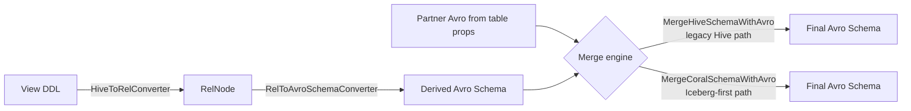

# 10 — coral-schema: Avro schema derivation

`coral-schema` turns a Hive view into a standardized Avro schema. It is the backend used when the consumer of a Coral view is not a SQL engine but LinkedIn's data infrastructure — Kafka topics, Espresso secondary indexes, event pipelines, and Iceberg datasets — all of which transport records keyed by Avro schemas. After this chapter you can navigate `ViewToAvroSchemaConverter` end-to-end, predict what each `RelNode` operator contributes to the output schema, and decide whether a change belongs in the legacy `MergeHiveSchemaWithAvro` engine or the newer `MergeCoralSchemaWithAvro` engine that drives Iceberg-first table resolution.

## Why Avro

LinkedIn's data platform is Avro-centric. Kafka topics carry Avro records and require an Avro schema in the schema registry before producers can publish. Espresso uses Avro to define document and secondary-index schemas. Tracking and event pipelines marshal everything through Avro. Even Iceberg datasets, which can be queried as SQL, ship with an Avro view of their schema for downstream Avro-only consumers. A logical view declared in HiveQL therefore needs an Avro schema computed from the view definition, not the underlying base tables — `SELECT lower(name) AS name FROM users` produces a different Avro schema than `users` even though the column count matches, because `lower(name)` is non-null only if `name` is.

The job of `coral-schema` is to derive that Avro schema directly from the view's logical plan and to merge it with any partner Avro schema the table metadata already carries (so docs, defaults, custom field props, and union envelope shapes survive). It is the only Coral backend whose output is not SQL.



## Entry point: `ViewToAvroSchemaConverter`

`coral-schema/src/main/java/com/linkedin/coral/schema/avro/ViewToAvroSchemaConverter.java` is the public face of the module. It exposes two factories — `create(HiveMetastoreClient)` (deprecated) and `create(CoralCatalog)` — and three flavors of `toAvroSchema(...)`:

- `toAvroSchema(String dbName, String tableOrViewName)` — the common case. Resolves the table or view, returns its Avro schema.
- `toAvroSchema(dbName, tableOrViewName, boolean strictMode)` — adds the strict-mode toggle described below.
- `toAvroSchema(dbName, tableOrViewName, boolean strictMode, boolean forceLowercase)` — adds a post-pass that lowercases every field name (`ToLowercaseSchemaVisitor`).

There is also `toAvroSchemaString(...)` for callers that want the JSON, and `toAvroSchema(String sql)` for ad-hoc SQL strings used by tests.

The class holds exactly one of `HiveMetastoreClient` or `CoralCatalog` per instance — the two paths never mix. `inferAvroSchema(...)` dispatches into `inferAvroSchemaUsingCoralCatalog` or `inferAvroSchemaUsingHiveMetastore`, and each path branches on whether the resolved entity is a table or a view:

- **Table:** the table already has an authoritative Avro schema (in `avro.schema.literal` or `dali.row.schema` table properties). `SchemaUtilities.getAvroSchemaForTable(...)` returns it, merged with the Hive or Coral column list to fill in any gaps.
- **View:** route through `HiveToRelConverter.convertView(db, view)` to get a `RelNode`, then call `relToAvroSchemaConverter.convert(...)`. In non-strict mode, the result is re-stamped with `SchemaUtilities.setupNameAndNamespace(schema, tableOrViewName, dbName + "." + tableOrViewName)` so the top-level record carries the view's name and the per-record namespaces nest under it.

Strict mode (the `strictMode` flag) hardens two behaviors: do not fall back to Hive column metadata when `avro.schema.literal` is missing (throw `SchemaNotFoundException` instead) and preserve the original namespace of every base-table record rather than re-stamping. Most callers use the non-strict default; strict mode exists for pipelines that want to fail loudly on missing schema literals.

## The conversion: `RelToAvroSchemaConverter`

`RelToAvroSchemaConverter` is a `RelShuttleImpl` that walks the `RelNode` tree bottom-up. The pattern in every `visit(...)` override is identical:

```java
public RelNode visit(LogicalFoo foo) {
  RelNode r = super.visit(foo);          // descend first
  // build this level's Avro schema from schemaMap.get(foo.getInput(...))
  schemaMap.put(foo, /* this level's schema */);
  return r;
}
```

The shuttle maintains a `Map<RelNode, Schema>` keyed by `RelNode` identity. After the walk, the schema for the root `RelNode` is the view's Avro schema. The contributions per operator:

- **`TableScan`** — leaf. `getTableScanSchema(tableScan)` extracts `db.table` from the qualified name and asks the configured `CoralCatalog` (or, for the legacy path, `HiveMetastoreClient`) for the base table's Avro schema. The base schema comes from table properties when present; otherwise it is synthesized from the Hive column list. Partition columns are appended via `SchemaUtilities.addPartitionColsToSchema(...)`.

- **`LogicalFilter`** — pass-through. The filter's output schema is its input schema. The condition affects which rows survive, not the shape.

- **`LogicalProject`** — the workhorse. The visitor pulls suggested field names from the project's row type, builds a fresh record assembler keyed by the input record's name and namespace, and walks each projection expression through `SchemaRexShuttle`. The Rex shuttle has its own per-`RexNode` rules: a `RexInputRef` copies the corresponding field from the input schema (preserving name, nullability, doc, props); a `RexLiteral` synthesizes a field of the literal's type with a generated documentation string; a `RexCall` decides nullability via `SchemaUtilities.isFieldNullable(rexCall, inputSchema)` and uses Calcite's derived return type; a `RexFieldAccess` traverses struct/array/map field references and copies the leaf field from the input schema.

- **`LogicalAggregate`** — keeps the input field for each group key (by index), then appends one field per `AggregateCall` using the aggregate's Calcite-derived return type. The doc string is "Field created in view by applying aggregate function of type: SUM" (or whatever the kind is).

- **`LogicalJoin`** — concatenates the left and right input schemas onto a single record assembler. The TODO in the source warns that Avro's "no two sibling fields with the same name" rule is not yet enforced for joins.

- **`LogicalUnion`** — delegates to `SchemaUtilities.mergeUnionRecordSchema(...)`. Heterogeneous union branches were the original motivation for `FuzzyUnionSqlRewriter` (chapter 15); the schema merge here mirrors that logic.

- **`LogicalCorrelate`** — joins the left and right input schemas via `SchemaUtilities.joinSchemas(...)`, used for lateral views.

- **`HiveUncollect` / `LogicalTableFunctionScan`** — handled in the generic `visit(RelNode)` fallback. These produce a "LateralViews" record whose fields are the unnest output columns.

- **`LogicalSort`, `LogicalIntersect`, `LogicalMinus`, `LogicalMatch`, `LogicalExchange`, `LogicalValues`, `TableFunctionScan`** — currently TODOs. They pass through `super.visit(...)` without populating `schemaMap`, which means views that include them will fail when the top-level lookup misses.

### Nullability rules

`RelToAvroSchemaConverter`'s class-level javadoc encodes the rule explicitly:

1. **Unmodified pass-through columns retain their base-table nullability.** A column flowing through `LogicalFilter` and a bare `RexInputRef` in `LogicalProject` keeps the exact `Schema.Field` from the table scan — nullable or not, with the same field props and doc.
2. **Operator outputs take nullability from operator semantics.** For a `RexCall`, `SchemaUtilities.isFieldNullable(rexCall, inputSchema)` walks the operands: if any operand is a non-`RexInputRef` (e.g., a literal), or if any input ref points at a UNION-typed input field, the result is nullable. If every operand is a `RexInputRef` and every referenced input field is non-UNION, the result is non-nullable. UDFs whose names appear in `USE_CALCITE_NULLABILITY_FUNCS` (currently just `extract_union`) bypass this and trust Calcite's derived type directly.
3. **Aggregate outputs follow Calcite's derived return type.** `COUNT(*)` is non-nullable BIGINT; `SUM(x)` is nullable.
4. **Window functions (`RexOver`) are emitted non-nullable** — the converter treats `ROW_NUMBER() OVER (...)`, `RANK()`, and their kin as always-defined.

The asymmetry between input refs and computed expressions is deliberate. A view that simply re-exposes a base column has no reason to widen its nullability; a view that transforms a column has no reliable way to prove the result is non-null without operator-specific knowledge, so the converter conservatively widens.

## Lower-level converters

Three helper classes do the type-level work `RelToAvroSchemaConverter` defers to.

`RelDataTypeToAvroType` maps a Calcite `RelDataType` to an Avro `Schema`. The mapping is mechanical and lives in `basicSqlTypeToAvroType(...)`: `BOOLEAN → BOOLEAN`; `TINYINT/INTEGER → INT`; `BIGINT → LONG`; `FLOAT → FLOAT`; `DOUBLE → DOUBLE`; `VARCHAR/CHAR → STRING`; `BINARY → BYTES`; `DATE → INT` with `logicalType=date`; `TIMESTAMP → LONG` with `logicalType=timestamp-millis`; `DECIMAL → BYTES` with `logicalType=decimal` plus precision/scale props. `RelRecordType` becomes a fresh Avro record with synthesized name and namespace, recursing on each field. `MapSqlType` checks that the key is a `CHAR_TYPES` member and emits an Avro map keyed by string. Inner fields are wrapped in nullable unions by default — the comment notes this is over-broad and tracked for tightening to HIVE_UDF-derived records only.

`TypeInfoToAvroSchemaConverter` is the other direction's bookend: it walks a Hive `TypeInfo` (the `org.apache.hadoop.hive.serde2` form) and produces Avro. It is what `SchemaUtilities.convertHiveSchemaToAvro(...)` uses when a base table has no `avro.schema.literal` and we have to synthesize one from the Hive column list. The single nontrivial case is `UNION`: Hive unions are de-duplicated by structural identity, flattened, and Avro-nullable-wrapping is stripped before union construction to avoid double-wrapping.

`SchemaUtilities` is the grab-bag of helpers everything else calls into. The methods worth knowing:

- `getAvroSchemaForTable(Table | CoralTable, strictMode)` — the table-side resolution entry point. For Hive tables, reads `avro.schema.literal` (or `dali.row.schema`); if missing, falls back via `MergeHiveSchemaWithAvro.visit(...)` over the Hive column list. For non-Hive `CoralTable`s (Iceberg), reads partner Avro from properties and calls `MergeCoralSchemaWithAvro.merge(...)`.
- `setupNameAndNamespace(schema, name, namespace)` — re-stamps the top-level record's name and rewrites nested namespaces recursively so they read `db.view.parentField.childField...`.
- `makeCompatibleName(name)` / `sanitize(name)` — Avro identifiers must start with a letter or underscore and contain only `[A-Za-z0-9_]`. Hive columns that violate this (`$` literals, leading digits) are sanitized: `$` becomes `_`, illegal characters become `_x<hex>`, digits get an underscore prefix.
- `toAvroQualifiedName(name)` — replaces `$` with `_` for synthesized fields like Calcite's `EXPR$3`.
- `isFieldNullable(RexCall, inputSchema)` — the nullability heuristic above.
- `extractIfOption(schema)` / `makeNullable(schema, nullSecond)` / `isNullableType(schema)` — manipulate Avro's `[null, T]` unions while respecting the original null placement.

## The two merge engines

A merge engine combines a Coral-derived schema (from Hive columns or `CoralDataType`) with a partner Avro schema (read from table properties). The Coral schema knows the structural shape and types; the partner knows the metadata — defaults, docs, custom field props, union envelope shape, UUID/ENUM/FIXED logical types. The merge preserves both.

### `MergeHiveSchemaWithAvro` (legacy)

`MergeHiveSchemaWithAvro` extends `HiveSchemaWithPartnerVisitor<Schema, Schema.Field, Schema, Schema.Field>` and is invoked via the static `visit(StructTypeInfo, Schema)`. The class-level rules:

1. Fields match case-insensitively by name.
2. Names, nullability, defaults, and field props come from the **Avro** partner.
3. Field types come from the **Hive** side.
4. Fields only in Hive are retained as optional, with sanitized Avro-compatible names; fields only in Avro are dropped.

The fields-from-partner rule is the legacy quirk: in Hive land the partner Avro is treated as authoritative for naming because Hive's column case is unreliable. `checkCompatibilityAndPromote(...)` is the one place Avro can override Hive's type: if Hive says `BYTES` and the partner says `FIXED`, the partner wins; same for `STRING → ENUM`. The path is used whenever the table is Hive-backed, including the `IcebergHiveTableConverter` bridge path that synthesizes a Hive table from an Iceberg one (chapter 05 discusses issue #575).

### `MergeCoralSchemaWithAvro` (new, 2024)

`MergeCoralSchemaWithAvro` is the Iceberg-first replacement, landed via PR #600. Its semantics invert the Hive merge in three places:

1. **`CoralDataType` is the source of truth for field existence, name, nullability, and type.** The partner Avro contributes metadata only — defaults, docs, props, aliases, the union envelope shape, and enum/fixed/uuid materialization.
2. **Output uses the Coral casing.** Where `MergeHiveSchemaWithAvro` would pull `fa` from the partner because partner names win, `MergeCoralSchemaWithAvro` emits `fA` because the `StructType` said `fA`. Case-insensitive resolution is the consumer's responsibility — Iceberg's schema spec disallows sibling fields that differ only in case, so the match is unambiguous.
3. **Nullability comes from `CoralDataType.isNullable()`.** `applyCoralNullability(...)` wraps the result in `[null, T]` (respecting the partner's null placement order via `isNullSecond(partner)` when possible) if Coral says nullable, and unwraps if Coral says non-nullable.

The matching test suite at `coral-schema/src/test/java/com/linkedin/coral/schema/avro/MergeCoralSchemaWithAvroTests.java` reads like a spec sheet: `shouldUseFieldNamesFromCoral`, `shouldUseNullabilityFromCoral`, `shouldUseTypesFromCoral`, `shouldIgnoreExtraFieldsFromAvro`, `shouldRetainExtraFieldsFromCoral`, `shouldRetainDocStringsFromAvro`, `shouldRetainDefaultValuesFromAvro`, `shouldRetainFieldPropsFromAvro`, `shouldHandleArrays`, `shouldHandleMaps`, plus precision-specific tests for timestamps and decimals. Use this file as the contract when changing merge behavior.

The new engine maps Coral primitives in `coralPrimitiveToAvro(...)`. The most interesting cases are timestamps and binary: `TimestampType` with precision ≤3 maps to `timestamp-millis`, otherwise to `timestamp-micros` (Iceberg's microsecond default lands here), with unspecified precision defaulting to micros; `BinaryType.isFixedLength()` produces an Avro `FIXED` of length `n`, otherwise plain `BYTES`. `checkCompatibilityAndPromote(...)` carries the same `BYTES → FIXED` and `STRING → ENUM` promotions as the Hive engine and adds preservation of partner UUID logical type.

### When each is used

The fork point is in `SchemaUtilities.getAvroSchemaForTable(CoralTable, strictMode)`. If the `CoralTable` is a `HiveTable`, the method unwraps it and calls the Hive overload, which uses `MergeHiveSchemaWithAvro`. If it is any other `CoralTable` subclass (currently `IcebergTable`), the method reads partner Avro from `CoralTable.properties()` and calls `MergeCoralSchemaWithAvro.merge(...)`. The `MergeCoralSchemaWithAvro` path will replace `MergeHiveSchemaWithAvro` as the `CoralCatalog` migration completes and the `IcebergHiveTableConverter` bridge is removed (chapter 05).

## Reviewer note

A PR that touches nullability semantics, field matching, or any aspect of the merge contract should add a test case under `MergeCoralSchemaWithAvroTests` — the existing test names model the spec, and a regression there is what downstream Iceberg consumers will hit first. Iceberg-related changes should prefer `MergeCoralSchemaWithAvro`; touching `MergeHiveSchemaWithAvro` is acceptable for legacy-path fixes but should be flagged as not the long-term destination. Watch for new code that adds a `HiveMetastoreClient` constructor when a `CoralCatalog` constructor already exists — `ViewToAvroSchemaConverter` and `RelToAvroSchemaConverter` already keep both side-by-side, and new public surface area should default to `CoralCatalog`.

## Files this chapter discusses

- `coral-schema/src/main/java/com/linkedin/coral/schema/avro/ViewToAvroSchemaConverter.java`
- `coral-schema/src/main/java/com/linkedin/coral/schema/avro/RelToAvroSchemaConverter.java`
- `coral-schema/src/main/java/com/linkedin/coral/schema/avro/RelDataTypeToAvroType.java`
- `coral-schema/src/main/java/com/linkedin/coral/schema/avro/TypeInfoToAvroSchemaConverter.java`
- `coral-schema/src/main/java/com/linkedin/coral/schema/avro/SchemaUtilities.java`
- `coral-schema/src/main/java/com/linkedin/coral/schema/avro/MergeHiveSchemaWithAvro.java`
- `coral-schema/src/main/java/com/linkedin/coral/schema/avro/MergeCoralSchemaWithAvro.java`
- `coral-schema/src/main/java/com/linkedin/coral/schema/avro/HiveSchemaWithPartnerVisitor.java`
- `coral-schema/src/main/java/com/linkedin/coral/schema/avro/ToLowercaseSchemaVisitor.java`
- `coral-schema/src/main/java/com/linkedin/coral/schema/avro/AvroSerdeUtils.java`
- `coral-schema/src/test/java/com/linkedin/coral/schema/avro/MergeCoralSchemaWithAvroTests.java`

## Read next

- Chapter 05 — type system and `CoralCatalog`. `CoralDataType` is what `MergeCoralSchemaWithAvro` consumes; the catalog migration is the lever that retires `MergeHiveSchemaWithAvro`.
- Chapter 15 — LinkedIn specifics, including why Avro is everywhere and where `FuzzyUnionSqlRewriter` interacts with `LogicalUnion` schema merging.
- Chapter 16 — reviewer's checklist, with module-level rules for `coral-schema` PRs.
