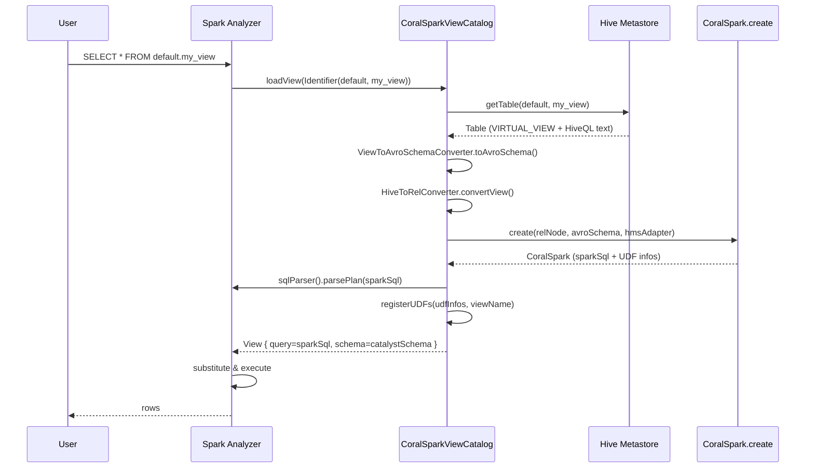
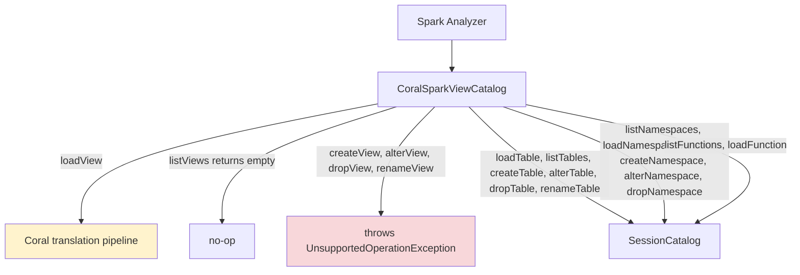

# 11 — coral-spark-catalog: runtime view translation

`coral-spark-catalog` plugs Coral into Spark 3.5's `CatalogExtension` SPI so a Spark session can read Hive views without anyone running `CoralSpark.create()` first. When a query references a view, Spark calls into the extension, the extension translates the view on the fly, and Spark executes the resulting Spark SQL. After this chapter you know how the SPI hookup works, what the `loadView` path does step by step, which operations the catalog intercepts versus delegates, and where UDFs are registered.

> **Reading time** ~12 min  ·  **Prerequisites** [chapter 08](08-coral-spark.md)
>
> **Key takeaways**
> - `CoralSparkViewCatalog` implements Spark 3.5's `CatalogExtension` SPI and is wired in by setting `spark.sql.catalog.spark_catalog`, so view resolution is intercepted while table, namespace, and function calls forward to the stashed `sessionCatalog` delegate.
> - `loadView` resolves the view from HMS, derives its Avro schema with `ViewToAvroSchemaConverter`, parses it with `HiveToRelConverter`, translates it through `CoralSpark.create`, parse-checks the output, registers any UDFs, and returns a `View` Spark can execute.
> - `registerUDFs` dispatches on `udfType`, using a reflection check (`isSparkUdf`) to distinguish Spark-native UDFs tagged `HIVE_CUSTOM_UDF` from genuine Hive UDFs, and uses the static `register(String)` entry point for `TRANSPORTABLE_UDF`.

## Why this module exists

[Chapter 08](08-coral-spark.md) walked `CoralSpark.create(RelNode, HiveMetastoreClient)` end to end. That API works when the caller already has the view's `RelNode` in hand — typically because they parsed the view definition out of HMS themselves and ran `HiveToRelConverter.convertView(...)` on it. In a real Spark application that is awkward: a query like `SELECT * FROM v JOIN w ON ...` references views by name; the application doesn't enumerate them ahead of time, and pre-translating every view in the warehouse is not a workable strategy.

Spark 3.5 added a `ViewCatalog` SPI for exactly this case — it lets a plugin intercept view resolution. `CoralSparkViewCatalog` implements that SPI. The caller writes Spark SQL that references HiveQL (or Trino) views by name; the catalog turns each view into Spark SQL the first time Spark looks it up, registers any UDFs the view depends on, and returns a `View` object Spark can execute. The pre-translation step disappears.

The module is intentionally narrow: one class, `CoralSparkViewCatalog`, plus tests. The translation work lives in `coral-spark` ([chapter 08](08-coral-spark.md)); the catalog only handles the Spark-side glue.

## How you plug it in

A single Spark configuration property:

```
spark.sql.catalog.spark_catalog=com.linkedin.coral.spark.CoralSparkViewCatalog
```

`spark_catalog` is Spark's reserved name for the default session catalog — overriding it routes every catalog-style call through `CoralSparkViewCatalog`. Because the class implements `CatalogExtension` (not just `ViewCatalog`), Spark also calls `setDelegateCatalog(CatalogPlugin)` with the original session catalog, which the extension stashes as `sessionCatalog`. Everything the extension doesn't itself implement — table reads, namespace operations, function lookup — gets forwarded to that delegate.

The Hive Metastore connection comes through standard Hive configuration (`hive-site.xml`, `HiveConf` system properties). `CoralSparkViewCatalog.loadView` constructs a fresh `HiveMetaStoreClient(new HiveConf())` each call. There is no constructor-time HMS binding.

A minimal session bootstrap, lifted from `CoralSparkViewCatalogTest`:

```java
SparkSession spark = SparkSession.builder()
    .config("spark.hadoop.hive.metastore.uris", hiveConf.get("hive.metastore.uris"))
    .enableHiveSupport()
    .getOrCreate();
spark.conf().set("spark.sql.catalog.spark_catalog", CoralSparkViewCatalog.class.getName());
```

Note `enableHiveSupport()` runs first so Spark wires up the regular `SessionCatalog` it will hand to `setDelegateCatalog`.

## What happens on loadView



The implementation lives in `CoralSparkViewCatalog.loadView(Identifier)` in [`coral-spark-catalog/src/main/java/com/linkedin/coral/spark/CoralSparkViewCatalog.java`](../coral-spark-catalog/src/main/java/com/linkedin/coral/spark/CoralSparkViewCatalog.java). The steps:

1. **Resolve from HMS.** Build a `HiveMscAdapter` over a fresh `HiveMetaStoreClient`. Pull the table; if it isn't a `VIRTUAL_VIEW`, throw `NoSuchElementException`. Real tables go through `loadTable`, which delegates to the session catalog.
2. **Derive the Avro schema.** Hand the adapter to `ViewToAvroSchemaConverter.create(adapter)` and call `toAvroSchema(db, tbl, false, false)`. Then re-parse the schema string with validation off and convert it to a Catalyst `DataType` via `SchemaConverters.toSqlType(...)`. The re-parse exists so Spark's Avro reader sees the schema as a string and preserves logical types (timestamp-millis, decimal, etc.); calling `SchemaConverters.toSqlType` on the in-memory `Schema` object directly would erase them. [Chapter 10](10-coral-schema.md) covers `ViewToAvroSchemaConverter`.
3. **Parse the view into IR.** `HiveToRelConverter(adapter).convertView(db, tbl)` runs the standard Hive frontend ([chapter 06](06-coral-hive.md)) and returns the Coral IR `RelNode`.
4. **Translate to Spark SQL.** `CoralSpark.create(relNode, avroSchema, adapter)` — the schema-aware overload from [chapter 08](08-coral-spark.md). Passing the Avro schema means `AddExplicitAlias` aligns the outer `SELECT` aliases to the Avro field names, so Spark's output columns match what `ViewToAvroSchemaConverter` produced.
5. **Sanity-parse the output.** `SparkSession.active().sessionState().sqlParser().parsePlan(sparkSql)`. A `ParseException` here means Coral emitted Spark SQL the running Spark version doesn't accept — the method wraps it in `RuntimeException` so the failure is visible at view-load time, not query-execute time.
6. **Register UDFs.** `registerUDFs(coralSpark.getSparkUDFInfoList(), db + "." + tbl)`. See below.
7. **Return a `View`.** An anonymous `org.apache.spark.sql.connector.catalog.View` whose `query()` returns the translated Spark SQL, `schema()` returns the Catalyst `StructType` derived in step 2, and `properties()` exposes the registered UDF names through `CatalogTable.VIEW_REFERRED_TEMP_FUNCTION_NAMES` so Spark's analyzer treats them as temporary functions the view depends on.

When Spark substitutes the `View`, it parses `view.query()` again — that's the same Spark SQL the catalog already parse-checked in step 5. The double parse is intentional: step 5 is a guard, step 7's substitution is what the analyzer actually consumes.

## What's intercepted versus delegated



The class is read-mostly:

- **`loadView`** is the only method that runs Coral.
- **`listViews`** returns an empty array. `CoralSparkViewCatalog` doesn't enumerate views — it only translates them on demand. A `SHOW VIEWS` call against this catalog therefore returns nothing.
- **Write paths on views** — `createView`, `alterView`, `dropView`, `renameView` — throw `UnsupportedOperationException`. The module deliberately doesn't proxy view writes: a Spark-style view definition created here wouldn't round-trip back through the Coral translation pipeline, so the catalog refuses the write rather than half-supporting it.
- **All table operations** — `loadTable`, `listTables`, `createTable`, `alterTable`, `dropTable`, `renameTable` — delegate to `sessionCatalog`. Same for the `SupportsNamespaces` methods.
- **`FunctionCatalog` methods** — `listFunctions`, `loadFunction` — delegate if the underlying session catalog implements `FunctionCatalog`; otherwise they return empty / throw `NoSuchFunctionException`. UDF registration for views is handled separately inside `loadView` (next section).

The split is the cleanest way to plug into `spark_catalog`: tables already work in Spark, so just forward; views need translation, so intercept.

## UDF registration

`CoralSpark.create` returns a `List<SparkUDFInfo>` describing every UDF the translated SQL references — [chapter 08](08-coral-spark.md) covers how the list gets assembled. `CoralSparkViewCatalog.registerUDFs` is the consumer.

The method takes the union of every `artifactoryUrls` entry across all UDF infos, wraps each as a `FunctionResource("jar", url)`, and calls `sessionCatalog.loadFunctionResources(...)` once. That kicks Spark's `SessionCatalog` to fetch and add each Ivy/Maven JAR to the running classpath. The `synchronized (sessionCatalog)` block guards the call because `SessionCatalog` is not thread-safe and `loadView` may run concurrently from multiple query threads.

Then for each `SparkUDFInfo` the method dispatches on `udfType`:

- **`HIVE_CUSTOM_UDF` with a Spark-native class.** `isSparkUdf(className)` reflects on the class looking for a `(Seq<Expression>)` constructor whose generic argument is `org.apache.spark.sql.catalyst.expressions.Expression`. That's the signature Transport UDFs and other Spark-native UDFs share. When the check passes, the method calls `functionRegistry().registerFunction(...)` with a closure that builds the expression via reflection on each invocation. This is the same registration approach Transport's `StdUDFUtils` uses.
- **`HIVE_CUSTOM_UDF` falling back to Hive.** Anything that fails `isSparkUdf` goes through `sessionState().catalog().registerFunction(new CatalogFunction(...))` — Spark's normal Hive-UDF registration path.
- **`TRANSPORTABLE_UDF`.** Load the class, find its static `register(String)` method, invoke it with the short function name. Transport UDFs ship with a `register` entry point precisely so frameworks can wire them up without knowing their inner shape.
- **Anything else** (e.g., `HIVE_BUILTIN_FUNCTION`) throws `RuntimeException`. The catalog doesn't register built-ins because Spark already has them.

The split between Spark-native and Hive-shim registration for `HIVE_CUSTOM_UDF` matters because Coral's `HiveUDFTransformer` ([chapter 08](08-coral-spark.md)) tags Transport UDFs that arrived via a Hive class name as `HIVE_CUSTOM_UDF` — they look like Hive UDFs to Coral but they execute as Spark UDFs at runtime. The reflection check disambiguates after the fact.

[Chapter 15](15-linkedin-specifics.md) covers the Transport UDF framework in detail.

## Test surface

This module hosts the closest thing the Coral repo has to end-to-end tests. Both test classes spin up a real `SparkSession` in `local[2]` mode against an embedded Hive Metastore (`TestHiveMetastore`, a Thrift HMS backed by Derby living entirely in a temp directory).

- **`CoralSparkViewCatalogTest`** — registers `CoralSparkViewCatalog` as `spark_catalog`, creates Hive tables and views through plain `spark.sql(...)`, then asserts that `spark.table("default.<view>").schema()` matches the expected Catalyst `StructType`. Each `spark.table(...)` call routes view resolution through `CoralSparkViewCatalog.loadView`, so a passing test exercises the full Hive-SQL → Coral IR → Spark SQL → executed-by-Spark pipeline. Coverage includes joins, lateral-view explode, subqueries, aggregations, nested struct access, `NAMED_STRUCT`, and a `dali_udf` view (`testViewQueryWithUDF`) that confirms the UDF gets registered in `sessionState().catalog()` after the view loads.
- **`TrinoToSparkCatalogTest`** — exercises the Trino→IR→Spark path explicitly. It parses Trino SQL through `TrinoToRelConverter` ([chapter 09](09-coral-trino.md)), runs it through `CoralSpark.create`, executes the resulting Spark SQL, and validates the output schema. Note the test's docstring: `TrinoToRelConverter` uppercases identifiers before parsing, so column aliases come back uppercase — the assertions encode this quirk.

Both tests use `TestHiveMetastore.INSTANCE`, a singleton that starts its Thrift server in `@BeforeSuite`. The Gradle build sets `hive.cbo.enable=false` and `-noverify` because Hive 2.3.9's `CalcitePlanner` clashes with the Calcite 1.21 the rest of Coral pulls in, and because `hive-exec-core` ships a signed Janino that conflicts with Spark's.

## Module shape and version pins

- **One source class**: `CoralSparkViewCatalog`. No additional public types; the entry point and the helper methods (`registerUDFs`, `isSparkUdf`, `jsonArrayString`) all live in the same file.
- **Spark version pinned to 3.5** via `deps.'spark3.5'.'sql'` / `deps.'spark3.5'.'avro'`, both `compileOnly` — the host Spark session provides the runtime jars.
- **Test stack pinned to Hive 2.3.9** for the embedded metastore, with explicit Jackson exclusions because Hive 2.3.9 ships Jackson 2.6 and Spark 3.5 ships Jackson 2.15. The build also forces Janino 3.1.9 to match Spark.
- **Module dependencies**: `coral-hive`, `coral-spark`, `coral-schema`. Tests additionally pull in `coral-trino`.

Recent PR history:

- **#584** — initial module landing with `CoralSparkViewCatalog` and the Spark 3.5 integration.
- **#594** — `README.md` for the module.
- **#595** — fix the `CatalogExtension` link in the README.
- **#585** — embedded-metastore upgrade from Hive 1.2.2 to 2.3.9 (the Jackson and Calcite exclusions in `build.gradle` are from this PR).

This module is one of the newer Coral pieces — all four PRs landed inside the last release cycle. When reviewing changes here, treat the SPI surface as the contract: a method that throws `UnsupportedOperationException` was a deliberate choice, and a method that delegates to `sessionCatalog` is doing so because Spark already handles that path correctly.

## Self-check

1. Trace `loadView` end to end: what does the catalog pull from HMS, why does it re-parse the Avro schema string with validation off before calling `SchemaConverters.toSqlType`, and why is the translated SQL parsed twice?
2. A reviewer sees a PR add a `createView` implementation to `CoralSparkViewCatalog`. Why does the existing code throw `UnsupportedOperationException` there instead, and which operations are forwarded to `sessionCatalog` versus run through Coral?
3. `CoralSpark.create` returns a `List<SparkUDFInfo>` ([chapter 08](08-coral-spark.md)). How does `registerUDFs` decide whether a `HIVE_CUSTOM_UDF` is registered as a Spark-native function or through Spark's Hive-UDF path?

## Files this chapter discusses

- [`coral-spark-catalog/README.md`](../coral-spark-catalog/README.md)
- [`coral-spark-catalog/build.gradle`](../coral-spark-catalog/build.gradle)
- [`coral-spark-catalog/src/main/java/com/linkedin/coral/spark/CoralSparkViewCatalog.java`](../coral-spark-catalog/src/main/java/com/linkedin/coral/spark/CoralSparkViewCatalog.java)
- [`coral-spark-catalog/src/test/java/com/linkedin/coral/spark/CoralSparkViewCatalogTest.java`](../coral-spark-catalog/src/test/java/com/linkedin/coral/spark/CoralSparkViewCatalogTest.java)
- [`coral-spark-catalog/src/test/java/com/linkedin/coral/spark/TrinoToSparkCatalogTest.java`](../coral-spark-catalog/src/test/java/com/linkedin/coral/spark/TrinoToSparkCatalogTest.java)
- [`coral-spark-catalog/src/test/java/com/linkedin/coral/spark/TestHiveMetastore.java`](../coral-spark-catalog/src/test/java/com/linkedin/coral/spark/TestHiveMetastore.java)
- [`coral-spark-catalog/src/test/java/com/linkedin/coral/spark/CoralTestUDF.java`](../coral-spark-catalog/src/test/java/com/linkedin/coral/spark/CoralTestUDF.java)

## Read next

- [Chapter 08](08-coral-spark.md) — `coral-spark`, the translation pipeline this module wraps.
- [Chapter 10](10-coral-schema.md) — `coral-schema` and `ViewToAvroSchemaConverter`, which supplies the Catalyst schema.
- [Chapter 15](15-linkedin-specifics.md) — Transport UDFs and the LinkedIn-specific UDF mechanics `registerUDFs` dispatches on.
- [Chapter 16](16-pr-review-companion.md) — PR review companion; the cheat sheet for this module is short, but the SPI contract is worth a second look.
