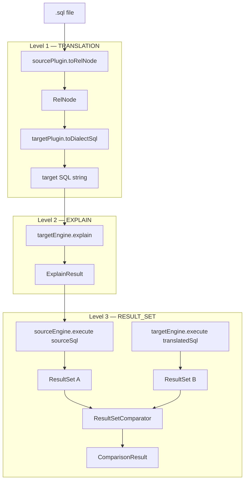
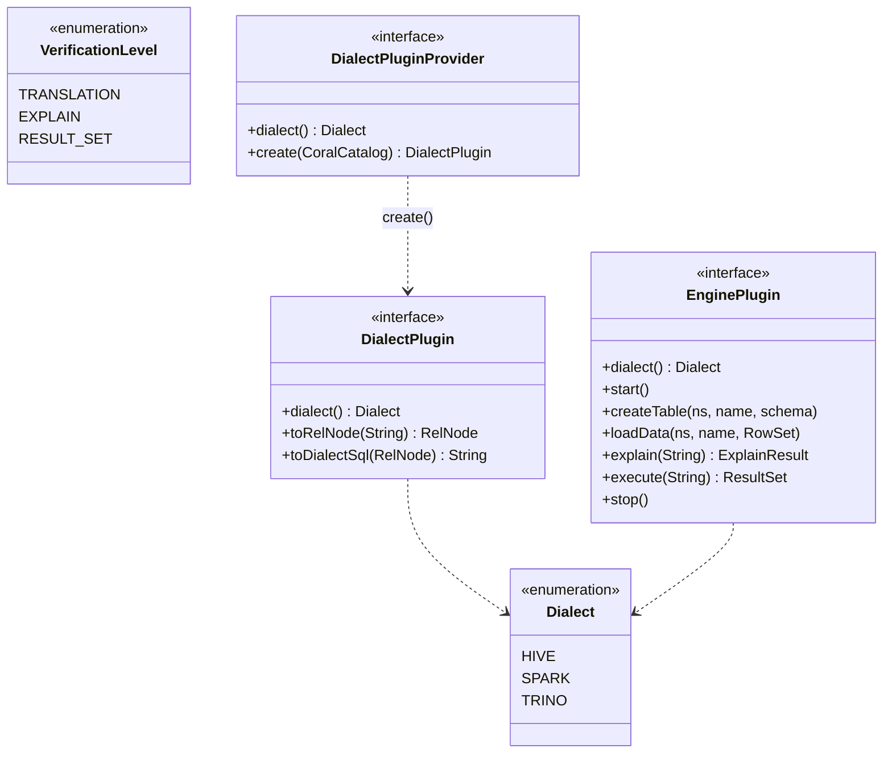

# 12 — coral-benchmark: cross-dialect correctness

`coral-benchmark` is the regression-catching framework for cross-dialect translation. A single Hive query translated to Trino must either round-trip through Coral IR cleanly (cheap), parse and plan on a Trino engine (medium), or produce the same result set when both engines execute the same data (expensive). This chapter walks the three verification levels, the SPI you implement to plug in a dialect or an engine, and the corpus pattern that makes adding new test cases a high-leverage contribution.

> **Reading time** ~16 min  ·  **Prerequisites** [chapter 01](01-the-big-picture.md) (and [chapter 07](07-transformers-pattern.md) helps)
>
> **Key takeaways**
> - The three verification levels — `TRANSLATION`, `EXPLAIN`, `RESULT_SET` — are an ordered escalation, each subsuming the one before, and `VerificationLevel`'s ordinal order gates the engine requirement in `TranslationTestSuite`.
> - The module ships only the framework — orchestrator, SPI (`Dialect`, `DialectPlugin`, `DialectPluginProvider`, `EnginePlugin`), `InMemoryCatalog`, and comparison machinery — built on `coral-common` alone; concrete plugins and the test corpus live elsewhere and the comparator still throws `UnsupportedOperationException`.
> - Adding a `TRANSLATION`-level test case is one `.sql` file plus catalog registration with no new Java, which is why expanding the corpus is a high-leverage contribution.

## Why this module exists

Coral's value proposition collapses N × N translators to 2 × N by introducing an IR — see [chapter 01](01-the-big-picture.md) for the framing. The cost of that abstraction is a coverage problem: any frontend or backend change can subtly break an unrelated dialect pair. Module-level unit tests in `coral-hive` and `coral-trino` catch obvious regressions, but they verify the converter in isolation. They do not check that a Hive query, after passing through `HiveToRelConverter` and `RelToTrinoConverter`, is also semantically equivalent on a live Trino engine.

`coral-benchmark` fills that gap. It is a *framework*, not a test corpus: the module ships the orchestrator, the SPI, the comparison machinery, and an in-memory catalog. Concrete `DialectPlugin` and `EnginePlugin` implementations live elsewhere — the spec ([`coral-benchmark/coral-benchmark-spec.md`](../coral-benchmark/coral-benchmark-spec.md)) intentionally defers the hosting module for plugins until real implementations exist. The module was introduced by PR #599 and is built on top of `coral-common` only — no other module dependency.

The design intent (from `coral-benchmark-spec.md`):

- Grounded in existing APIs. The catalog is `CoralCatalog`; types come from `CoralDataType` and its `StructType` / `PrimitiveType` / etc. subtypes. The framework does not invent a parallel type system.
- In-memory by default. No metastore, no Hadoop config, no Hive site XML.
- Dialect-agnostic core. The orchestrator imports only `Dialect`, `DialectPlugin`, `EnginePlugin`, and `VerificationLevel` — it has no compile-time dependency on `coral-hive` or `coral-trino`.
- Incremental verification. You pick the level that matches the change you are validating.

## The three verification levels



Each level subsumes the one before it. The matrix from the spec:

| Level         | Engines required  | Test data |
|---------------|-------------------|-----------|
| `TRANSLATION` | none              | no        |
| `EXPLAIN`     | target only       | no        |
| `RESULT_SET`  | source + target   | yes       |

### Level 1: TRANSLATION

The source plugin parses the query into a `RelNode`, the target plugin emits dialect SQL from that `RelNode`. The test passes if both steps complete and produce non-empty SQL. No engines are involved. No data is involved.

This is the cheapest level and the one you run on every commit. It catches the failures the existing module tests already exercise — parser failures, unsupported SQL constructs, operator mapping gaps, type-conversion errors — but it runs them as a corpus rather than as isolated cases per converter.

### Level 2: EXPLAIN

Take the translated SQL from Level 1 and hand it to the target engine's `EXPLAIN`. The engine parses and plans the query against the schema you registered in the catalog. If `EXPLAIN` succeeds, the translated SQL is syntactically valid in the target dialect and resolves against the schema.

This is the cheapest way to catch dialect-specific syntax errors that the IR round-trip missed. The Coral converter emits SQL it believes is valid Trino; only the Trino parser knows for sure. Schema mismatches and unresolved function references also surface here.

### Level 3: RESULT_SET

Both engines execute, against the same in-memory data. The source engine runs the original SQL; the target engine runs the translated SQL. The two `ResultSet` outputs go through `ResultSetComparator`.

This is the only level that catches semantic mismatches: NULL handling between Hive and Trino, float precision drift, timestamp precision differences, ordering ambiguity in unordered queries, integer-vs-decimal divisions. It is also the most expensive — two engines to start and stop per suite, test data to load, and a comparator with several knobs.

The spec is explicit that engine plugins for embedded Spark, Trino test harness, and embedded HiveServer2 are the expected implementations. The module ships none of them today; only the SPI.

## The SPI



### `Dialect`

A three-value enum: `HIVE`, `SPARK`, `TRINO`. Adding a new dialect means adding a value here, then providing a `DialectPluginProvider`. The enum is deliberately small — Coral's POC trino-to-rel direction exists, but only the directions already proven in `coral-hive`, `coral-spark`, and `coral-trino` are on the enum.

### `DialectPlugin` and `DialectPluginProvider`

`DialectPlugin` is the runtime translator. It has exactly two methods past `dialect()`: `toRelNode(String sql)` to parse the source dialect into IR, and `toDialectSql(RelNode rel)` to emit the target dialect from IR.

`DialectPluginProvider` is the discovery shim. It declares the dialect it produces plugins for and exposes a `create(CoralCatalog catalog)` factory. The provider has a no-arg constructor (required for `ServiceLoader`); the plugin holds the catalog as a `final` field. This split deliberately avoids a two-phase `init(catalog)` pattern on the plugin, which would force the plugin to defend against unset state.

The wrap-existing-converters strategy is spelled out in the `DialectPlugin` javadoc:

- Hive — `HiveToRelConverter` for `toRelNode`, `CoralRelToSqlNodeConverter` (Hive dialect) for `toDialectSql`.
- Trino — `TrinoToRelConverter` for `toRelNode`, `RelToTrinoConverter` for `toDialectSql`.
- Spark — `HiveToRelConverter` (Spark SQL parses as Hive in Coral; see [chapter 04](04-coral-common.md)) for `toRelNode`, `CoralSpark` for `toDialectSql`.

Providers are picked up by `ServiceLoader` via `META-INF/services/com.linkedin.coral.benchmark.spi.DialectPluginProvider`, or supplied explicitly to the suite builder through `sourcePluginProvider()` / `targetPluginProvider()`. `TranslationTestSuite.Builder#resolveProvider` does the discovery walk and throws a descriptive `IllegalStateException` if no provider matches.

### `EnginePlugin`

The execution side. Lifecycle: `start()` once, then any sequence of `createTable`, `loadData`, `explain`, `execute`, then `stop()` once. The orchestrator owns the lifecycle — you do not call `start()` yourself.

Two execution methods: `explain(sql)` returns an `ExplainResult` (success or failure with message); `execute(sql)` returns a `ResultSet`. `createTable(namespace, tableName, CoralDataType schema)` takes the Coral type as input — the engine plugin is responsible for translating Coral types into whatever the engine's `CREATE TABLE` requires.

`EnginePlugin` is optional. A pure `TRANSLATION`-level suite never instantiates one.

### `VerificationLevel`

Three-value enum with declared ordinal ordering: `TRANSLATION < EXPLAIN < RESULT_SET`. The builder in `TranslationTestSuite` uses `verificationLevel.ordinal() >= VerificationLevel.EXPLAIN.ordinal()` to gate the target-engine requirement check. Treat the ordinal order as load-bearing.

## Catalog: `InMemoryCatalog`

`InMemoryCatalog` implements `CoralCatalog` over a `Map<String, Map<String, CoralTable>>`. No metastore, no Hadoop config, deep-copy-immutable after `build()`. The builder enforces that a namespace exists before you add a table to it and rejects duplicate table names.

The table implementation, `InMemoryTable`, always reports `TableType.TABLE` — views are out of scope. The [chapter 04](04-coral-common.md) view-expansion mechanism lives in `coral-common`, not here; benchmark queries reference base tables only.

Build pattern from the spec:

```java
InMemoryCatalog catalog = InMemoryCatalog.builder()
    .createNamespace("db")
    .addTable("db", "users", StructType.of(Arrays.asList(
        StructField.of("id",   PrimitiveType.of(CoralTypeKind.INT, true)),
        StructField.of("name", PrimitiveType.of(CoralTypeKind.STRING, true))
    ), true))
    .build();
```

All column types are expressed through the Coral type hierarchy. No raw string types — `"INT"` will not compile.

## Data: `RowSet`, `ResultSet`, `ExplainResult`

Three immutable value containers, all in the `data/` package.

`RowSet` holds typed test data for loading. It binds to a `StructType` schema and exposes a builder where `addRow(Object... values)` enforces the column count. Java type mapping is the obvious one (`INT` → `Integer`, `STRING` → `String`, `ARRAY` → `List`, `MAP` → `Map`, `STRUCT` → `Object[]`); see the `RowSet` javadoc for the full table.

`ResultSet` is `RowSet`'s output-side counterpart. Same shape — schema plus `List<Object[]>` — but produced by `EnginePlugin.execute()` and consumed by `ResultSetComparator`.

`ExplainResult` is a success/failure union. `ExplainResult.success(planText)` carries the (optional) plan text; `ExplainResult.failure(message, exception)` carries the error. The plan text is `Optional<String>` because some engines don't expose plan output in a usable form.

## Comparison: `ResultSetComparator` + `ComparisonConfig`

`ResultSetComparator.compare(source, target)` returns a `ComparisonResult` that is either `equivalent()` or `mismatch(summary, diffs)`. The configuration knobs live on `ComparisonConfig` and capture the real-world ways two engines can produce semantically-equal but structurally-different output:

- **Row ordering** — `isOrderedComparison()` defaults to `false`. Result sets are compared as multisets; the same rows must appear the same number of times, regardless of order. Set to `true` only when the query has an explicit `ORDER BY`.
- **Floating-point tolerance** — `getFloatingPointEpsilon()` defaults to `1e-9`. FLOAT and DOUBLE values are equal if their absolute difference is less than epsilon.
- **NULL equivalence** — two NULLs in the same column position are equal. This is a semantic choice, not a SQL `NULL = NULL` reading; standard SQL says NULL is unknown.
- **Timestamp precision** — normalized to the lower precision of the two result sets before comparison. Hive's millisecond timestamps and Trino's microsecond timestamps compare equal modulo the truncation.
- **Type widening** — `isAllowTypeWidening()` defaults to `true`. INT-vs-BIGINT and FLOAT-vs-DOUBLE are promoted to the wider type before comparison; flag unsafe mismatches.

At the time of writing, the comparator's `compare()` method throws `UnsupportedOperationException("Not yet implemented")`. The spec, config, and result types are stable; the comparison logic is the next implementation step. If you are looking at the source and it still throws, that is expected — the framework was introduced as scaffolding first.

## Orchestration: `TranslationTestSuite`

The suite builder is parameterized by source dialect, target dialect, catalog, query directory, verification level, optional plugin providers, optional engines, optional test data, and optional `ComparisonConfig`. The `build()` validation enforces:

- All five core fields are non-null.
- `EXPLAIN` or `RESULT_SET` requires `targetEngine`.
- `RESULT_SET` additionally requires `sourceEngine` and non-empty `testData`.

If you do not set a `DialectPluginProvider`, the builder calls `resolveProvider(dialect)` which walks `ServiceLoader.load(DialectPluginProvider.class)` and matches on `provider.dialect()`. The error message tells you exactly which `META-INF/services` file is missing.

`run()` returns a `TestReport`. The implementation (which the spec describes but the code currently leaves as `UnsupportedOperationException`):

1. Discover `.sql` files in `queryDir` from the classpath.
2. Start engines if needed.
3. For `RESULT_SET`: create tables and load `testData` into both engines.
4. For each query: translate, then verify at each level up to the requested one, accumulating a `QueryTestResult`.
5. Stop engines, even on failure.
6. Build the `TestReport`.

`QueryTestResult` carries the source SQL, requested level, status (`PASS` / `FAIL`), translated SQL (if reached), `ExplainResult` (if reached), `ComparisonResult` (if reached), failure category, error message, and exception. `FailureCategory` enumerates the three places translation can go wrong: `TRANSLATION_ERROR`, `EXPLAIN_FAILURE`, `RESULT_MISMATCH`.

`TestReport` aggregates: `passCount()`, `failCount()`, `passRate()`, `getFailures()`, and `failureCountsByCategory()` for slicing by failure type.

## How a new test case is added

For Level 1 (TRANSLATION), the workflow is one new file:

1. Drop a `.sql` file into `coral-benchmark/src/test/resources/queries/<source-dialect>/`. File name is descriptive: `group_by_count.sql`, `nested_struct_access.sql`, `union_all_distinct.sql`.
2. Make sure any tables the query references are registered in the `InMemoryCatalog` that the test uses.

That is the entire delta for a translation-only test. No new Java, no new dependencies, no new wiring. This is why [chapter 17](17-first-contributions.md) lists "expand the benchmark query corpus" as a first PR — the blast radius is tiny and the regression value is real.

For Level 2 you additionally need a target `EnginePlugin` registered. For Level 3 you also need a source `EnginePlugin` and a `RowSet` for each table the query touches. The data is sometimes the larger problem; see [chapter 13](13-coral-data-generation.md) for how `coral-data-generation` solves it symbolically — given a SQL predicate, it infers a domain per source field and produces rows that satisfy the predicate.

## Why this is a high-leverage place to contribute

Three reasons, in order of importance:

1. **The corpus is small and the surface is well-defined.** A query file is plain text. There is no Java, no Calcite, no convertlet logic to learn. Adding a CTE test or a window-function test exercises a code path that the rest of the module test suites already hit, but does so as a corpus the framework runs against every dialect pair on every CI build (once the framework is wired into CI).
2. **It catches regressions other tests miss.** The unit tests in `coral-trino` verify a converter against an expected SQL string. They do not check that Trino can actually plan that SQL. They certainly do not check that Trino produces the same result as Hive on the same data. Level 2 and Level 3 catch both.
3. **The SPI is the extension point.** When a new dialect lands (say, Coral grows a Snowflake backend), the work to add benchmark coverage is exactly one `DialectPluginProvider` plus one `EnginePlugin`. The orchestrator and the comparator come along for free.

The module is new and there is no test corpus committed yet — that is exactly the contribution [chapter 17](17-first-contributions.md) points at. The framework is the scaffolding; the queries are the value.

## Self-check

1. What does each of the three verification levels actually check, which engines and test data does each require, and why does `RESULT_SET` need a `ComparisonConfig`?
2. A contributor wants to add a window-function translation test. What is the full delta for a `TRANSLATION`-level case, and what additionally changes for `EXPLAIN` and `RESULT_SET`?
3. Why does `DialectPluginProvider` exist as a separate interface from `DialectPlugin` rather than putting an `init(catalog)` method on the plugin, and how does the suite discover providers? Connect this to where `coral-data-generation` ([chapter 13](13-coral-data-generation.md)) would supply the `RowSet` data.

## Files this chapter discusses

- [`coral-benchmark/coral-benchmark-spec.md`](../coral-benchmark/coral-benchmark-spec.md)
- [`coral-benchmark/build.gradle`](../coral-benchmark/build.gradle)
- [`coral-benchmark/src/main/java/com/linkedin/coral/benchmark/spi/Dialect.java`](../coral-benchmark/src/main/java/com/linkedin/coral/benchmark/spi/Dialect.java)
- [`coral-benchmark/src/main/java/com/linkedin/coral/benchmark/spi/DialectPlugin.java`](../coral-benchmark/src/main/java/com/linkedin/coral/benchmark/spi/DialectPlugin.java)
- [`coral-benchmark/src/main/java/com/linkedin/coral/benchmark/spi/DialectPluginProvider.java`](../coral-benchmark/src/main/java/com/linkedin/coral/benchmark/spi/DialectPluginProvider.java)
- [`coral-benchmark/src/main/java/com/linkedin/coral/benchmark/spi/EnginePlugin.java`](../coral-benchmark/src/main/java/com/linkedin/coral/benchmark/spi/EnginePlugin.java)
- [`coral-benchmark/src/main/java/com/linkedin/coral/benchmark/spi/VerificationLevel.java`](../coral-benchmark/src/main/java/com/linkedin/coral/benchmark/spi/VerificationLevel.java)
- [`coral-benchmark/src/main/java/com/linkedin/coral/benchmark/catalog/InMemoryCatalog.java`](../coral-benchmark/src/main/java/com/linkedin/coral/benchmark/catalog/InMemoryCatalog.java)
- [`coral-benchmark/src/main/java/com/linkedin/coral/benchmark/catalog/InMemoryTable.java`](../coral-benchmark/src/main/java/com/linkedin/coral/benchmark/catalog/InMemoryTable.java)
- [`coral-benchmark/src/main/java/com/linkedin/coral/benchmark/data/RowSet.java`](../coral-benchmark/src/main/java/com/linkedin/coral/benchmark/data/RowSet.java)
- [`coral-benchmark/src/main/java/com/linkedin/coral/benchmark/data/ResultSet.java`](../coral-benchmark/src/main/java/com/linkedin/coral/benchmark/data/ResultSet.java)
- [`coral-benchmark/src/main/java/com/linkedin/coral/benchmark/data/ExplainResult.java`](../coral-benchmark/src/main/java/com/linkedin/coral/benchmark/data/ExplainResult.java)
- [`coral-benchmark/src/main/java/com/linkedin/coral/benchmark/comparison/ResultSetComparator.java`](../coral-benchmark/src/main/java/com/linkedin/coral/benchmark/comparison/ResultSetComparator.java)
- [`coral-benchmark/src/main/java/com/linkedin/coral/benchmark/comparison/ComparisonConfig.java`](../coral-benchmark/src/main/java/com/linkedin/coral/benchmark/comparison/ComparisonConfig.java)
- [`coral-benchmark/src/main/java/com/linkedin/coral/benchmark/comparison/ComparisonResult.java`](../coral-benchmark/src/main/java/com/linkedin/coral/benchmark/comparison/ComparisonResult.java)
- [`coral-benchmark/src/main/java/com/linkedin/coral/benchmark/suite/TranslationTestSuite.java`](../coral-benchmark/src/main/java/com/linkedin/coral/benchmark/suite/TranslationTestSuite.java)
- [`coral-benchmark/src/main/java/com/linkedin/coral/benchmark/suite/QueryTestResult.java`](../coral-benchmark/src/main/java/com/linkedin/coral/benchmark/suite/QueryTestResult.java)
- [`coral-benchmark/src/main/java/com/linkedin/coral/benchmark/suite/TestReport.java`](../coral-benchmark/src/main/java/com/linkedin/coral/benchmark/suite/TestReport.java)

## Read next

- [Chapter 13](13-coral-data-generation.md) — `coral-data-generation`: symbolic solver for test data. Pairs directly with this module's Level 3 verification.
- [Chapter 17](17-first-contributions.md) — first contributions. "Expand the benchmark corpus" is the canonical easy PR; this chapter explains what that delta looks like.
- [Chapter 16](16-pr-review-companion.md) — PR review companion. When reviewing a translation PR, ask whether benchmark coverage exists for the regression it claims to fix.
