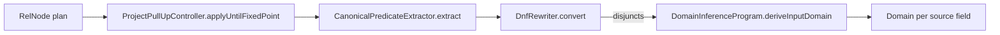
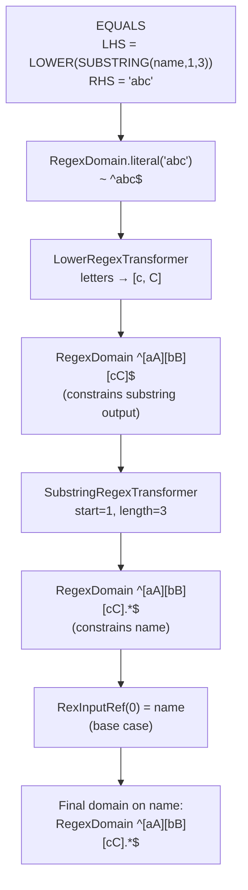

# 13 — coral-data-generation: the symbolic solver

`coral-data-generation` solves a problem most test frameworks dodge: given a SQL predicate, produce concrete input rows that satisfy it — without generating-and-rejecting. It does this by inverting the predicate's expression tree symbolically, computing for each base-table column a `Domain` of values that, when run forward through the predicate, are guaranteed to make it true. The module is small (one `domain/` package, one `rel/` package, ~15 source files), and it is the most academically dense code in the repo: closed algebraic structures, automaton intersection, fixed-point rewrites, DNF normalization. After this chapter you can read the package without consulting the `dk.brics.automaton` Javadoc on every line.

## Why this exists

A SQL test corpus needs rows that exercise specific predicates: `WHERE LOWER(SUBSTRING(name, 1, 3)) = 'abc' AND age * 2 + 5 > 50`. Random data generation produces overwhelmingly rejected rows — almost no random name matches the prefix, almost no random age satisfies the arithmetic. Selectivity collapses on conjunction. The cost scales with predicate restrictiveness, and at any non-trivial corpus size the random approach simply does not converge.

Symbolic inversion sidesteps this. Instead of guess-and-check, the module starts from the predicate's required output (`true`, equivalently `LHS = 'abc'`) and walks the expression tree backward, asking each operator: "given that you must produce this output domain, what input domain must your variable operand belong to?" Every sampled row is valid by construction. The same machinery, as a side effect, detects contradictory predicates — when the intersection of two derived domains is empty, the query has no valid input and no test data is generated.

[Chapter 12](12-coral-benchmark.md)'s `coral-benchmark` is the natural consumer: its `RowSet` generation step can take a SQL file, run it through this module, and emit fixtures sized to the actual predicate's solution space.

## The shift in perspective

Forward evaluation, the standard SQL engine direction, is a function: `f(name, age) -> Boolean`. Random testing samples the input space and applies `f`. The cost is proportional to `1 / selectivity(f)`.

Symbolic inversion treats `f` as a composition `g3 ∘ g2 ∘ g1` (e.g., `LOWER ∘ SUBSTRING ∘ identity`) and inverts each `g_i` with a paired transformer. The output constraint flows backward through transformers. At the leaf — a `RexInputRef` — what arrives is the domain on that input. Sampling from the domain is now O(domain-emptiness check + automaton/interval traversal), not O(rejection rate). And if any transformer along the way produces an empty domain, the algorithm stops: the predicate is unsatisfiable.

This is constraint solving, not data generation. The data generation is a thin sampling layer on top of the domains.

## Domain types

A `Domain<T, D>` is the algebraic substrate. [`coral-data-generation/src/main/java/com/linkedin/coral/datagen/domain/Domain.java`](../coral-data-generation/src/main/java/com/linkedin/coral/datagen/domain/Domain.java) declares five abstract operations: `isEmpty()`, `intersect(D)`, `union(D)`, `sample(int limit)`, `isSingleton()`. Domains form a lattice under intersection — every transformer's job is to compute the next refinement.

### RegexDomain

[`coral-data-generation/src/main/java/com/linkedin/coral/datagen/domain/RegexDomain.java`](../coral-data-generation/src/main/java/com/linkedin/coral/datagen/domain/RegexDomain.java) represents a set of strings as a finite-state automaton from the `dk.brics.automaton` library. The library is not a regex matcher in the Java `Pattern` sense; it is a closed algebra over deterministic finite automata. Intersection is the product construction, union is the standard NFA union, emptiness is reachability of any accept state, and sampling is depth-first traversal collecting accepted prefixes.

A few details to internalize from the source:

- `parseRegex(String)` strips `^` and `$` anchors before handing the pattern to `dk.brics.automaton`'s `RegExp` because brics matches the whole string implicitly. It also expands `\d`, `\w`, `\s` into bracketed character classes since brics doesn't speak those shorthands.
- `isLiteral()` calls `automaton.getFiniteStrings(2)` — if exactly one string is accepted, the domain is a literal. This is the optimization `LowerRegexTransformer` exploits.
- `sample(int)` does a DFS over the automaton's states with a `StateWithPrefix` seen-set for cycle prevention and a per-string length cap (`DEFAULT_MAX_SAMPLE_LENGTH = 100`). The alphabet enumerated at each transition is restricted to seven visible ASCII ranges in `ALPHABET_RANGES` — digits, letters, common punctuation — so samples are printable. A non-empty automaton whose minimum string exceeds the length cap throws `IllegalStateException`; this is a sign the predicate forces unreasonably long strings.

`RegexDomain.literal("abc")` is the canonical entry point when a predicate is `expr = literal`. `RegexDomain.empty()` is the canonical contradiction.

### IntegerDomain

[`coral-data-generation/src/main/java/com/linkedin/coral/datagen/domain/IntegerDomain.java`](../coral-data-generation/src/main/java/com/linkedin/coral/datagen/domain/IntegerDomain.java) represents a set of longs as a normalized, sorted, disjoint list of closed `[min, max]` intervals. The class is closed not only under set operations but also under arithmetic — `add(long)` and `multiply(long)` are present and saturating at `Long.MIN_VALUE` / `Long.MAX_VALUE`. This is what makes inverting `x + 5` straightforward: the result of inversion is just `domain.add(-5)`.

The internal `Interval` class handles overlap (`thisInterval.min <= other.max && other.min <= thisInterval.max`), adjacency (intervals that differ by 1 are mergeable), and merge by min/max bounds. `normalizeIntervals(...)` sorts by min and walks the list merging overlapping or adjacent intervals, producing the canonical form. Intersection iterates the cross product of intervals and emits new ones bounded by `max(min1, min2)` and `min(max1, max2)`. Union concatenates and re-normalizes. `isSingleton()` is true iff there is exactly one interval and its min equals its max.

`IntegerDomain.all()` is `[Long.MIN_VALUE, Long.MAX_VALUE]`; `IntegerDomain.empty()` is the empty list. Sampling iterates intervals: small intervals are enumerated exhaustively, large intervals are sampled uniformly (`Random.nextLong` scaled to the interval width).

### Crossing between domains

CAST is the only operator that crosses domain types. The bridge is two pieces:

- `IntegerRangeAutomaton.build(long lo, long hi)` produces a minimal automaton that accepts exactly the decimal-string representations of integers in `[lo, hi]`. It splits the range by digit count, then recursively constructs fixed-length sub-automata with a clever pair of `boundedBelow`/`boundedAbove` flags — at each digit position, the bottom edge (digit = lo's digit) keeps the lower bound active while freeing the upper, the top edge does the reverse, and the middle band (digits strictly between) is unconstrained. The result is the language of, e.g., "all four-digit strings between 1900 and 1999" without enumerating each value.
- `RegexToIntegerDomainConverter` runs the reverse: given a `RegexDomain` whose automaton is finite and digit-only, it either enumerates all accepted strings (up to `MAX_ENUMERATION_SIZE = 5000`) and parses them to longs, or — when enumeration is too large — computes `min` and `max` via memoized DFS over the automaton and emits a single interval. If the automaton is non-finite or contains non-digit transitions, it throws `NonConvertibleDomainException` ([`coral-data-generation/src/main/java/com/linkedin/coral/datagen/domain/NonConvertibleDomainException.java`](../coral-data-generation/src/main/java/com/linkedin/coral/datagen/domain/NonConvertibleDomainException.java)). The exception is a signal to the cast transformer that the cross-domain hop isn't safe — `CastRegexTransformer` catches it and falls back to intersecting with a `^-?[0-9]+$` mask.

These two utilities together mean a `WHERE CAST(age AS STRING) = '50'` predicate can flow: `RegexDomain("^50$")` → conversion check → `IntegerDomain([50])` → arithmetic inversion through any preceding `*`/`+` → final domain on `age`.

## Transformers: inverting one operator at a time

The transformer is the only thing that knows how to invert a specific SQL operator. `DomainTransformer` ([`coral-data-generation/src/main/java/com/linkedin/coral/datagen/domain/DomainTransformer.java`](../coral-data-generation/src/main/java/com/linkedin/coral/datagen/domain/DomainTransformer.java)) is intentionally not generic in the domain type — a transformer like `CastRegexTransformer` may take a `RegexDomain` on output and produce an `IntegerDomain` on input. Every implementation answers four questions: do I match this `RexNode`? is the variable in a valid operand position? where is the child to recurse into? and what domain do I produce on that child?

Five transformers ship today. They live in `coral-data-generation/src/main/java/com/linkedin/coral/datagen/domain/transformer/`.

`LowerRegexTransformer` handles `LOWER(x) = pattern`. When the output domain is a literal, it walks the string character by character: letters become `[lowerUpper]` character classes (`'a'` → `[aA]`), non-letters pass through unchanged. The result is a new `RegexDomain` built by concatenating per-character automata. For non-literal output domains, the transformer returns the output unchanged — the safe fallback when a more precise inversion is harder than the time-saved.

`SubstringRegexTransformer` handles `SUBSTRING(x, start, length) = pattern`. Calcite represents Hive's `substr` with the operator name "substr" and kind `OTHER_FUNCTION`, so the `canHandle` check matches on both. The transformer reads the literal `start` and `length`, converts `start` to a 0-based index, constrains the output automaton to exactly `length` characters (intersection with `Automaton.makeAnyChar().repeat(length, length)`), and embeds it: prefix of `.{startIdx}`, then the constrained output, then `.*` suffix. If the constrained output is empty after the length intersection, the transformer returns `RegexDomain.empty()` — that is the "you said `SUBSTRING(x, 1, 4) = 'foo'` but `'foo'` is only 3 characters" contradiction.

`CastRegexTransformer` is the cross-domain piece. It branches on (source SQL type, target SQL type, output domain type). String→int with `IntegerDomain` output produces a `RegexDomain` of valid string encodings via `IntegerRangeAutomaton`. Int→string with `RegexDomain` output runs `RegexToIntegerDomainConverter` if convertible, falls back to an integer-format regex intersection otherwise. String→date intersects with a date-format regex. Same-type casts pass the domain through. Unsupported pairs throw `UnsupportedOperationException` — the right behavior, since the caller (the solver) is the one that decides how to handle a non-invertible expression.

`PlusIntegerTransformer` handles `x + literal = output` (or `literal + x`). The inverse is `outputDomain.add(-literal)`. Saturation is handled inside `IntegerDomain.add`, so unbounded outputs (`[51, Long.MAX_VALUE)`) remain unbounded after the inversion. The transformer's `isVariableOperandPositionValid` requires that exactly one operand is a literal.

`TimesIntegerTransformer` handles `x * literal = output`. Division is more subtle than addition. The transformer iterates each output interval `[outMin, outMax]` and computes `[ceilDiv(outMin, literal), floorDiv(outMax, literal)]` for positive multipliers, swapping for negatives. If `inMin > inMax` after the divide, that interval contributes nothing — that is the integer-arithmetic contradiction. The most relevant case: `WHERE x * 2 = 7` gives `ceilDiv(7, 2) = 4` and `floorDiv(7, 2) = 3`, so `inMin > inMax` and the interval is dropped. The result is `IntegerDomain.empty()` — no integer `x` satisfies it, which the solver propagates up. `x * 0` is special-cased: if the output domain contains zero, any input works (`IntegerDomain.all()`); otherwise the result is empty.

The transformer set is open. Adding `UPPER`, `CONCAT`, `MOD`, or a date transformer is a matter of implementing the interface and adding the instance to the `DomainInferenceProgram` constructor list. The solver does not need to change.

## The solver

`DomainInferenceProgram` ([`coral-data-generation/src/main/java/com/linkedin/coral/datagen/domain/DomainInferenceProgram.java`](../coral-data-generation/src/main/java/com/linkedin/coral/datagen/domain/DomainInferenceProgram.java)) is the top-down recursive inverter. The algorithm is twelve lines of meaningful logic:

```java
public Domain<?, ?> deriveInputDomain(RexNode expr, Domain<?, ?> outputDomain) {
  if (expr instanceof RexInputRef) {
    return outputDomain;
  }
  for (DomainTransformer transformer : transformers) {
    if (transformer.canHandle(expr) && transformer.isVariableOperandPositionValid(expr)) {
      Domain<?, ?> childDomain = transformer.refineInputDomain(expr, outputDomain);
      if (childDomain.isEmpty()) {
        return createEmptyDomain(outputDomain);
      }
      RexNode child = transformer.getChildForVariable(expr);
      return deriveInputDomain(child, childDomain);
    }
  }
  throw new IllegalStateException("No applicable transformer for expression: " + expr);
}
```

Base case: a `RexInputRef` is the variable, and whatever output domain arrived is now the input domain. Recursive case: find a matching transformer, ask it to refine, check for emptiness, recurse on the variable-carrying child. If no transformer matches, the solver throws — silently producing wrong data is the worst outcome, so unhandled operators fail loudly.

`DomainInferenceProgram.withDefaultTransformers()` is the production constructor — five transformers, registered in the order: `LowerRegexTransformer`, `SubstringRegexTransformer`, `PlusIntegerTransformer`, `TimesIntegerTransformer`, `CastRegexTransformer`. Order matters only insofar as `canHandle` is mutually exclusive across the current set; if you add a transformer that overlaps another, ordering becomes meaningful.

Multiple predicates against the same variable do not extend the solver — they extend the caller. Each predicate is solved independently to a `Domain` on the variable, and the caller intersects the domains. Empty intersection means contradiction, e.g., `SUBSTRING(name, 1, 4) = '2000' AND SUBSTRING(name, 1, 4) = '1999'`.

## Relational preprocessing

The solver expects a single `RexNode` predicate referencing base-table columns by stable global indices. Raw Calcite plans don't deliver that. The `rel/` package converts a plan into that shape in three steps.



`ProjectPullUpController.applyUntilFixedPoint(RelNode)` repeatedly calls `ProjectPullUpRewriter.rewriteOneStep(RelNode)`. Each step finds the first `Filter → Project` or `Join → Project` pattern in the tree, inlines the project expressions into the parent's condition, and rebuilds the parent with the project pulled above it. Calling it in a loop until the tree stops changing (`next == current`) normalizes the plan so that every filter and join condition references base-table columns directly, not projected expressions. The controller caps iterations at 1000 and throws if the limit is hit — a safety net against bugs in the rewrite logic.

`CanonicalPredicateExtractor.extract(RelNode)` does two things at once. First, it collects sequential scans in left-to-right order — the same order Calcite would assign for a flat join. Second, it walks the tree collecting predicates from `Filter.getCondition()` and `Join.getCondition()`, tracking which node each predicate came from, and remaps every `RexInputRef` from the local-to-input scheme into a global scheme that spans all scans. For a plan with scans `[T1, T2]` of sizes 3 and 4, `T2.fld0` becomes `RexInputRef(3)`, `T2.fld1` becomes `RexInputRef(4)`, and so on. The output is `(List<RelNode> sequentialScans, List<RexNode> canonicalPredicates)`.

`DnfRewriter.convert(extracted, rexBuilder)` composes all canonical predicates with `RexUtil.composeConjunction`, converts the result to disjunctive normal form via `RexUtil.toDnf`, and extracts the top-level disjuncts with `RelOptUtil.disjunctions`. The output is `(sequentialScans, disjuncts)`. Each disjunct is solved independently. The final domain on a variable is the union of that variable's domain across disjuncts.

The point of DNF is that OR branches are independent: `(name = 'Alice' AND age > 30) OR (name = 'Bob' AND age < 25)` is two separate constraint systems. Solving them separately and unioning is correct; trying to solve them jointly requires reasoning about which branch a row picks, which the solver doesn't model.

## Worked example

Trace `LOWER(SUBSTRING(name, 1, 3)) = 'abc'` through the system.



Step by step. The solver starts with `outputDomain = RegexDomain.literal("abc")`. The root expression is `LOWER(SUBSTRING(name, 1, 3))`. `LowerRegexTransformer.canHandle` matches the `LOWER` operator, so it runs. The output domain is a literal, so the transformer walks `'abc'` character by character and produces `RegexDomain` over the automaton built from `Automaton.makeChar('a').union(Automaton.makeChar('A'))` concatenated with the same construction for `b` and `c`. That gives `^[aA][bB][cC]$`.

The solver recurses into the child, `SUBSTRING(name, 1, 3)`. `SubstringRegexTransformer.canHandle` matches. It reads `start = 1` and `length = 3`, converts to a 0-based start index of 0, constrains the input domain to exactly 3 characters (intersection with `.{3}` — already true since the automaton is `[aA][bB][cC]`), then embeds it: prefix `.{0}` (empty), the constrained output, and suffix `.*`. Result: `^[aA][bB][cC].*$`.

The solver recurses into the child, which is `RexInputRef(0)`. Base case. Return the domain. `name ∈ RegexDomain("^[aA][bB][cC].*$")`. Sampling produces strings like `"abc"`, `"abC"`, `"Abc"`, `"ABc..."`, all guaranteed to satisfy the original predicate.

If a second predicate (say, `SUBSTRING(name, 1, 4) = '1999'`) were intersected with this, the result would be `^[aA][bB][cC].*$ ∩ ^1999.*$ = empty`. Contradiction detected without ever emitting a row.

## Soundness and limits

The current transformer set is sound for what it handles: every value sampled from a derived domain is provably satisfying. It is incomplete in the obvious way — a SQL operator with no registered transformer fails the solver. Some specific gaps:

- Operators not yet registered: `UPPER`, `CONCAT`, `TRIM`, `REPLACE`, `MOD`, `DIVIDE`, date functions, `IN`-with-subquery.
- Predicates other than equality and the implicit `>`/`<` handled via `IntegerDomain` ranges. The current code assumes the top-level predicate is an equality or comparable; non-comparable predicates (e.g., `NOT LIKE`, `IS NULL`, function-of-multiple-variables) are outside scope.
- Both operands of `+` and `*` must be literal-and-variable. `x + y = z` between two variables is not invertible single-pass and is rejected by `isVariableOperandPositionValid`. The README discusses fixed-point iteration as the route for multi-variable systems, but the iteration loop is not implemented today.
- Join-propagation across `=` constraints (`T1.id = T2.id`) is similarly architectural rather than coded — the preprocessing identifies scans and canonical indices, but the solver itself runs per predicate and does not yet propagate domains across equality predicates.
- `RegexDomain.sample` caps generated strings at 100 characters. A predicate that forces longer strings (`SUBSTRING(name, 1000, 5) = 'abc'`) yields a non-empty domain whose minimum string exceeds the cap, triggering an exception.

The architecture is open to closing each gap by adding transformers, adding the multi-variable fixed-point loop, and extending sampling. None of these require changing `DomainInferenceProgram`.

## Pairing with coral-benchmark

[Chapter 12](12-coral-benchmark.md) covers `coral-benchmark`'s three verification levels (TRANSLATION, EXPLAIN, RESULT_SET). The third level needs in-memory data for both source and target engines. Today the corpus uses static `RowSet` fixtures wired up per query; nothing prevents an integration where `coral-data-generation` ingests the same query, walks the pipeline, derives a `Domain` per column, and emits a `RowSet` sized to the predicate's solution space. That removes the per-query fixture burden and makes the test corpus generative.

The shape of that integration is clean: `coral-benchmark` already depends on `coral-hive` for parsing, and `coral-data-generation` consumes a `RelNode` produced by the same parser. A small adapter — `Domain` → `RowSet` cell values, choosing one sample per row — is the bridge. When a query produces an empty domain for any column, the benchmark surfaces it as a contradiction rather than a translation failure, which is more useful diagnostic information.

## Files this chapter discusses

- [`coral-data-generation/README.md`](../coral-data-generation/README.md)
- [`coral-data-generation/build.gradle`](../coral-data-generation/build.gradle)
- [`coral-data-generation/src/main/java/com/linkedin/coral/datagen/domain/Domain.java`](../coral-data-generation/src/main/java/com/linkedin/coral/datagen/domain/Domain.java)
- [`coral-data-generation/src/main/java/com/linkedin/coral/datagen/domain/RegexDomain.java`](../coral-data-generation/src/main/java/com/linkedin/coral/datagen/domain/RegexDomain.java)
- [`coral-data-generation/src/main/java/com/linkedin/coral/datagen/domain/IntegerDomain.java`](../coral-data-generation/src/main/java/com/linkedin/coral/datagen/domain/IntegerDomain.java)
- [`coral-data-generation/src/main/java/com/linkedin/coral/datagen/domain/IntegerRangeAutomaton.java`](../coral-data-generation/src/main/java/com/linkedin/coral/datagen/domain/IntegerRangeAutomaton.java)
- [`coral-data-generation/src/main/java/com/linkedin/coral/datagen/domain/RegexToIntegerDomainConverter.java`](../coral-data-generation/src/main/java/com/linkedin/coral/datagen/domain/RegexToIntegerDomainConverter.java)
- [`coral-data-generation/src/main/java/com/linkedin/coral/datagen/domain/NonConvertibleDomainException.java`](../coral-data-generation/src/main/java/com/linkedin/coral/datagen/domain/NonConvertibleDomainException.java)
- [`coral-data-generation/src/main/java/com/linkedin/coral/datagen/domain/DomainTransformer.java`](../coral-data-generation/src/main/java/com/linkedin/coral/datagen/domain/DomainTransformer.java)
- [`coral-data-generation/src/main/java/com/linkedin/coral/datagen/domain/DomainInferenceProgram.java`](../coral-data-generation/src/main/java/com/linkedin/coral/datagen/domain/DomainInferenceProgram.java)
- [`coral-data-generation/src/main/java/com/linkedin/coral/datagen/domain/transformer/LowerRegexTransformer.java`](../coral-data-generation/src/main/java/com/linkedin/coral/datagen/domain/transformer/LowerRegexTransformer.java)
- [`coral-data-generation/src/main/java/com/linkedin/coral/datagen/domain/transformer/SubstringRegexTransformer.java`](../coral-data-generation/src/main/java/com/linkedin/coral/datagen/domain/transformer/SubstringRegexTransformer.java)
- [`coral-data-generation/src/main/java/com/linkedin/coral/datagen/domain/transformer/CastRegexTransformer.java`](../coral-data-generation/src/main/java/com/linkedin/coral/datagen/domain/transformer/CastRegexTransformer.java)
- [`coral-data-generation/src/main/java/com/linkedin/coral/datagen/domain/transformer/PlusIntegerTransformer.java`](../coral-data-generation/src/main/java/com/linkedin/coral/datagen/domain/transformer/PlusIntegerTransformer.java)
- [`coral-data-generation/src/main/java/com/linkedin/coral/datagen/domain/transformer/TimesIntegerTransformer.java`](../coral-data-generation/src/main/java/com/linkedin/coral/datagen/domain/transformer/TimesIntegerTransformer.java)
- [`coral-data-generation/src/main/java/com/linkedin/coral/datagen/rel/ProjectPullUpRewriter.java`](../coral-data-generation/src/main/java/com/linkedin/coral/datagen/rel/ProjectPullUpRewriter.java)
- [`coral-data-generation/src/main/java/com/linkedin/coral/datagen/rel/ProjectPullUpController.java`](../coral-data-generation/src/main/java/com/linkedin/coral/datagen/rel/ProjectPullUpController.java)
- [`coral-data-generation/src/main/java/com/linkedin/coral/datagen/rel/CanonicalPredicateExtractor.java`](../coral-data-generation/src/main/java/com/linkedin/coral/datagen/rel/CanonicalPredicateExtractor.java)
- [`coral-data-generation/src/main/java/com/linkedin/coral/datagen/rel/DnfRewriter.java`](../coral-data-generation/src/main/java/com/linkedin/coral/datagen/rel/DnfRewriter.java)

## Read next

- [Chapter 12](12-coral-benchmark.md) — `coral-benchmark`, the consumer of generated `RowSet`s.
- [Chapter 16](16-pr-review-companion.md) — PR review companion; the row "are new transformers sound (no false positives)?" is the load-bearing reviewer question for this module.
- [Chapter 07](07-transformers-pattern.md) — the transformer pattern in `coral-common`, for contrast: that one is a forward `RelNode → RelNode` rewriter, while these transformers are a backward `Domain → Domain` inverter. Same name, opposite direction.
