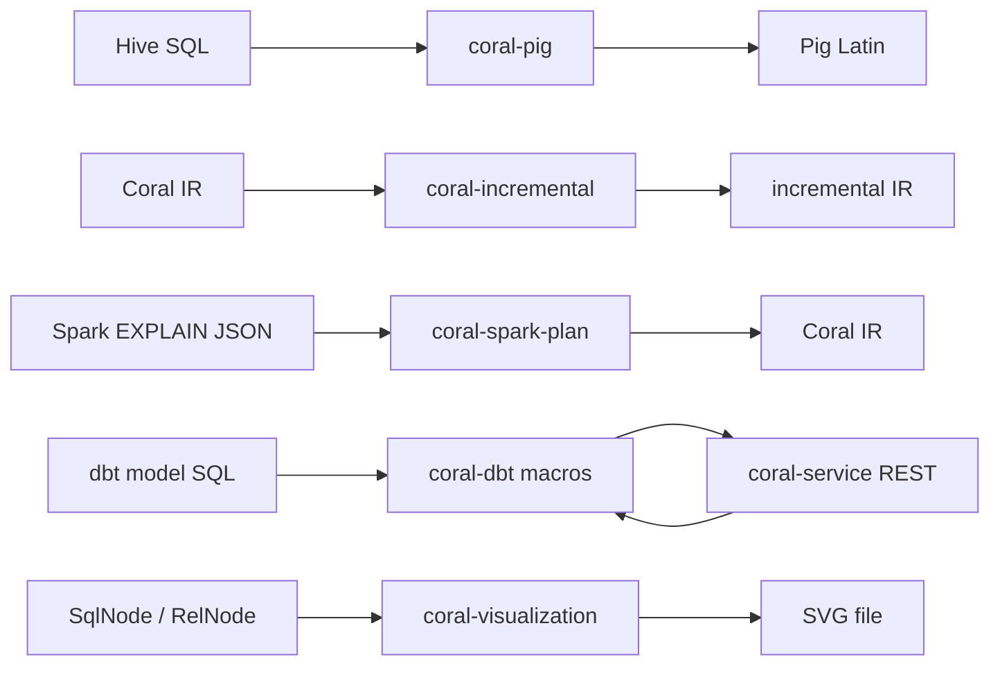

# 14 — Other modules

The remaining six modules each have a focused scope: one legacy emitter, one Python-bridged dbt integration, one IR-rewriting transformer, one debug visualizer, one Spring service, and one reverse-direction Spark parser. After this chapter you have enough orientation to read code in any of them and to recognize what kinds of PRs land there.

## coral-pig

Translates Coral IR `RelNode` trees to Pig Latin scripts. Mostly legacy — Pig is in maintenance mode across the industry and this backend hasn't seen feature work in years. It exists because some LinkedIn batch jobs still emit Pig.

The entry point is `coral-pig/src/main/java/com/linkedin/coral/pig/rel2pig/RelToPigLatinConverter.java`. `convert(RelNode root, String outputRelation)` walks the plan top-down and emits Pig statements into a `RelToPigBuilder` accumulator. The `outputRelation` argument names the final Pig alias the script writes into.

The package layout under `rel2pig/` follows a per-operator class pattern. `PigTableScan` emits a `LOAD` statement; `PigLogicalProject` emits `FOREACH ... GENERATE`; `PigLogicalFilter` emits `FILTER ... BY`; `PigLogicalJoin` emits `JOIN`; `PigLogicalAggregate` emits `GROUP ... BY` followed by aggregate `FOREACH`; `PigLogicalUnion` emits `UNION`. `PigRexUtils` translates `RexNode` expressions; `PigRelUtils` collects UDF definitions for the script preamble. The companion `functions/` and `operators/` subpackages map Calcite operator names to their Pig equivalents through `CalcitePigOperatorMap`. The supported `RelNode` set is narrow — `LogicalCorrelate`, `LogicalIntersect`, `LogicalMinus`, `LogicalSort`, and `LogicalValues` all throw `UnsupportedRelNodeException`.

The translation assumes LinkedIn's `dali.data.pig.DaliStorage` LoadFunc by convention (see the Javadoc on `RelToPigLatinConverter`), but the actual LoadFunc and path are injected via the `PigLoadFunction` and `TableToPigPathFunction` lambdas passed to the constructor — so non-Dali deployments can plug in their own.

Typical PRs: rare. When they appear, they are usually small operator coverage gaps (a new function in `CalcitePigOperatorMap`) or bug fixes against a specific LinkedIn workload. Review hot-spots are escape and quoting in the emitted text — Pig is whitespace- and identifier-sensitive — and the boundary between the supported and unsupported `RelNode` set.

## coral-dbt

Integrates Coral with dbt (data build tool) by shipping a dbt package of macros that call out to Coral Service for SQL rewriting. Used to implement incremental view maintenance for dbt models.

The module is unusual because it has no Java source — `coral-dbt/src/main/` contains only `resources/macros/` (Jinja-templated SQL) and `resources/tests/` (Python `unittest` files). The `build.gradle` runs `python3 -m unittest -v` against a virtualenv it sets up at build time and swallows failures rather than breaking the build (see the catch around `runCoralDbtTests`).

The macros under `macros/coral_macros/` add a `incremental_maintenance` materialization to dbt as a drop-in replacement for `table`. Instead of recomputing the full table on every run, it asks Coral Service for an incremental rewrite of the model SQL — Coral computes deltas on the input tables, applies them, and merges into the output. `default/utils/get_coral_incremental_response.sql` is the HTTP client macro; `spark/materializations/incremental_maintenance.sql` is the Spark-flavored materialization. The companion `trino_to_spark.sql` macros translate Trino DDL to Spark DDL through Coral.

The README spells out the setup: a local dbt-core patch to expose Python `requests` to the Jinja context, plus a running `coral-service` instance (default `http://localhost:8080`, overridable via the `coral_url` dbt var). The whole flow is described in Walaa Eldin Moustafa's "Incremental View Maintenance with Coral, dbt, and Iceberg" talk linked from the README.

Typical PRs: macro fixes for new dbt versions, additional materialization variants, and Python test updates. Review hot-spots are macro escaping (Jinja braces inside SQL strings), the contract with `coral-service` endpoints, and the silent-failure pattern in `build.gradle` that can hide regressions if you don't actually read the build log.

## coral-incremental

Rewrites a `RelNode` view definition into an incremental form: replace every base table `T` with `T_delta ∪ T`, then push that union upward through joins by distributing across `(left, right)`, `(left_delta, right)`, `(left, right_delta)`, `(left_delta, right_delta)`. The output computes the delta-set of the view from the delta-sets of its inputs, which is dramatically cheaper than recomputing the full view when input changes are small. This is the engine behind the dbt `incremental_maintenance` materialization in the section above, and behind ViewShift's incremental refresh path.

The entire module is one class: `coral-incremental/src/main/java/com/linkedin/coral/incremental/RelNodeIncrementalTransformer.java`. The static entry point is `convertRelIncremental(RelNode)`. It runs a Calcite `RelShuttleImpl` that overrides one visit method per logical operator.

The two interesting cases:

- `visit(TableScan)` — clones the table's qualified name, appends `_delta` to the last segment (so `db.users` becomes `db.users_delta`), and emits a `LogicalTableScan` over the renamed table. The schema is unchanged — the delta table is expected to have the same row type as its base.
- `visit(LogicalJoin)` — recursively transforms both children, then builds three `LogicalProject` nodes wrapping three `LogicalJoin` variants: `(left, incrementalRight)`, `(incrementalLeft, right)`, `(incrementalLeft, incrementalRight)`. These three are unioned with `UNION ALL`. The `Project` wrapper exists to capture the join's row type explicitly so downstream operators don't choke on field-name shadowing.

`Filter`, `Project`, `Union`, and `Aggregate` are pass-through — they recurse into the child and rebuild themselves over the transformed input. The shuttle is intentionally narrow: any `RelNode` type without an override (e.g., `LogicalSort`, `LogicalWindow`, `LogicalCorrelate`) is left untouched by the default `RelShuttleImpl` behavior, which can produce semantically wrong output for views that use them. The companion talk (referenced as `docs/talks/coral-incremental-view-maintenance.pdf`) covers the algebra in detail.

There is a subtle correctness gap in the Aggregate path: incrementally maintaining an aggregate generally requires either a delta-friendly aggregate (SUM, COUNT) or a state-keeping rewrite (MIN, MAX, AVG, DISTINCT). The current implementation passes the aggregate through over the unioned delta without that decomposition, so the consumer (typically the dbt macro) is expected to merge the result into the base table rather than treat it as a literal delta.

Typical PRs: extending the `RelShuttle` to handle more operator types, fixing field-naming bugs in the join projection (the names list comes straight from the child row type — collisions are a recurring source of issues), and integrating with new consumers. Review hot-spots: the `_delta` table-naming convention is wired in here and assumed everywhere downstream; any change to it breaks every dbt model in flight. Watch joins on three or more tables carefully — the rewrite is recursive and the union-of-unions structure can explode in plan size.

## coral-visualization

Renders `SqlNode` and `RelNode` trees as SVG files via Graphviz. The intended use is debugging gnarly transformations — when a `SqlCallTransformer` or convertlet behaves unexpectedly, dump the before/after trees and diff the pictures.

`coral-visualization/src/main/java/com/linkedin/coral/vis/VisualizationUtil.java` is the entry point. Factory method `VisualizationUtil.create(File outputDirectory)` configures where SVGs land; `visualizeSqlNodeToFile(SqlNode, String)` and `visualizeRelNodeToFile(RelNode, String)` write a single tree to the named file. Internally, `SqlNodeVisualizationVisitor` (a `SqlVisitor<Node>`) and `RelNodeVisualizationShuttle` (a `RelShuttle`) walk their respective trees, build `guru.nidi.graphviz.model.Node` objects with Courier-font labels, and hand them to `Graphviz.fromGraph(...).render(Format.SVG)`. Width is hard-coded at 1000 pixels.

The module is wrapped by `coral-service`'s `VisualizationController` (`POST /api/visualizations/generategraphs`), which produces up to four SVGs per request (pre-rewrite SqlNode and RelNode, post-rewrite SqlNode and RelNode) keyed by UUIDs and serves them through a separate GET endpoint.

Typical PRs: visiting a node type the visitor doesn't recognize (rendering shows a placeholder), styling tweaks, and the rare diagnostic-improvement PR that exposes more `RexNode` detail in operator labels. Review hot-spots are Graphviz escaping (special characters in operator descriptions can corrupt the DOT output) and the dependency footprint — `guru.nidi.graphviz-java` pulls in a native Graphviz binary at runtime, which is awkward in some deployment contexts.

## coral-service

Spring Boot REST service that exposes translation, visualization, and incremental-rewrite APIs over HTTP. The driver for the dbt integration above and the development-time UI under `coral-service/frontend/`.

`coral-service/src/main/java/com/linkedin/coral/coralservice/CoralServiceApplication.java` is a one-line `@SpringBootApplication` bootstrap. Under `coralservice/` the layout is conventional Spring:

- `controller/TranslationController` — `POST /api/translations/translate`, gated by Spring profile `remoteMetastore` or `default`. Talks to a real HMS via `MetastoreProvider`.
- `controller/TranslationControllerLocal` — gated by profile `localMetastore`. Adds `POST /api/catalog-ops/execute` for `CREATE DATABASE|TABLE|VIEW` against an embedded Hive metastore (Derby-backed via `SessionState.start(conf)`). Extends `TranslationController` so all the translation endpoints work locally too.
- `controller/VisualizationController` — `POST /api/visualizations/generategraphs`, `GET /api/visualizations/images/{id}`.
- `metastore/MetastoreProvider` — builds an `HiveMscAdapter` (from `coral-common`) over either a remote Thrift HMS or a local embedded one. Supports Kerberos via `hive.properties`.
- `utils/CoralProvider`, `TranslationUtils`, `IncrementalUtils`, `VisualizationUtils` — wire the underlying `coral-hive`, `coral-trino`, `coral-spark`, and `coral-incremental` modules to the controllers. `RewriteType` is the enum the API uses to select incremental vs. straight translation.

The two run modes — `localMetastore` (embedded Derby HMS, useful for demos and isolated development) and `remoteMetastore`/`default` (real HMS, what production hits) — are pure Spring profile switches; choose one with `-Dspring.profiles.active=...`. `build.gradle` excludes Calcite from the `hive-exec-core` transitive set so the service doesn't pull in the wrong Calcite jar.

The frontend lives at `coral-service/frontend/` as a Next.js app with Tailwind (`next.config.js`, `tailwind.config.js`, `package.json`). It is built and deployed separately from the Spring service. CORS is opened to the frontend URL via the `@CrossOrigin(origins = CORAL_SERVICE_FRONTEND_URL)` annotation on each controller.

Typical PRs: new endpoints (a new IR rewrite usually surfaces here as an API), profile-handling fixes, frontend wiring, and the perennial Spring Boot version bump. Review hot-spots: the local-vs-remote profile split (changes to `TranslationController` need to work for both subclasses), the catalog-ops handler that runs arbitrary `CREATE` statements (sanitize input), and the dependency exclusions in `build.gradle` (re-introducing Calcite-from-Hive is a classpath disaster).

## coral-spark-plan

The reverse-direction module: a Spark physical-plan or optimized-logical-plan text dump (the output of `EXPLAIN`) is parsed into a Coral `RelNode`. Useful for analyzing how Spark optimized a query — predicate pushdown, join reordering, partition pruning — without reimplementing Spark's own analyzer.

`coral-spark-plan/src/main/java/com/linkedin/coral/sparkplan/SparkPlanToIRRelConverter.java` is the entry point. Factory methods `create(HiveMetastoreClient)` and `create(String localMetastorePath)` configure the underlying `HiveToRelConverter` (since plan text references Hive tables by name and needs to resolve their schemas). The main analysis API is `getComplicatedPredicatePushedDownInfo(String plan)` and `containsComplicatedPredicatePushedDown(String plan)` — given a plan, walk the scan nodes and classify their pushed-down predicates as "simple" (`=`, `>`, `IN`, `IS NULL`, boolean ops, `LIKE`) or "complicated" (anything containing `datediff`, `substring`, or other non-trivial functions). The use case is detecting when a Spark optimization didn't fire as expected, before the query goes to production.

Internally, `constructDAG` parses the indented plan text into a tree of `SparkPlanNode` containers (in `containers/SparkPlanNode.java`), then `traverse` walks each scan node and re-parses its predicate string through `HiveToRelConverter` to recover a `RexNode` for analysis. The plan-text parsing is regex-and-indent based — fragile against Spark version changes that tweak `EXPLAIN` output format.

Typical PRs: extending the `SIMPLE_PREDICATE_OPERATORS` set, adapting the regex to a new Spark plan format, and adding new analysis APIs (the predicate-pushdown analysis is the only one currently shipped — adding e.g. shuffle-detection would slot in alongside `getComplicatedPredicatePushedDownInfo`). Review hot-spots: the regex that splits the plan, the `HiveToRelConverter` reuse (it's a static field, so concurrent converter instances share state), and the exception swallowing in the public APIs that turns parser errors into `{"Error!": "..."}` entries in the result map — easy to miss in calling code.

## Files this chapter discusses

- `coral-pig/src/main/java/com/linkedin/coral/pig/rel2pig/RelToPigLatinConverter.java`
- `coral-pig/src/main/java/com/linkedin/coral/pig/rel2pig/rel/`
- `coral-dbt/build.gradle`
- `coral-dbt/README.md`
- `coral-dbt/src/main/resources/macros/`
- `coral-incremental/src/main/java/com/linkedin/coral/incremental/RelNodeIncrementalTransformer.java`
- `coral-visualization/src/main/java/com/linkedin/coral/vis/VisualizationUtil.java`
- `coral-visualization/src/main/java/com/linkedin/coral/vis/SqlNodeVisualizationVisitor.java`
- `coral-visualization/src/main/java/com/linkedin/coral/vis/RelNodeVisualizationShuttle.java`
- `coral-service/build.gradle`
- `coral-service/src/main/java/com/linkedin/coral/coralservice/CoralServiceApplication.java`
- `coral-service/src/main/java/com/linkedin/coral/coralservice/controller/TranslationController.java`
- `coral-service/src/main/java/com/linkedin/coral/coralservice/controller/TranslationControllerLocal.java`
- `coral-service/src/main/java/com/linkedin/coral/coralservice/controller/VisualizationController.java`
- `coral-service/src/main/java/com/linkedin/coral/coralservice/metastore/MetastoreProvider.java`
- `coral-service/frontend/`
- `coral-spark-plan/src/main/java/com/linkedin/coral/sparkplan/SparkPlanToIRRelConverter.java`
- `coral-spark-plan/src/main/java/com/linkedin/coral/sparkplan/containers/SparkPlanNode.java`

## Read next

- Chapter 13 — coral-incremental in context: how `RelNodeIncrementalTransformer` plugs into the larger transformer story.
- Chapter 16 — PR review companion: per-module checklists for the six modules covered here.
</content>
</invoke>