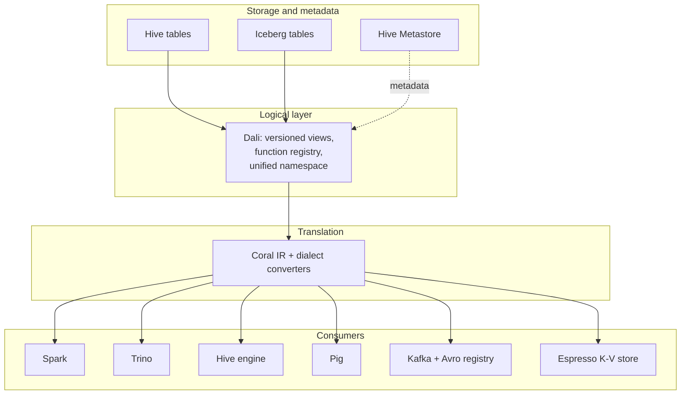

# 15 — LinkedIn-specific concepts

Coral is open source, but its design is rooted in LinkedIn's data platform. Read the code long enough and you will trip over names that mean nothing outside the company: `dali_udf`, `VersionedSqlUserDefinedFunction`, `FuzzyUnionSqlRewriter`, `coral_udf_version_x_y_z`, `IcebergTable`, `MergeCoralSchemaWithAvro`. This chapter is the orientation a non-LinkedIn reader needs — what each term refers to in the surrounding ecosystem, why the corresponding code paths exist, and which files implement the integration. None of this is required to *use* Coral, but you cannot read PRs in `coral-common`, `coral-hive`, or `coral-spark` without it.

## The ecosystem in one diagram

Dali sits in front of physical storage. Coral is the translation engine that turns Dali's logical views into whatever the consumer needs — engine SQL, an Avro schema, an incremental form. Everything below is one slice of that arrangement.

## Dali

Dali is LinkedIn's logical dataset platform. It provides three things on top of Hive Metastore (and, increasingly, Iceberg):

- **Versioned views.** A Dali view is a SQL definition stored in HMS, but the storage layer treats the view as a logical contract — base tables can evolve, the view's schema stays stable.
- **A function registry.** Each Dali view declares the UDFs it uses by a short name. The mapping from short name to Java class lives in the HMS table's `TBLPROPERTIES` under the key `functions`.
- **A unified namespace.** Consumers reference a view by `database.view`, and the underlying engine (Hive, Spark, Trino) is irrelevant.

Coral's role is the translation engine. Given a Dali view, Coral converts it to whatever engine SQL the caller needs. The Dali-specific bits show up in two places in the source.

The first is `HiveCalciteTableAdapter` ([`coral-common/src/main/java/com/linkedin/coral/common/HiveCalciteTableAdapter.java`](../coral-common/src/main/java/com/linkedin/coral/common/HiveCalciteTableAdapter.java)), which exposes two helpers:

- `getDaliFunctionParams()` reads the `functions` TBLPROPERTY and parses it into a `Map<String, String>` from short name to fully qualified Java class name. The format is whitespace-separated `name:class` entries, e.g. `'functions' = 'fn1:com.linkedin.X.Y fn2:com.linkedin.A.B'`.
- `getDaliUdfDependencies()` reads the `dependencies` TBLPROPERTY and returns the Ivy coordinates of the JARs the UDFs need.

The second is `DaliOperatorTable` ([`coral-hive/src/main/java/com/linkedin/coral/hive/hive2rel/DaliOperatorTable.java`](../coral-hive/src/main/java/com/linkedin/coral/hive/hive2rel/DaliOperatorTable.java)), the Calcite `SqlOperatorTable` that lets the validator see Dali UDFs as if they were built-in operators. `DaliOperatorTable.lookupOperatorOverloads` delegates to a `HiveFunctionResolver`, whose `tryResolveAsDaliFunction` consults the TBLPROPERTY map from `HiveCalciteTableAdapter`. If a function in the view references `my_udf`, the resolver looks up `my_udf` in the `functions` map, finds `com.linkedin.foo.MyUdf`, and binds the call. [Chapter 06](06-coral-hive.md) walks the full resolution path.

The function-name convention used in test fixtures (`default_foo_dali_udf_LessThanHundred`, `default_foo_dali_udf3_FuncSquare`) follows Dali's `databaseName_tableName_udfName` format. `HiveFunctionResolver.tryResolveAsDaliFunction` strips the `databaseName_tableName_` prefix if it matches the view's containing table, then looks up the bare UDF name. The matching logic is case-insensitive and tolerates the prefix being absent.

One quirk worth remembering: a Dali UDF class can carry a versioning prefix like `coral_udf_version_0_1_x.com.linkedin.coral.hive.hive2rel.CoralTestVersionedUDF`. `HiveFunctionResolver.removeVersioningPrefix` matches the regex `coral_udf_version_(\d+|x)_(\d+|x)_(\d+|x)` and strips it before the registry lookup, so a single registered class can serve multiple versioned aliases.

The LinkedIn blog post `engineering.linkedin.com/blog/2017/11/dali-views--functions-as-a-service-for-big-data` (referenced in the README) is the surface-level introduction.

## Transport UDFs

Transport UDFs are LinkedIn's portable-UDF framework. The pitch is straightforward: write a UDF once, ship engine-specific JARs (Hive, Spark, Trino, Presto) generated from one source. The Coral side has to detect the Hive-form class name a Dali view references and rewrite it to the engine-form name plus the right Ivy coordinate for the consuming engine.

`TransportUDFTransformer` ([`coral-spark/src/main/java/com/linkedin/coral/spark/transformers/TransportUDFTransformer.java`](../coral-spark/src/main/java/com/linkedin/coral/spark/transformers/TransportUDFTransformer.java)) is the key class. One transformer instance carries four fields: the Hive UDF class name, the Spark UDF class name, an Ivy URL for the Spark 2.x build (Scala 2.11), and an Ivy URL for the Spark 3.x build (Scala 2.12). The constructor takes those four plus a shared `Set<SparkUDFInfo>` to accumulate into.

`CoralToSparkSqlCallConverter` constructs a chain of two-dozen `TransportUDFTransformer` instances, one per known LinkedIn UDF mapping — `DateFormatToEpoch`, `EpochToEpochMilliseconds`, `MapLookup`, `Sanitize`, `UserAgentParser`, `Ip2Str`, and so on. The chain runs before the `HiveUDFTransformer` fallback ([chapter 08](08-coral-spark.md) covers the ordering).

`condition(SqlCall)` checks three things:

1. The call's operator is a `VersionedSqlUserDefinedFunction` (the wrapper `HiveFunctionResolver` builds for Dali UDFs).
2. The operator name equals the transformer's Hive class name, case-insensitive.
3. The active Spark session's Scala version has a non-null Ivy URL on this transformer.

`getScalaVersionOfSpark()` calls `SparkSession.active().version()`. Spark 2.x maps to `SCALA_2_11`; Spark 3.x maps to `SCALA_2_12`. If no Spark session is active or the Spark class is missing entirely, the method warns and defaults to `SCALA_2_11`. If the active version expects (say) Scala 2.12 but this transformer has only the 2.11 URL set, `condition` throws `UnsupportedUDFException` so the caller can surface a clear "UDF owner needs to publish a 2.12 build" error rather than silently emitting broken SQL.

`transform(SqlCall)` does three things:

1. Add a `SparkUDFInfo` with `UDFTYPE.TRANSPORTABLE_UDF`, the Spark class name, the short function name (pulled from `VersionedSqlUserDefinedFunction.getOriginalViewTextFunctionName()`), and the Ivy URL matching the active Scala version.
2. Build a fresh `SqlOperator` whose name is that short function name.
3. Re-emit the call with the new operator.

The accumulated `SparkUDFInfo` list is what the caller (Spark catalog plugin, REST service, etc.) uses to know which JARs to `ADD JAR` and which functions to `CREATE TEMPORARY FUNCTION` before executing the rewritten SQL.

The blog post `engineering.linkedin.com/blog/2018/11/using-translatable-portable-UDFs` is the introduction to the framework's motivation. For the rest of the UDF chain — `HiveUDFTransformer` fallback, `FuzzyUnionGenericProjectTransformer` — see [chapter 08](08-coral-spark.md).

## ViewShift

ViewShift is LinkedIn's dynamic policy enforcement layer for the data lake. The mechanism: when a user queries a view, the platform consults a central policy store, decides what access controls and redactions apply for that user against that dataset, and rewrites the view's logical plan to enforce the policy. Coral provides the rewriting machinery — the user-facing query stays unchanged; the rewriter injects `CASE` expressions, hash functions, masking, or row filters into the view's `RelNode` plan before the engine sees it.

The implementation is not in the open-source Coral repo. What is in the repo is the talk that introduces the system: `docs/talks/coral-viewshift.pdf` (Databricks Data + AI Summit, June 10, 2025). For a Coral committer, the relevant facts are:

- ViewShift uses Coral IR rewrites — the same `SqlShuttle` and `RelShuttle` machinery `coral-incremental` uses for IVM.
- The integration consumes Coral's `ToRelConverter` output, then plugs in its own `RelShuttle` between Coral's `RelNode` production and the backend stage.
- Any PR that touches `ToRelConverter`'s public surface (the `RelNode` it returns, the `CoralCatalog` it consumes) needs to consider ViewShift even though ViewShift's code is not in the same repo.

The talk and the Data Guard paper (`arxiv.org/abs/2502.01998`, cited from the README) are the public references.

## Fuzzy Union

Fuzzy Union is the most LinkedIn-specific piece of code in the open-source repo. The scenario, lifted from the Javadoc in `FuzzyUnionSqlRewriter`:

A Dali view is declared as `SELECT * FROM a UNION ALL SELECT * FROM b`. Tables `a` and `b` have identical struct columns when the view is deployed — say `f1: struct(f2: int)` on both sides. The view validates and ships. Later, `b` evolves and gains a third field: `f1: struct(f2: int, f3: int)`. The view's declared schema still says `f1: struct(f2: int)` — that is the deployed contract — but the underlying `b` no longer matches. A naive query against the view fails because Calcite cannot unify the two struct types.

`FuzzyUnionSqlRewriter` ([`coral-common/src/main/java/com/linkedin/coral/common/FuzzyUnionSqlRewriter.java`](../coral-common/src/main/java/com/linkedin/coral/common/FuzzyUnionSqlRewriter.java)) is a `SqlShuttle` that fires during view expansion ([chapter 06](06-coral-hive.md) covers the `HiveViewExpander` call site). When it finds a `SqlKind.UNION` node, it does two things:

1. Compute the common subset of fields across all union branches by recursing through `getUnionDataType`. For struct columns, it builds a new struct keeping only the fields that exist in every branch, in the first branch's order. The recursion also covers arrays and maps — `getUnionDataType` reaches into element and value types so a `map<string, struct<...>>` is reconciled at the struct level.
2. For each branch, compare the branch's actual type against the expected common type. If they match structurally, leave the branch alone. If they drift, wrap the affected column with a `generic_project(col, 'col_name', hive_type_string)` call, where the third argument is the Hive type-system string for the expected common type.

The result is a rewritten `SqlNode` AST where every union branch projects exactly the same fields in the same shape. `GenericProject` is a Hive UDF — its job at execution time is to take a record of one struct shape and emit it as another struct shape, dropping extra fields and null-padding missing ones. Spark and Trino each have their own implementation. `coral-spark`'s `FuzzyUnionGenericProjectTransformer` ([chapter 08](08-coral-spark.md)) registers the Spark version's JAR and rewrites the call to the form Spark expects.

The rewriter is idempotent — re-running it on already-rewritten output produces the same AST — which matters because `HiveViewExpander.expandView` applies it once per view, and nested views can route through it multiple times.

What the rewriter is *not*: it is not a general-purpose schema-evolution tool. It only resolves backward-compatible additions where one branch is a strict superset of another. If `a` and `b` have genuinely conflicting types for a same-named field, the rewriter cannot help and the view stays broken.

## Espresso

Espresso is LinkedIn's distributed key-value store. It backs online services that need strong consistency on per-key reads and writes. Espresso documents and secondary indexes are defined with Avro schemas — every record stored in Espresso has a known Avro shape.

For Coral, Espresso matters in one direction: it consumes the Avro schemas `coral-schema` produces. A logical view defined over Espresso-backed (or Espresso-bound) data needs an Avro schema derived from the view definition rather than from the base tables, because the projection, filtering, and complex-type manipulation in the view all change the resulting schema. [Chapter 10](10-coral-schema.md) walks `ViewToAvroSchemaConverter` and the two merge engines (`MergeHiveSchemaWithAvro` and `MergeCoralSchemaWithAvro`).

If you are reading a `coral-schema` PR and the author asks "what does Espresso need here," the answer almost always reduces to nullable correctness and field-default fidelity — Espresso's Avro consumers refuse records whose nullability or defaults disagree with the registered schema.

## Iceberg integration

Coral started Hive-centric. Iceberg support is a more recent expansion. The relevant additions:

- `CoralCatalog` ([`coral-common/src/main/java/com/linkedin/coral/common/catalog/CoralCatalog.java`](../coral-common/src/main/java/com/linkedin/coral/common/catalog/CoralCatalog.java)) is the unified table-metadata abstraction. It exposes `getTable(namespace, tableName) → CoralTable` and is implemented by Hive- and Iceberg-backed catalogs.
- `IcebergTable` ([`coral-common/src/main/java/com/linkedin/coral/common/catalog/IcebergTable.java`](../coral-common/src/main/java/com/linkedin/coral/common/catalog/IcebergTable.java)) is the `CoralTable` wrapper for an Apache Iceberg `org.apache.iceberg.Table`. It exposes properties, schema (via `IcebergToCoralTypeConverter`), and base name.
- `MergeCoralSchemaWithAvro` ([`coral-schema/src/main/java/com/linkedin/coral/schema/avro/MergeCoralSchemaWithAvro.java`](../coral-schema/src/main/java/com/linkedin/coral/schema/avro/MergeCoralSchemaWithAvro.java)) is the Iceberg-first schema merger. It treats the Coral `StructType` as the source of truth for field existence, naming, and nullability; the partner Avro contributes metadata (defaults, docs, aliases, enum/fixed materialization) for matched fields. This is the counterpart to the older Hive-first `MergeHiveSchemaWithAvro` ([chapter 10](10-coral-schema.md) covers both).

The integration is not yet complete. `ToRelConverter.processView` still routes Iceberg paths through `processViewWithCoralCatalog`, which currently converts the Iceberg table into a "minimal Hive Table" for backward compatibility — see the Javadoc on `HiveCalciteTableAdapter`, which explicitly calls this out as the workaround tracked by GitHub issue #575. The longer-term plan is to refactor `ParseTreeBuilder` and `HiveFunctionResolver` to consume `CoralTable` directly, dropping the Hive-Table shim. When you see a comment like "this fails unit test right now" or "is hacky approach to make calcite correctly generate relational algebra" in `coral-common`, it is usually pointing at this seam.

## Incremental View Maintenance

Incremental View Maintenance (IVM) is the rewrite that turns a view definition into an incremental computation — given the deltas to base tables, produce the deltas to the view rather than recomputing the whole thing. LinkedIn uses Coral as the IVM engine.

The relevant module is `coral-incremental` ([chapter 14](14-other-modules.md) covers it). The relevant talks shipped with the repo:

- `docs/talks/coral-incremental-view-maintenance.pdf` — Iceberg Summit, May 2024. Walks the Coral-plus-Iceberg integration that materializes incremental outputs into Iceberg snapshots.
- The 2023 Iceberg Meetup deck (linked from the README's Resources section) is the precursor.

For a Coral committer, the takeaways are: IVM is a Coral IR rewrite — a `RelShuttle` that walks the view's logical plan and emits an incremental form — and Iceberg is the natural materialization target because Iceberg's snapshot deltas line up with the IVM output. [Chapter 14](14-other-modules.md) dives into the rewriting rules themselves; chapter 15 just establishes that this is one of the major LinkedIn workloads driving the open-source project.

## Files this chapter discusses

- [`coral-common/src/main/java/com/linkedin/coral/common/FuzzyUnionSqlRewriter.java`](../coral-common/src/main/java/com/linkedin/coral/common/FuzzyUnionSqlRewriter.java)
- [`coral-common/src/main/java/com/linkedin/coral/common/HiveCalciteTableAdapter.java`](../coral-common/src/main/java/com/linkedin/coral/common/HiveCalciteTableAdapter.java)
- [`coral-common/src/main/java/com/linkedin/coral/common/catalog/CoralCatalog.java`](../coral-common/src/main/java/com/linkedin/coral/common/catalog/CoralCatalog.java)
- [`coral-common/src/main/java/com/linkedin/coral/common/catalog/IcebergTable.java`](../coral-common/src/main/java/com/linkedin/coral/common/catalog/IcebergTable.java)
- [`coral-hive/src/main/java/com/linkedin/coral/hive/hive2rel/DaliOperatorTable.java`](../coral-hive/src/main/java/com/linkedin/coral/hive/hive2rel/DaliOperatorTable.java)
- [`coral-hive/src/main/java/com/linkedin/coral/hive/hive2rel/functions/HiveFunctionResolver.java`](../coral-hive/src/main/java/com/linkedin/coral/hive/hive2rel/functions/HiveFunctionResolver.java)
- [`coral-spark/src/main/java/com/linkedin/coral/spark/transformers/TransportUDFTransformer.java`](../coral-spark/src/main/java/com/linkedin/coral/spark/transformers/TransportUDFTransformer.java)
- [`coral-spark/src/main/java/com/linkedin/coral/spark/CoralToSparkSqlCallConverter.java`](../coral-spark/src/main/java/com/linkedin/coral/spark/CoralToSparkSqlCallConverter.java)
- [`coral-schema/src/main/java/com/linkedin/coral/schema/avro/MergeCoralSchemaWithAvro.java`](../coral-schema/src/main/java/com/linkedin/coral/schema/avro/MergeCoralSchemaWithAvro.java)
- `docs/talks/coral-viewshift.pdf`
- `docs/talks/coral-incremental-view-maintenance.pdf`

## Read next

- [Chapter 06](06-coral-hive.md) — function resolution and `DaliOperatorTable`, the read-side of the Dali integration.
- [Chapter 08](08-coral-spark.md) — `TransportUDFTransformer` and the full Spark UDF chain.
- [Chapter 10](10-coral-schema.md) — `coral-schema`, Avro merge engines, and the Espresso/Kafka consumer side.
- [Chapter 14](14-other-modules.md) — `coral-incremental`, the module that implements IVM.
- [Chapter 19](19-glossary.md) — glossary; one-sentence definitions for every term in this chapter.
