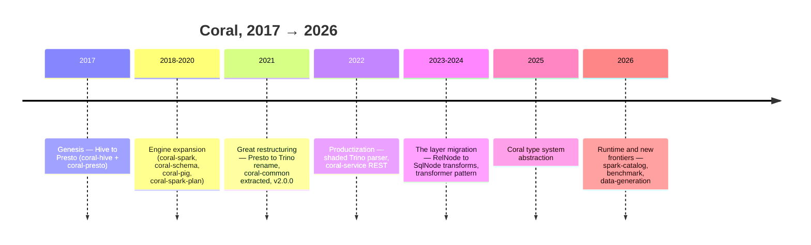

# 20 — Project history and major pivots

Coral did not arrive at its current shape by design — it got there through nine years of incremental change and a handful of decisive pivots. This chapter reconstructs that arc from the git history on `origin/master`, because the *why* behind the structure makes PRs easier to read: `coral-common` exists because of a 2021 restructuring, and the `SqlCallTransformer` pattern exists because of a multi-year migration that moved transforms from one IR layer to another. Knowing which era a piece of code came from tells you what conventions it follows.

> **Reading time** ~10 min  ·  **Prerequisites** [chapter 01](01-the-big-picture.md)
>
> **Key takeaways**
> - Coral was born in 2017 as a Hive→**Presto** translator; Trino is a later rebrand, not the origin.
> - The 2021 v1→v2 restructuring extracted `coral-common` and decoupled HiveQL, which is why every module depends on `coral-common` today.
> - The 2023–2024 migration of transforms from the RelNode layer to the SqlNode layer is what produced the `SqlCallTransformer` pattern that dominates the codebase now.

## The arc at a glance

Some anchoring numbers: the first commit (`d15de373`) lands 2017-07-12 as a bare `mint product create`; the latest on `master` at the time of writing is 2026-05-11. That is ~9 years and 676 commits, with 2021 the peak year (159 commits). Releases are Shipkit auto-versioned — `v1.0.x` through 2021, then `v2.0.0`, now in the `2.4.*` line.

## 2017 — Genesis: a Hive→Presto translator

Coral's first real commit, `1cf8fd67` ("Reorganized project structure and build", 2017-11-13), created two modules at once: `coral-hive` and `coral-presto`. That pairing is the whole original thesis — parse HiveQL into an intermediate representation, emit Presto SQL from it. There was no `coral-common`, no `coral-spark`, no Trino. The IR-based design (parse to Calcite, emit per dialect) was there from day one, but the surface area was a single source dialect and a single target.

The most important thing to internalize: **Coral started Presto-first.** The Trino name that saturates the current codebase is a 2021 rebrand (see below). Code, comments, and class names that still say "Presto" are historical residue, not a separate feature.

## 2018–2020 — Engine expansion

With the Hive→Presto core working, the next three years added target engines and analyses, all still under the v1 line:

- `coral-spark` (2018-12) — emit Spark SQL from the IR. This is also where LinkedIn's Transport-UDF handling grew up (chapter 08).
- `coral-schema` (2019-05) — derive Avro schemas from views. This is the tie into LinkedIn's Avro-centric platform (chapters 10 and 15); it is the only backend whose output is not SQL.
- `coral-pig` (2019) — emit Pig Latin. Now largely legacy (chapter 14).
- `coral-spark-plan` (2020-07) — the reverse direction: reconstruct a `RelNode` from a Spark physical plan.

By the end of 2020 Coral was a multi-target translation library, but still a fairly flat one: shared code lived inside `coral-hive`, and there was no extracted foundation module.

## 2021 — The great restructuring (v1 → v2)

2021 was Coral's busiest year and its most consequential. Three things happened close together:

- **Presto → Trino rebrand.** `4d051be1` "Rename coral-presto module to coral-trino (#65)" (2021-04-08) followed the industry-wide Presto→Trino rename. This is a pivot in name and packaging, not in mechanism — the converter kept doing the same job under a new identity.
- **`coral-common` extraction.** `b515576e` "Decouple HiveQL support from the rest of `coral-hive`; re-organize and simplify APIs (#151)" (2021-10-19) pulled the shared converter base, schema layer, and Calcite glue out of `coral-hive` into a new foundation module. This is the structural reason **every module today depends on `coral-common`** (chapter 04). The same day, `v2.0.0` was tagged (`390c6482`) — the major-version bump marks this restructuring as the v1→v2 boundary.
- **Frontend symmetry.** Late 2021 added Presto/Trino SQL → IR (#171), making `coral-trino` bidirectional rather than emit-only (chapter 09).

If a class looks like it was designed to be shared and dialect-neutral, it most likely dates from this era or later. Anything older tends to carry Hive-specific assumptions inline.

## 2022 — Productization

Two changes turned Coral from "a set of libraries" into something deployable:

- **Shaded Trino parser** (2022-01). The `shading/coral-trino-parser` module repackages Trino's parser (and its ANTLR v4 + Airlift dependencies) under `coral.shading.*` to avoid a classpath clash with Calcite's ANTLR v3 (chapter 09). This is the kind of fix that only matters once people are embedding Coral in real engines.
- **`coral-service`** (2022-05) — a Spring Boot REST front end over translation and catalog operations (chapter 14). This is the first "Coral as a running service," not just a library, pivot.

## 2023–2024 — The layer migration (the deepest pivot)

This is the era that shaped the codebase a reviewer reads today, and it is the least obvious from the outside. Across roughly fifteen PRs from `#349` (2023-02) through `#491` (2024-04), the team systematically **moved dialect transformations from the RelNode layer (`RexShuttle`, operating on `RexNode`s) up to the SqlNode layer (`SqlShuttle` / `SqlCallTransformer`, operating on `SqlCall`s).** Representative commits: migrating the alias appender, `UNNEST`, `FROM_UNIXTIME`/`FROM_UTC_TIMESTAMP`, `SUBSTR`, `CONCAT`, `named_struct`, and finally `CAST` (#491) out of the Rel layer.

Two supporting moves made it possible:

- `TypeDerivationUtil` (#424) — lets a SqlNode-layer transformer ask Calcite for the derived type of a subtree mid-shuttle, which the Rel layer used to provide for free.
- Two **backward-incompatible API refactors** — `RelToTrinoConverter` (#420) and `CoralSpark` (#448), both 2023 — reshaped the public entry points around the new layering.

The payoff is the `SqlCallTransformer` pattern in [chapter 07](07-transformers-pattern.md): the reason that pattern exists, and the reason there are parallel `transformers/` packages in `coral-trino` and `coral-spark`, is this migration. When you review a transformer PR, you are working inside the architecture this era produced.

The same period grew the rewrite-and-tooling modules: `coral-incremental` (incremental view maintenance), `coral-dbt` (dbt integration), and `coral-visualization` (SVG of IR trees) all appeared in 2023 (chapter 14).

## 2025–2026 — Types, runtime, and new frontiers

The recent arc points at two themes — richer types and closer-to-runtime integration:

- **Coral type system abstraction** (#558, 2025-11) introduced `CoralDataType`, a dialect- and framework-neutral type layer (chapter 05). This is the groundwork for treating Hive and Iceberg tables uniformly rather than assuming Hive everywhere.
- **`coral-spark-catalog`** (2026-03) plugs Coral into Spark 3.5's `CatalogExtension` so Hive views are translated at query time, not pre-translated (chapter 11) — the "library → also a runtime" pivot taken further than `coral-service`.
- **`coral-benchmark`** (#599) and **`coral-data-generation`** / the symbolic constraint solver (#564), both 2026-05, added a cross-dialect correctness framework (chapter 12) and symbolic test-data generation (chapter 13).
- **Catalog SPI refactor** — in flight on the `pr/590` branch at the time of writing, splitting catalog code into `coral-catalog-spi` / `coral-catalog-hive` / `coral-catalog-iceberg`. It is **not yet on `master`**, so the chapters in this guide still describe the `coral-common/catalog/` layout; expect 04/05/06/10/15 to need a refresh once it lands.

## The major pivots, distilled

- **Presto → Trino** (2021) — an industry rebrand; module rename, not a mechanism change.
- **Monolith → layered modules** (2021, v1→v2) — `coral-common` extracted; the dependency root every module now shares.
- **RelNode layer → SqlNode layer** (2023–2024) — the migration that produced the `SqlCallTransformer` pattern.
- **Hive-only → multi-format types** (2025→) — `CoralDataType` and the catalog work, aimed at Iceberg parity.
- **Library → also a runtime/service** (2022 `coral-service`, 2026 `coral-spark-catalog`) — Coral moving closer to the engines that consume it.

## Self-check

1. What dialect was Coral's *original* translation target, and what does that tell you about code or comments that still say "Presto"?
2. What did the 2021 v1→v2 restructuring produce structurally, and why does it explain `coral-common`'s position in the dependency graph?
3. The `SqlCallTransformer` pattern in chapter 07 is the product of which era, and what layer did transformations live in before it?

## Files this chapter discusses

This chapter is sourced from the git history of `origin/master` rather than specific files. For external context:

- `README.md` (repo root) — the Resources section: blog posts and the talks under `docs/talks/` that narrate the same evolution from the outside.

## Read next

- [01 — The big picture](01-the-big-picture.md) — the current architecture this history produced.
- [07 — The SqlCallTransformer pattern](07-transformers-pattern.md) — the artifact of the 2023–2024 layer migration.
- [18 — Engagement and community](18-engagement-and-community.md) — who maintains Coral now.
