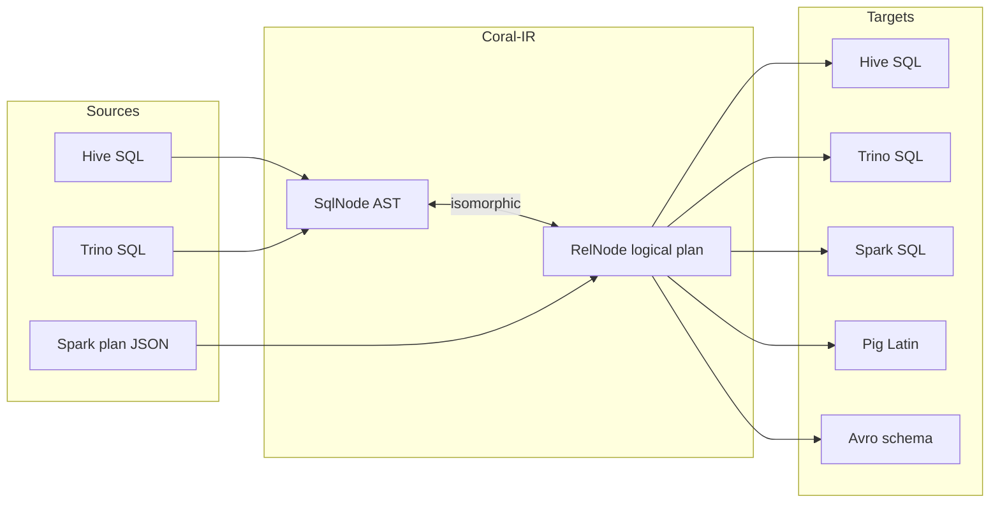

# Coral Study Guide

A personal study guide to the [Coral](https://github.com/linkedin/coral) codebase, written so the author can become a Coral committer, review PRs faster, and have an opinionated mental model of every module.

This guide is **not canonical Coral documentation**. It lives on a personal fork branch (`simbadzina/study-guide`) and reflects one engineer's understanding at a point in time. Source files are linked by relative path so the guide is read alongside the code. If a class or PR cited here no longer exists, the code is the source of truth — fix the guide.

## How to use this guide

There are three reading modes:

1. **Sequential learner**: read in order 00 → 19. Roughly 8-12 hours plus exercises. Builds the full mental model.
2. **Reviewer**: a PR lands in module *X*. Jump to the matching chapter (06 for coral-hive, 09 for coral-trino, ...) plus [chapter 16](16-pr-review-companion.md) for the per-module review checklist.
3. **Speed-run (2 hours)**: read `01-the-big-picture.md`, `03-pipeline-deep-dive.md`, and `16-pr-review-companion.md`. Enough to follow a code review conversation and not be lost.

## Prerequisites

- Java 8+ (the repo currently builds against Java 8; Gradle 8.6).
- Comfort with SQL (HiveQL, Spark SQL, or Trino — any one is enough).
- Apache Calcite literacy is helpful. If `SqlNode`, `RelNode`, and convertlets are unfamiliar, read `02-calcite-primer.md` first.
- Ability to build the repo (`./gradlew clean build`) and run a single test class.

## Table of contents

| # | Chapter | What it covers |
|---|---|---|
|   | [README](README.md) | This file |
| 00 | [Prerequisites](00-prerequisites.md) | Build setup, Gradle, IDE, ANTLR-generated sources |
| 01 | [The big picture](01-the-big-picture.md) | Coral as an IR project; the N×N→2N argument; module map |
| 02 | [Calcite primer](02-calcite-primer.md) | `SqlNode`, `RelNode`, convertlets, `RelBuilder`, `SqlValidator` |
| 03 | [Pipeline deep dive](03-pipeline-deep-dive.md) | A Hive query from string to Spark string, stage by stage |
| 04 | [coral-common](04-coral-common.md) | The foundation module: `ToRelConverter`, schema layer, transformers |
| 05 | [Type system and CoralCatalog](05-type-system-and-catalog.md) | `CoralDataType`, `HiveTypeSystem`, `CoralCatalog`, Hive + Iceberg |
| 06 | [coral-hive](06-coral-hive.md) | ANTLR grammar, `ParseTreeBuilder`, `StaticHiveFunctionRegistry` |
| 07 | [The SqlCallTransformer pattern](07-transformers-pattern.md) | The pattern used everywhere; composition; anti-patterns |
| 08 | [coral-spark](08-coral-spark.md) | `CoralSpark`, TransportUDF, `SparkUDFInfo` |
| 09 | [coral-trino](09-coral-trino.md) | Two-stage Hive→Trino, the transformer zoo, shaded parser |
| 10 | [coral-schema](10-coral-schema.md) | Avro schema derivation from views; merge engines |
| 11 | [coral-spark-catalog](11-coral-spark-catalog.md) | Spark 3.5 `CatalogExtension` for runtime view translation |
| 12 | [coral-benchmark](12-coral-benchmark.md) | Cross-dialect correctness; 3 verification levels |
| 13 | [coral-data-generation](13-coral-data-generation.md) | Symbolic constraint solver for test data |
| 14 | [Other modules](14-other-modules.md) | pig, dbt, incremental, visualization, service, spark-plan |
| 15 | [LinkedIn-specific concepts](15-linkedin-specifics.md) | Dali, Transport UDFs, ViewShift, Fuzzy Union |
| 16 | [PR review companion](16-pr-review-companion.md) | Per-module checklists, red flags, comment templates |
| 17 | [First contributions](17-first-contributions.md) | Concrete easy-PR ideas |
| 18 | [Engagement and community](18-engagement-and-community.md) | Maintainers, Slack, release cadence |
| 19 | [Glossary](19-glossary.md) | Alphabetical reference for terms |

Exercises live under [`exercises/`](exercises/) and are designed to be done with a debugger and a real source tree open.

## How Coral fits together (one diagram)



Frontends parse a dialect into Coral IR. Backends generate code from Coral IR. The two-layer IR (AST + logical plan) is what makes the N×N → 2N reduction possible. [Chapter 01](01-the-big-picture.md) unpacks this; [chapter 03](03-pipeline-deep-dive.md) traces an actual query through it.

## Working with this guide

```bash
# branch lives on simbadzina/study-guide
git fetch simbadzina
git checkout study-guide

# render Mermaid: any GitHub view, or `npx @mermaid-js/mermaid-cli -i 03-pipeline-deep-dive.md`
```

The guide is markdown-only. No build step.
